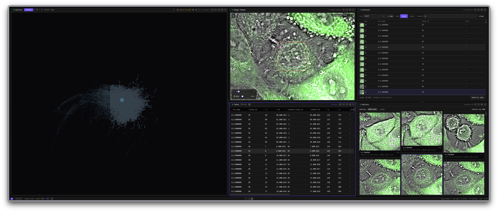

# nd-embedding-atlas

[![CI][badge-ci]][link-ci] [![Release][badge-release]][link-release] [![Bun][badge-bun]][link-bun] [![License][badge-license]][link-license]

Explore and annotate n-dimensional (`TCZYX`) microscopy images with precomputed embeddings. nd-embedding-atlas links embedding space to source images so researchers can review, select, and annotate examples for downstream model training. It does not train models or include model-training code.

nd-embedding-atlas runs locally with linked scatter plots, tables, filters, charts, image viewers, and annotation tools. Your data remains on your machine.

> **Project status:** Active development. APIs, file-format support, and behaviour may change between releases.



## Quick start

Install the latest release on macOS with Apple silicon, or on Linux with `x64` or `arm64`:

```bash
curl -fsSL https://czbiohub-sf.github.io/nd-embedding-atlas/install.sh | sh
```

Launch an AnnData Zarr store:

```bash
ndea view path/to/data.zarr
```

Open `http://localhost:5055` in Chrome or Edge. The scatter renderer requires WebGPU.

For multiple datasets or linked OME-Zarr images, launch a project file:

```bash
ndea view project.yaml
```

```yaml
settings:
  port: 5055

datasets:
  - name: experiment-a
    path: ./experiment-a.zarr
    plate_path: ./experiment-a-images.zarr
```

See [Install][docs-install], [Launch ndea][docs-launch], and [Prepare data][docs-formats] for the complete workflow.

## What it does

- Links points in precomputed embedding space to their source images.
- Supports image review, selection, and annotation for downstream model-training workflows.
- Streams local AnnData, a supported MuData subset, and mounted OME-Zarr HCS images.
- Uses DuckDB and Mosaic for server-side queries and cross-filtering.
- Renders large scatter plots and selections with WebGPU.
- Opens the fixed `annotate` preset with linked views for exploration and annotation.

## Data compatibility

nd-embedding-atlas implements specific parts of the upstream formats rather than every valid variant.

| Input        | Current support                                                               |
| ------------ | ----------------------------------------------------------------------------- |
| AnnData Zarr | Primary tabular and embedding input; `obs` is required and `var` is optional  |
| MuData Zarr  | `axis=0` stores with one-to-one observations across modalities                |
| OME-Zarr     | Mounted HCS plates using OME-NGFF 0.4/Zarr v2 or 0.5/Zarr v3                  |
| Project YAML | Multiple dataset mounts, image linkage, channel metadata, and launch settings |

Read the [supported formats reference][docs-formats] before preparing production data.

## Update and maintain

```bash
ndea update                       # latest stable release
ndea update --channel pre-release # latest active pre-release
ndea gc                           # remove inactive installed versions
ndea doctor                       # inspect installation health
```

The installer verifies the release checksum and stores versioned binaries under `~/.ndea/versions/`. See the [CLI reference][docs-cli] for channels, environment variables, completions, garbage collection, and exit codes.

## Documentation

- [Install][docs-install]
- [Launch ndea][docs-launch]
- [Supported formats][docs-formats]
- [CLI reference][docs-cli]
- [WebGPU on HPC][webgpu-hpc]
- [Contributing][docs-contrib]

## Development

This repository uses Bun and Vite+. The monorepo contains the application and shared packages; `docs/` is an independent Fumapress/Waku application.

```bash
vp install
vp run dev path/to/data.zarr
vp run -r check
vp run -r test
vp run build
```

See [CONTRIBUTING.md](./CONTRIBUTING.md) for package-level commands and repository conventions.

## Community and security

Ask questions in [GitHub Discussions][discussions-link]. Report bugs and request features in the [issue tracker][issue-tracker]. Follow the [Code of Conduct](./CODE_OF_CONDUCT.md) when participating.

Report vulnerabilities privately according to [SECURITY.md](./SECURITY.md); do not open a public issue.

## Citation

Citation guidance will be published with the first stable research release.

## Licence

nd-embedding-atlas is available under the [MIT License][link-license]. See [LICENSE.md](./LICENSE.md).

<!-- badges -->

[badge-ci]: https://github.com/czbiohub-sf/nd-embedding-atlas/actions/workflows/ci.yml/badge.svg?branch=main
[badge-release]: https://img.shields.io/github/v/release/czbiohub-sf/nd-embedding-atlas?label=release&color=blue
[badge-bun]: https://img.shields.io/badge/Bun-1.x-000?logo=bun&logoColor=fbf0df
[badge-license]: https://img.shields.io/badge/License-MIT-blue.svg
[link-ci]: https://github.com/czbiohub-sf/nd-embedding-atlas/actions/workflows/ci.yml
[link-release]: https://github.com/czbiohub-sf/nd-embedding-atlas/releases/latest
[link-bun]: https://bun.com
[link-license]: https://opensource.org/licenses/MIT

<!-- project links -->

[issue-tracker]: https://github.com/czbiohub-sf/nd-embedding-atlas/issues
[discussions-link]: https://github.com/czbiohub-sf/nd-embedding-atlas/discussions
[docs-install]: https://czbiohub-sf.github.io/nd-embedding-atlas/install/
[docs-launch]: https://czbiohub-sf.github.io/nd-embedding-atlas/launch/
[docs-formats]: https://czbiohub-sf.github.io/nd-embedding-atlas/supported-formats/
[docs-cli]: https://czbiohub-sf.github.io/nd-embedding-atlas/cli/
[webgpu-hpc]: https://czbiohub-sf.github.io/nd-embedding-atlas/webgpu-hpc-setup/
[docs-contrib]: https://czbiohub-sf.github.io/nd-embedding-atlas/contributing/
