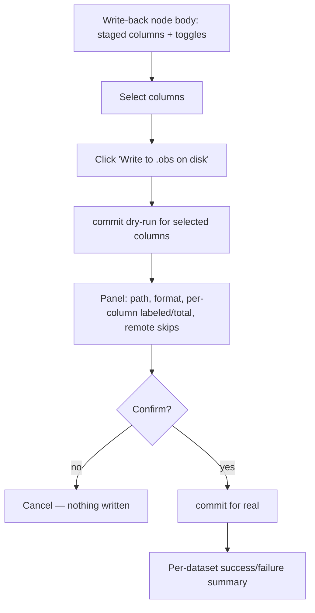

# Commit annotations to the source AnnData `.obs` on disk

## Summary

Add a dedicated "Write-back" node whose body commits staged annotation columns
back into the source AnnData `.zarr`, with per-column selection and a dry-run
preview gated behind explicit confirmation. The server write path already exists
and is validated; this work is the missing frontend seam — a new node, one host
method, one shim call, and a commit panel.

---

## Problem Frame

Labels made in the browser live only in server-side DuckDB `ann_*` staging
tables. They can be exported to a parquet/csv sidecar, but a researcher who
wants those labels _in their AnnData_ — visible to `anndata` / scanpy / any
downstream Python — must export and hand-merge by index. That manual round-trip
is the friction: the labels exist, the source store exists, but nothing joins
them without leaving the tool.

The destructive-write half of the problem is already solved and shipped:
`src/zarr/write-obs.ts` writes `.obs` columns into zarr v2 and v3 (all dtypes),
and `POST /api/annotations/commit[?dryRun=1]` (`src/server/routes/annotate.ts:249`)
drives it, including an optional `columns` subset. The gap is purely reach: that
endpoint is unreachable from the UI — it is not on the `NodeHost` `DataApi`, and
no node or button calls it.

---

## Key Decisions

- **A dedicated "Write-back" node.** The commit is a first-class node in the
  graph — not a button on the Annotate node, not a workspace menu command.
- **The node carries no data-in edge; its body is the commit control.**
  Annotations don't flow through an edge — they are server-side column state, and
  the port vocabulary is only `pred | sel | focus`. So the Write-back node isn't
  a sink consuming an "annotations" edge; it is an action/view node whose body
  lists the dataset's staged columns and drives the commit. Whether it takes an
  optional `pred` for dataset-context / preview-scoping is a planning detail (see
  Outstanding Questions).
- **The user picks which columns to write.** The panel lists every staged column
  with a per-column toggle (default all), so a commit is all-staged or a chosen
  subset. The endpoint's optional `columns` field already supports this — no
  server change.
- **Dry-run then confirm, always.** The commit mutates irreplaceable source
  data, so the write is never one click — the dry-run report is shown and
  confirmed first.
- **Reuse, don't rebuild.** The endpoint, the zarr writers, the alignment, the
  atomic `column-order` publish, and the remote-store refusal all exist. This
  work adds no server logic beyond what the endpoint already exposes.

---

## Requirements

### Trigger & wiring

- R1. The commit is a dedicated terminal "Write-back" node whose body drives the
  commit; it is not a control on the Annotate node.
- R2. The node has no data-carrying input edge — any input port it takes is for
  dataset-context / preview only (see Outstanding Questions), never a payload it
  commits.
- R3. The commit reaches the server through a new `NodeHost` `DataApi` method
  behind the `annotate` capability; the node never calls an `/api/*` literal
  directly (the `use-dashboard-host-shim` seam owns the fetch).
- R4. The node body lists every staged annotation column for its dataset with a
  per-column toggle (default all selected); the commit writes the selected set.
- R5. Pressing "Write to .obs on disk" runs a dry-run first; the on-disk write
  happens only after an explicit second confirmation.

### Commit behavior

- R6. Confirming writes the selected annotation columns into the source AnnData
  `.obs` on disk via the existing `POST /api/annotations/commit`.
- R7. The full-width column always lands: un-annotated obs are written as NA
  (categorical code -1, float NaN, empty string).
- R8. Re-committing an already-committed column overwrites it in place; it never
  duplicates the column or its `column-order` entry.
- R9. A commit never overwrites a pre-existing (non-app-authored) obs column —
  colliding names are already blocked at annotation-creation time.

### Safety, disclosure & feedback

- R10. The dry-run panel discloses, per affected dataset: target `.zarr` path,
  detected format (`v2`/`v3`), total obs, and for each selected column its name,
  dtype, and labeled-of-total count.
- R11. Datasets backed by remote (`http(s)://`) stores are reported as
  non-writable; co-committed local datasets in the same commit still proceed.
- R12. Completion surfaces a per-dataset success/failure summary.

---

## Key Flow

- F1. Commit with confirm.
  - **Trigger:** User opens the Write-back node and clicks "Write to .obs on
    disk".
  - **Steps:** The user picks which staged columns to write; the node requests a
    dry-run for that set; the panel renders the report; the user reviews target
    path, columns, and counts; the user confirms; the node requests the real
    commit; a summary is shown.
  - **Outcome:** The source `.zarr` `.obs` gains or updates the selected columns.
    DuckDB `ann_*` staging is untouched — it stays the live, editable layer.
  - **Covers:** R1–R12.

---

## Acceptance Examples

- AE1. Partial labeling → NA fill.
  - **Given:** 1,240 of 50,000 obs are labeled in `cell_type`.
  - **When:** committed.
  - **Then:** `.obs/cell_type` has 50,000 entries, 1,240 non-NA; the panel showed
    "1,240 of 50,000".
  - **Covers:** R7, R10.
- AE2. Subset commit.
  - **Given:** three staged columns; the user deselects one in the panel.
  - **When:** committed.
  - **Then:** only the two selected columns are written to `.obs`; the third
    stays in staging.
  - **Covers:** R4.
- AE3. Re-commit after more labeling.
  - **Given:** `cell_type` was committed, then 300 more obs are labeled.
  - **When:** committed again.
  - **Then:** on-disk `cell_type` reflects 1,540 non-NA as a single column with a
    single `column-order` entry.
  - **Covers:** R8.
- AE4. Mixed local/remote workspace.
  - **Given:** two datasets, one local and one `https://…`.
  - **When:** committed.
  - **Then:** the local dataset is written; the remote one is reported "remote
    stores can't be written back yet".
  - **Covers:** R11.
- AE5. Collision guard.
  - **Given:** the source `.obs` already has a `leiden` column.
  - **When:** the user tries to create an annotation column named `leiden`.
  - **Then:** creation is refused, so no commit can ever clobber it.
  - **Covers:** R9.

---

## Scope Boundaries

- No new port kind — the Write-back node reuses the existing `pred | sel | focus`
  vocabulary (and takes no data-carrying input at all).
- Predicate-scoped writes are out — the node writes full-width columns; a wired
  filter never restricts _which obs_ get written, only what the preview counts.
- Parquet/csv export (`/api/annotations/export`, `/api/export`) unchanged — it
  stays the "don't touch my zarr" path.
- Remote store write-back — out of scope; the endpoint already refuses it.
- Durability hardening (fsync, fully transactional metadata publish) — deferred.
  The current write is write-through: correct on immediate re-read, not
  power-loss-durable.

---

## Dependencies / Assumptions

- Depends on the existing, validated server path: `POST /api/annotations/commit`
  (`src/server/routes/annotate.ts:249`) and `commitObsColumns`
  (`src/zarr/write-obs.ts:307`). No new server logic is required; per-column
  selection uses the endpoint's existing optional `columns` field.
- Assumes the single-user local trust model already used by export and
  predicate interpolation.
- Assumes the Write-back node can resolve which dataset(s) its staged columns
  belong to from node context (the endpoint groups by `dataset_key` and falls
  back to the sole dataset when only one is mounted).

---

## Outstanding Questions

### Deferred to planning

- Node input port: does the Write-back node take an optional `pred` input (for
  dataset-context and preview-scoping, explicitly _not_ restricting the write)
  or no input at all? Lean: a context/preview-only `pred` if it aids graph
  legibility, otherwise none.
- Panel surface: how the staged-column list + dry-run report render inside the
  node body (inline vs. expandable), and node geometry.
- Continued editing of an already-committed column after the dataset is
  reopened. Once committed, the column becomes a real `.obs` column in the
  `dataset` VIEW, so re-creating a same-named staging column is then blocked;
  define the re-open/re-edit path.
- Durability hardening (fsync + temp/rename for all metadata publishes).

---

## Sources / Research

- Host seam + capability-gated data API: `src/frontend/core/node/host.ts:54`
  (annotate methods; note there is no commit method yet), `:172` (`NodeHost`).
- Annotate node: `src/frontend/nodes/annotate/node.tsx`, `plugin.ts`,
  `view.tsx` (stamps labels via `host.api.writeAnnotationByPredicate`).
- Only frontend caller of `/api/annotations/*`, never `/commit`:
  `src/frontend/core/host/use-dashboard-host-shim.ts:170`.
- Commit endpoint: `src/server/routes/annotate.ts:249` (`handleCommitAnnotations`),
  registered at `src/server/app.ts:420`; optional `columns` subset in
  `CommitAnnotationsBodySchema`.
- Zarr write module: `src/zarr/write-obs.ts:307` (`commitObsColumns`), dry-run
  report shape `:318`, idempotent `column-order` publish `:344`.
- Collision guard: `src/server/store.ts:525` (`datasetColumnExists`), used at
  `src/server/routes/annotate.ts:101`.
- Sibling precedent for an action/sink node in the graph:
  `src/frontend/nodes/utils/export/node.tsx`.
