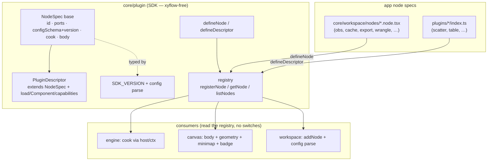
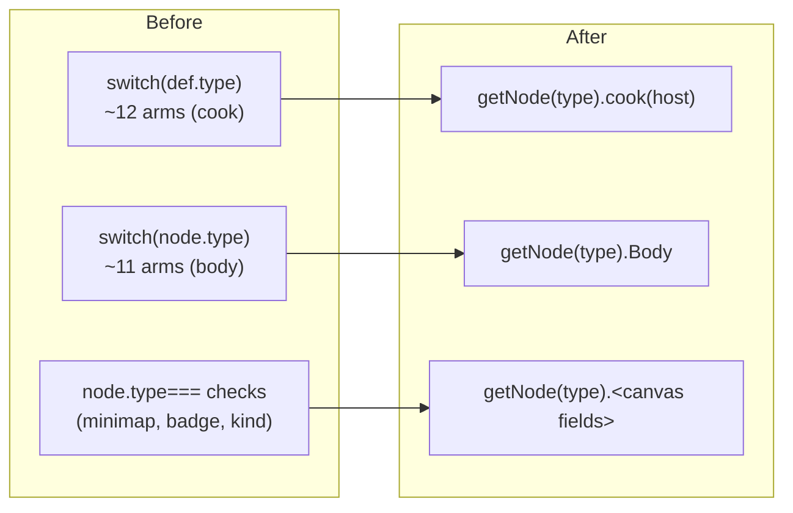

# refactor: SDK-homed unified node contract

## Summary

Make the node layer evolutionary by giving every node — built-in graph node and
plugin alike — a single self-registering contract that lives in the **plugin
SDK** (`src/frontend/core/plugin/`), with workspace, canvas, and engine as
consumers. Today there are two parallel definition systems: rich
`PluginDescriptor`s (7 view/transform plugins) and `NODE_DEFS` literals + type
switches (~9 built-in nodes). Adding a node touches ~5 scattered sites with no
guard that they stay in sync, and per-node config is unvalidated flat fields on
a shared interface.

This plan lands the contract in the SDK as a base `NodeSpec` that
`PluginDescriptor extends`, moves all genuinely type-keyed dispatch (cook, body,
geometry mapping, minimap, badge) to registry lookups, replaces flat per-node
fields with a zod-typed `config` blob, and adds fitness-function tests that make
backsliding fail CI. Persistence _plumbing_ (save/load/rehydrate) is out of
scope; the architectural _foundation_ for it (config schema + version field +
parse hook) is in.

---

## Problem Frame

Adding or changing a node type requires hand-editing: the `WsNodeType` union
(`src/frontend/core/workspace/types.ts`), the `NODE_DEFS` literal
(`src/frontend/core/workspace/node-defs.ts`), the cook switch in
`registerEngineNode` (`src/frontend/core/workspace/workspace-store.ts`), the
body switch (`src/frontend/core/workspace/canvas/NdGraphNode.tsx`), and several
secondary `node.type ===` sites (minimap color, ◆ badge, feedback-by-kind). A
missed site fails at runtime, not at build/CI. Lived this adding the `export`
node (commit `3655247`).

The SDK already declares itself the mount-agnostic contract layer ("ZERO xyflow
imports, so the same descriptor mounts in Dockview/Float/PiP today and as an
xyflow node later" — `src/frontend/core/plugin/types.ts`). Built-in nodes
bypassing it is the debt this plan pays down. (see origin:
docs/brainstorms/2026-06-25-evolutionary-node-design-requirements.md)

**Two consequences the plan targets:**

- _Slow / drift-prone_ — five hand-edits per node, no sync guard.
- _Unsafe config_ — per-node state is flat optional fields on `WsNode`
  (`prql`, `datasetKey`, `collectionId`, `collectionName`, `stamp`), typed but
  never runtime-validated.

---

## Requirements

Carried from the origin requirements doc:

- **R1 — One contract, SDK-homed.** Every node (built-in + plugin) is defined by
  a single `NodeSpec` contract that lives in the SDK; workspace/canvas/engine
  consume a registry, not switches.
- **R2 — Faster to change.** Adding a node = the node file + one guarded type-
  level edit; no switch edits. A test fails if a type has no spec.
- **R3 — Typed, validated config.** Per-node state moves to a `config` blob
  typed by the spec's zod schema, with a schema version. Config parses through
  one SDK helper.
- **R4 — Fitness functions.** Guards that keep the seam a seam:
  every-type-has-a-spec, no-stray-`switch (node.type)`, schema-validates-its-own-
  defaultConfig.
- **R5 — Preserve behavior.** Migration is behavior-neutral; the deprecated
  `selection`-node alias keeps cooking; all existing tests stay green.
- **R6 — Persistence foundation, not feature.** The version field + config
  schema + parse hook land so persistence is trivial later; save/load/rehydrate
  plumbing is deferred.

---

## Key Technical Decisions

- **KTD1 — SDK base `NodeSpec`; `PluginDescriptor extends NodeSpec`.** The SDK
  grows a base spine (identity, ports, config schema + version, cook contract,
  body). `PluginDescriptor` becomes `NodeSpec` + heavy bits (lazy `load()`,
  `Component`, `capabilities`, `placement`, `instancePolicy`). Built-in nodes use
  the base with an eager inline body + simple cook. One registry, one `define*`
  family, one `PluginTypeMap` declaration-merge for typed config. _Rationale:
  neither `PluginMeta` nor `NodeDef` is a superset of the other; a shared
  ancestor unifies without distorting either._ (see origin: Core decision)
- **KTD2 — `config` blob over flat fields.** `WsNode` gains a `config` object
  typed per-type; `prql`/`datasetKey`/`collectionId`/`collectionName`/`stamp`
  migrate into it. _Rationale: flat fields are the per-type leakage the design
  exists to kill; a schema-typed blob is the pydantic-equivalent and makes
  schema-per-node clean. Accepted blast radius — every body + cook that reads
  the old fields — because it is the correct shape._
- **KTD3 — Cook host/context seam.** Built-in cooks currently close over
  `Workspace` runtime (`this.frozenPredicates`, `this.wranglePreds`, the engine
  `WsValue` type). For cooks to live in SDK specs, the spec exposes a cook that
  receives a lightweight host/context instead of closing over `Workspace`,
  mirroring the existing `PluginHost` + `createInstance(host)` pattern used by
  the threshold filter (`makeTransformHost`). _Rationale: the pattern already
  exists; reuse it rather than inventing a second seam._
- **KTD4 — Mount-agnostic base, canvas-specific mapping.** The SDK base stays
  xyflow-free: it carries ports, config, cook, body. Canvas-only concerns
  (`card`/`full`/`chip` geometry, minimap color, ◆ badge) are mapped from the
  spec by the canvas layer, not stored in the SDK base. _Rationale: preserves the
  SDK's stated zero-xyflow invariant._
- **KTD5 — Keep the `WsNodeType` union; guard it.** The union stays for compile-
  time exhaustiveness on `node.type` discriminations. Adding a node = node file +
  union member (2 sites), with the every-type-has-a-spec test tying them so they
  cannot drift. _Rationale: a runtime registry can't generate a compile-time
  union; the guard makes the residual edit safe._ (see origin: Open questions)
- **KTD6 — Persistence foundation only.** Config schema + doc `version` field +
  parse-on-construct land; save/load/rehydrate is a separate plan. _Rationale:
  building load-time machinery before a persistence layer exists is the
  speculative work the brainstorm flagged._ (see origin: Non-goals)

---

## High-Level Technical Design

Contract hierarchy and consumers — the SDK owns the spine, everything reads the
registry:



Dispatch, before vs after:



---

## Output Structure

New app-side spec directory (registered into the SDK registry at boot, mirroring
`registerPlugins()`):

```text
src/frontend/core/workspace/nodes/
  index.ts            # registerBuiltinNodes() — called from main.tsx boot
  obs.node.tsx        # source
  dataset.node.tsx    # source (config: datasetKey)
  wrangle.node.tsx    # transform (config: prql)
  count.node.tsx      # passthrough view
  cache.node.tsx      # stateful checkpoint (config: stamp) + selection alias
  export.node.tsx     # sink
  collection.node.tsx # source (config: collectionId/Name)
  subnet.node.tsx     # passthrough
  proxy.node.tsx      # passthrough
```

The tree is a scope declaration; the per-unit `**Files:**` sections remain
authoritative.

---

## Implementation Units

### U1. SDK `NodeSpec` base + registry generalization + config contract

**Goal:** Add the base contract, the typed-config field, and the parse helper —
additive, no node migrated yet, switches intact.
**Requirements:** R1, R3, R5.
**Dependencies:** none.
**Files:**

- `src/frontend/core/plugin/types.ts` — `NodeSpec` base; `PluginDescriptor extends NodeSpec`.
- `src/frontend/core/plugin/sdk.ts` — `defineNode` helper alongside `defineDescriptor`.
- `src/frontend/core/plugin/registry.ts` — generalize register/get to NodeSpec (`registerNode`/`getNode`/`listNodes`; keep `registerPlugin`/`getPlugin` as typed aliases).
- `src/frontend/core/plugin/registry-types.ts` — extend `PluginTypeMap` to carry config types for built-ins too.
- `src/frontend/core/plugin/version.ts` — config-schema version helper next to `SDK_VERSION`.
- `src/frontend/core/workspace/types.ts` — `WsNode.config?: JsonValue` field (flat fields retained transitionally).
- `src/frontend/core/plugin/registry.test.ts` — extend.

**Approach:** `NodeSpec` carries `type`, `label`, `ports {in,out}`,
`configSchema?` (zod), `configVersion?`, `cook` contract (signature finalized in
U2), `body?`. `PluginDescriptor` keeps its heavy fields by extension. Registry
stays one `Map`; `registerNode` is the general entry, `registerPlugin` calls it.
SDK parse helper: `parseConfig(spec, raw) -> {ok, value|error}` over
`configSchema['~standard']` (zod v4 speaks Standard Schema).
**Patterns to follow:** existing `defineDescriptor` (`sdk.ts`), `registerPlugin`
duplicate/version guards (`registry.ts`), declaration-merge in
`plugins/scatter/index.ts`.
**Test scenarios:**

- Registering a base `NodeSpec` (no `load`) then `getNode` returns it.
- Registering a `PluginDescriptor` still works and `getPlugin` returns the typed shape (existing tests stay green).
- Duplicate id throws; incompatible `sdkVersion` throws (existing behavior preserved).
- `parseConfig` returns `ok:false` with a structured error on a schema mismatch; `ok:true` with the parsed value on match.
  **Verification:** `vp check` clean; `registry.test.ts` green; no node behavior change (switches still own dispatch).

### U2. Cook host/context seam for built-in nodes

**Goal:** Define the lightweight host a spec's `cook` receives so cooks stop
closing over `Workspace`.
**Requirements:** R1, R3.
**Dependencies:** U1.
**Files:**

- `src/frontend/core/plugin/host.ts` — `NodeHost` (or extend `PluginHost`): exposes per-node runtime accessors (frozen-predicate lookup, wrangle-pred lookup, config read) + `ctx` (epoch, signal).
- `src/frontend/core/workspace/workspace-store.ts` — provide the host implementation backed by the existing `frozenPredicates`/`wranglePreds` maps.

**Approach:** Finalize the `NodeSpec.cook` signature as
`cook(inputs, host) -> WsValue` where `host` carries `ctx` plus typed accessors.
Workspace builds one host per node at registration time (closure over its maps,
not exposed to the spec). Mirror `makeTransformHost`.
**Patterns to follow:** `makeTransformHost` + `createThresholdFilterInstance` in
`src/frontend/plugins/transform-filter/`.
**Test scenarios:**

- A spec `cook` reading `host.config` returns the expected predicate without referencing `Workspace`.
- A stateful cook reading `host.frozenPredicate(id)` returns the pinned predicate when present, the live input when absent (mirrors current cache semantics).
  **Verification:** host unit test green; no production wiring change yet (consumed in U3).

### U3. Tracer: migrate `export`, `cache`, `obs` onto specs (lookup-or-switch coexistence)

**Goal:** Prove the contract end-to-end on a sink, a stateful checkpoint, and a
source before migrating the rest.
**Requirements:** R1, R2, R3, R5.
**Dependencies:** U1, U2.
**Files:**

- `src/frontend/core/workspace/nodes/export.node.tsx`, `cache.node.tsx`, `obs.node.tsx` (new).
- `src/frontend/core/workspace/nodes/index.ts` (new) — `registerBuiltinNodes()`.
- `src/frontend/main.tsx` — call `registerBuiltinNodes()` at boot (next to `registerPlugins()`).
- `src/frontend/core/workspace/workspace-store.ts` — `registerEngineNode`: `getNode(type)?.cook` first, fall back to the switch.
- `src/frontend/core/workspace/canvas/NdGraphNode.tsx` — body: `getNode(type)?.Body` first, fall back to the switch.
- `src/frontend/core/workspace/cache-node.test.ts` — retarget to assert specs drive cook (extend, keep green).

**Approach:** `cache` carries `config: { stamp? }` and the alias for the retired
`selection` type (same spec, registered under both keys). `export` is a sink
(`out: null`), no config. `obs` is a bare source. Consumers prefer the registry,
falling back to switches for unmigrated types — safe coexistence.
**Patterns to follow:** the `export` shape from commit `3655247`; the
`selection`→`cache` alias in the current cook switch.
**Test scenarios:**

- `Covers R5.` Migrated `cache` cooks identically to the pre-migration switch (live passthrough; pinned returns frozen predicate) — existing `cache-node.test.ts` assertions pass against the spec path.
- A persisted `selection`-type node resolves to the `cache` spec and cooks (alias preserved).
- `export` (sink) registers, renders its body, and saves rows via the existing path; engine handles `out:null` cleanly.
- An unmigrated type (e.g. `wrangle`) still cooks via the switch fallback.
  **Verification:** `vp check` clean; `bun test cache-node.test.ts` green; canvas renders the three migrated nodes; lasso→cache→export flow works in `vp run dev`.

### U4. Migrate remaining built-ins; delete the cook + body switches

**Goal:** Move every remaining built-in onto a spec (each carrying its config
schema), then remove the two switches.
**Requirements:** R1, R2, R3, R5.
**Dependencies:** U3.
**Files:**

- `src/frontend/core/workspace/nodes/{dataset,wrangle,count,collection,subnet,proxy}.node.tsx` (new); register in `nodes/index.ts`.
- `src/frontend/core/workspace/workspace-store.ts` — `registerEngineNode` becomes a pure `getNode(type).cook` lookup; delete the `switch (def.type)`.
- `src/frontend/core/workspace/canvas/NdGraphNode.tsx` — body becomes pure `getNode(type).Body` lookup; delete the `switch (node.type)`.
- Node bodies in `src/frontend/core/workspace/canvas/node-extras.tsx`, `WranglePane`, `DatasetSourceBody` — read `node.config.*` instead of `node.prql` / `node.datasetKey` / `node.collectionId`.
- `src/frontend/core/workspace/types.ts` — drop the migrated flat fields from `WsNode`.

**Approach:** `wrangle` config `{ prql }`, `dataset` config `{ datasetKey }`,
`collection` config `{ collectionId, collectionName }`; `count`/`subnet`/`proxy`
configless passthroughs. Migrate readers and the cook closures to `host.config`.
This is the config-blob blast radius (KTD2) — landed per-node, not as one mega
edit.
**Patterns to follow:** U3 spec files; the existing per-type cook bodies being
replaced.
**Test scenarios:**

- `Covers R2.` `registerEngineNode` and the body dispatcher contain no `switch` on node/def type (asserted in U6).
- Each migrated node cooks identically to its pre-migration switch arm (wrangle ANDs its `config.prql`-derived pred; dataset emits the `_dataset` predicate from `config.datasetKey`; collection emits the members subquery).
- A node body reads its value from `node.config` and renders unchanged.
- Removing a flat field from `WsNode` produces no remaining type references (compile-clean).
  **Verification:** `vp check` clean; full `bun test` + `vp test` green; `vp run dev` smoke of each node type.

### U5. Migrate secondary dispatch to spec fields

**Goal:** Move the remaining `node.type ===` sites that are genuinely type
properties onto the spec; leave view-intrinsic conditionals local.
**Requirements:** R1, R2.
**Dependencies:** U4.
**Files:**

- `src/frontend/core/workspace/canvas/WorkspaceCanvas.tsx` — minimap `nodeColor` reads a spec field (e.g. `spec.accent`) instead of `type === "cache" || "selection"`.
- `src/frontend/core/workspace/canvas/NdGraphNode.tsx` — ◆ `isSel` badge reads a spec flag; canvas geometry maps from the spec (KTD4).
- `src/frontend/core/workspace/canvas/node-extras.tsx` — feedback bypass/off availability reads spec capability/kind, not inline `def.kind`.

**Approach:** Add the small set of canvas-facing fields to the spec (accent/badge
flags, geometry) per KTD4 — mapped by the canvas, kept out of the SDK base.
**Keep local** (do NOT migrate): scatter lasso footer, proxy chip-lock
(`port-positions.ts`), obs-undeletable — these are view/layout intrinsics, not
node-type dispatch.
**Test scenarios:**

- Minimap color for a cache node is unchanged after sourcing from the spec.
- The ◆ badge shows for cache/selection and not others, driven by the spec flag.
- Test expectation: view-intrinsic conditionals untouched — confirm scatter footer / proxy lock still behave.
  **Verification:** `vp check` clean; visual parity in `vp run dev` (minimap, badge).

### U6. Fitness functions

**Goal:** Lock the gains so backsliding fails CI.
**Requirements:** R4.
**Dependencies:** U4 (switch deletion), U1 (registry).
**Files:**

- `src/frontend/core/plugin/node-registry.test.ts` (new).

**Approach:** Three guards. Runtime type list via `Object.keys(NODE_DEFS)` (it is
already `Record<WsNodeType, NodeDef>`) or an exported `ALL_NODE_TYPES`.
**Test scenarios:**

- `Covers R4.` Every node type resolves to a registered spec (`getNode(t)` defined for all types) — fails if a type is added without a spec.
- No `switch (node.type)` / `switch (def.type)` outside the registry/spec files — grep-count ratchet at 0.
- Each spec's `configSchema` validates its own `defaultConfig` (catches schema/default drift).
  **Verification:** new test green; deliberately deleting a spec or re-adding a switch turns it red.

### U7. Persistence foundation (no load path)

**Goal:** Land the architectural foundation that makes persistence trivial later,
without building save/load.
**Requirements:** R3, R6.
**Dependencies:** U1, U4.
**Files:**

- `src/frontend/core/workspace/types.ts` — `version` field on the persisted-doc shape (`WsState` or a `PersistedDoc` wrapper).
- `src/frontend/core/workspace/workspace-store.ts` — `addNode` parses `config` through the SDK helper at construction.
- `src/frontend/core/workspace/workspace-context.tsx` — stub a `load-or-seed` seam (comment + branch) where rehydration will attach; today it still calls `seedWorkspace()`.

**Approach:** Wire `parseConfig` into node construction so bad config is caught at
the one choke point a future load path will also use. Add the doc version field
now so the first persisted format is versioned from day one.
**Execution note:** behavior-neutral; no save/load. Save/load/rehydrate +
back-compat fixtures are deferred (see Scope Boundaries).
**Test scenarios:**

- `addNode` with valid config succeeds; with malformed config the parse helper rejects/repairs (does not silently store corrupt state).
- The persisted-doc shape carries a `version` field with the current value.
- Test expectation: no load path — assert the seam exists and `seedWorkspace()` still runs.
  **Verification:** `vp check` clean; tests green; `vp run dev` boots via the seam unchanged.

---

## Phased Delivery

- **Phase A — Contract + seam:** U1, U2.
- **Phase B — Tracer:** U3 (sink + stateful + source proven end-to-end).
- **Phase C — Full migration:** U4, U5 (switches deleted; secondary dispatch moved).
- **Phase D — Guards + foundation:** U6, U7.

Each phase is independently shippable; the registry/switch coexistence in U3
means main stays green throughout.

---

## Scope Boundaries

**In scope:** the SDK `NodeSpec` contract + registry generalization; cook host
seam; migration of all built-in nodes; config-blob + per-node zod schemas; full
dispatch migration; fitness functions; persistence _foundation_ (schema +
version + parse hook).

**Deferred to Follow-Up Work:**

- Save/load/rehydrate persistence plumbing + back-compat doc fixtures (its own plan; this plan lays the foundation).
- Cook combinator vocabulary (`cook.passthrough`, `cook.setConsuming`, …) — until a third near-duplicate cook appears.
- Config-migration registry/DSL — until a second real migration appears (the `selection` alias is the first).
- Folding existing plugin descriptors fully into `defineNode` — they already work via `defineDescriptor extends`; converge later only if it pays.

**Outside scope:** engine/predicate-flow semantics; rendering changes; Rust/napi
for the node layer (browser-side + glue-not-compute — see origin Non-goals).

---

## Alternatives Considered

- **Sibling `core/workspace/node-kit.ts` registry** (earlier sketch). Rejected:
  duplicates the SDK's registry and leaves two contracts. The SDK is the
  mount-agnostic home; built-ins bypassing it is the debt.
- **Flat-field-subset schemas** (validate `WsNode`'s existing flat fields per
  type, no restructure). Rejected: keeps the per-type leakage; the config blob is
  the architectural fix and the pydantic-equivalent originally asked for.
- **Class inheritance for shared cook behavior.** Rejected: composition via the
  host seam + (deferred) combinators is the TS-idiomatic path; class hierarchies
  fight the existing functional engine.

---

## Risk Analysis & Mitigation

- **Config-blob blast radius** (every body + cook reading old fields). Mitigation:
  land per-node during migration (U4), not as one mega edit; `vp check` catches
  every stale reader at compile time.
- **Cook host refactor on stateful nodes** (`cache` reads `frozenPredicates`).
  Mitigation: U2 proves the host against the cache semantics before U3 wires it;
  `cache-node.test.ts` is the regression net.
- **SDK xyflow-free invariant** could be broken by leaking canvas geometry into
  the base. Mitigation: KTD4 keeps geometry/minimap/badge in the canvas mapping;
  a lint/grep check for xyflow imports under `core/plugin/` can guard it.
- **`selection` alias regression** — old docs must still cook. Mitigation: U3
  registers the alias explicitly with a dedicated test.
- **Registry/switch coexistence confusion** during migration. Mitigation: the
  fallback is removed in U4 the moment all types are migrated; U6's no-switch
  ratchet prevents reintroduction.

---

## System-Wide Impact

- **Boot path:** `main.tsx` gains `registerBuiltinNodes()` alongside
  `registerPlugins()`.
- **Every `NODE_DEFS` consumer** (~16 sites incl. `WorkspaceCanvas`,
  `NdGraphNode`, `AddNodeMenu`, `port-positions`, `K1Cursor`, `feedback.ts`)
  continues to read geometry/ports from the spec; the spec supersedes the
  `NodeDef` literal as source of truth (NODE_DEFS may become a thin derived view
  or be removed once all consumers read the registry — confirm during U5).
- **Plugin authors** are unaffected: `defineDescriptor` keeps working via
  `extends NodeSpec`.

---

## Open Questions (deferred to implementation)

- Whether `NODE_DEFS` is deleted outright or kept as a registry-derived view for
  the existing ~16 consumers — resolve in U5 once consumers read the registry.
- Exact field set that is SDK-base vs canvas-mapped (KTD4) — finalize in U5
  against the real consumer list.
- Whether `registerPlugin` is renamed to `registerNode` or kept as a typed alias
  — naming detail, resolve in U1.

---

## Sources & Research

- Origin: `docs/brainstorms/2026-06-25-evolutionary-node-design-requirements.md`.
- SDK contract: `src/frontend/core/plugin/{types,sdk,registry,registry-types,version,host}.ts`.
- Dispatch sites: cook switch `src/frontend/core/workspace/workspace-store.ts` (`registerEngineNode`); body switch `src/frontend/core/workspace/canvas/NdGraphNode.tsx`; minimap `src/frontend/core/workspace/canvas/WorkspaceCanvas.tsx`; badge/feedback `src/frontend/core/workspace/canvas/node-extras.tsx`.
- Engine contract: `src/frontend/core/graph/engine.ts` (`addNode`, `GraphNodeSpec`, `CookFn`).
- No persistence layer today: `WsState` is in-memory; `seedWorkspace()` runs every boot (`src/frontend/core/workspace/workspace-context.tsx`).
- No `docs/solutions/`, `STRATEGY.md`, or `CONCEPTS.md` present. External research skipped (strong local template + zod v4 already in use).
