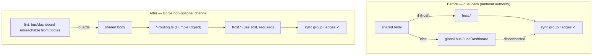
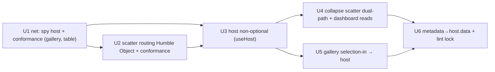

# refactor: Host seam as the single cross-view channel

**Date:** 2026-06-26
**Type:** refactor
**Depth:** Deep
**Origin:** `docs/brainstorms/2026-06-26-host-seam-single-channel-requirements.md`
**Status:** Ready for `/ce-work`

---

## Summary

Make the per-node `host` seam the **single, non-optional** channel for every cross-view interaction (focus, selection-in, selection-out/predicate, view-sync), so a plugin/node body can no longer silently bind to the global dashboard/bus channel and fail to reach its sync group. Delivered as **B + C + A** sequenced **C-net → B → A**: a Humble-Object conformance harness captures current correct routing first (net), then the dual-path collapses to a single channel, then a boundary lint locks the door.

Research refined the brainstorm in two ways that shrink the work: (1) **no host-less render site exists today** — every body is host-backed via its `PluginView` (scatter/image-viewer wrap in `HostProvider`; table/gallery pass `host` as props), so the `useOptionalHost` `else`-branches are dead-defensive, not serving a live path; (2) **no React-test infra exists** (`jsdom`/`testing-library` absent), so conformance is built on plain-function routing modules, not component mounting — no new test dependency.

---

## Problem Frame

Two parallel cross-view state channels exist: the per-node **host seam** (`host.highlight / inputSelection / publishPredicate / publishRowSet / viewSync`, made sync-group- and edge-aware by the `body-dock.tsx` proxy) and the legacy **global channel** (`useDashboard()` + `src/frontend/core/buses` / `stores`). Shared `components/**` bodies that plugin views render branch between them via `host ? host.* : bus.*`, gated on `useOptionalHost()`. Forgetting a branch — or a body reaching a bus inline — silently routes to the global channel, which is disconnected from the node graph's sync groups/edges. The Gallery node shipped exactly this (`useDashboard().actions.setHighlight` instead of `host.highlight.set`); it was fixed per-instance, but nothing stops the next node repeating it. The enforcement gap matches: the Oxlint import-ban (`vite.config.ts:268`) globs `plugins/**` only, leaving `components/**` bodies free to import buses.

This plan closes the **class**, not the instance: the root cause is _ambient authority_ (a reachable global), and the sound fix removes the ability to reach it rather than detecting it after the fact.

---

## Requirements

Traced from origin success criteria:

- **R1** — No shared body reads/writes cross-view state through `useDashboard()` or a global bus; all of it flows through `host.*`.
- **R2** — `useOptionalHost()` is retired; bodies use `useHost()`. Every render path supplies a host.
- **R3** — A registry-driven conformance test fails if any registered view node routes a cross-view gesture anywhere but the host.
- **R4** — A boundary lint fails CI if a shared body imports a cross-view bus / store / `DashboardContext`.
- **R5** — No user-facing behavior change: existing linking still works; the dashboard/dock mount keeps functioning.

---

## Key Technical Decisions

- **KTD1 — Conformance via Humble Object, not component mounting.** Extract each body's cross-view gesture handlers into plain `*-routing.ts` functions `(host, eventData) => void`; the conformance test invokes them with a spy host. Rationale: no `jsdom`/`testing-library` in the repo and no precedent for React-component tests; plain-function routing is testable under the existing runner, covers WebGPU bodies the same as DOM bodies, and is the stronger separation regardless. (Confirmed default.)
- **KTD2 — `host` becomes non-optional (`useHost`).** Audit confirms no host-less render path; flip all `useOptionalHost` callers to `useHost`. The `else`-branches are removed as dead code. Rationale: "make illegal states unrepresentable" — the null-host state stops existing, so no branch can fall to the global channel. (No provider backfill needed — the brainstorm's feared work does not exist.)
- **KTD3 — Metadata moves to `host.data`; `useDashboard` banned wholesale in bodies.** Legit metadata reads (`state.panels`, `state.metadata`, `state.trajectories`) migrate to `host.data`, so the boundary lint can ban `useDashboard` _entirely_ in shared bodies — catching a future `useDashboard().actions.setHighlight` reach that a narrower bus-only ban would miss. (Confirmed default.)
- **KTD4 — Reuse the existing Oxlint `no-restricted-imports` block.** Extend `vite.config.ts:268` with a glob over the shared-body directories (not blanket `components/**`, which contains non-body components that legitimately use the dashboard). No new dependency-cruiser dependency unless element-type rules are later needed. (Confirmed default.)
- **KTD5 — Sequence is C-net → B → A.** The conformance harness lands first as the regression net (captures "every node routes through host" while it's still true), B collapses the dual-path under that net, A turns on the lint only once no body imports a cross-view bus.

---

## High-Level Technical Design

Channel topology — before (dual) vs. after (single):

Unit dependency / sequencing:

---

## Implementation Units

### U1. Spy host + registry-driven conformance harness (the net)

**Goal:** Stand up the conformance fitness test and the routing-extraction pattern, covering the already-host-correct DOM bodies (gallery, table) first to capture current correct routing as the regression net before B changes anything.
**Requirements:** R3.
**Dependencies:** none.
**Files:**

- create `src/frontend/core/plugin/spy-host.ts` — a `PluginHost` test double recording calls to `highlight/inputSelection/publishPredicate/publishRowSet/viewSync`, with a poisoned global-bus sentinel that throws if touched.
- create `src/frontend/components/gallery/gallery-routing.ts`, `src/frontend/components/table/table-routing.ts` — plain functions extracting the existing cross-view handlers (e.g. `onCardClick(host, rowIndex)` → `host.highlight.set`).
- modify `src/frontend/components/gallery/GalleryPane.tsx`, `src/frontend/plugins/gallery/GalleryPluginView.tsx`, `src/frontend/components/table/DataTable.tsx`, `src/frontend/plugins/table/TablePluginView.tsx` — delegate the handlers to the routing modules.
- create `src/frontend/core/plugin/host-routing.test.ts` — registry-driven: iterate view-kind node specs, invoke each available routing module with the spy host, assert `host.*` called and the global-bus sentinel never touched.
  **Approach:** Mirror `core/plugin/node-registry.test.ts` (registry iteration, runs under the existing runner — no jsdom). The harness grows as U2 adds scatter. Gallery/table extraction is mechanical — their handlers already call `host.*`.
  **Patterns to follow:** `src/frontend/core/plugin/node-registry.test.ts` (registry-driven fitness test); `src/frontend/plugins/table/TablePluginView.tsx` (host-routed handler).
  **Execution note:** Net-first — land green before any B unit changes routing.
  **Test scenarios:**
- Covers R3. Gallery routing: `onCardClick(spyHost, "4821")` calls `spyHost.highlight.set("4821")`; global-bus sentinel untouched.
- Table routing: row-click handler calls `spyHost.highlight.set(id)`; sentinel untouched.
- Registry guard: every view-kind node with a routing module is exercised; a node whose routing touches the sentinel fails the suite.
  **Verification:** New conformance suite passes under the existing runner; `vp check` clean.

### U2. Extract scatter routing Humble Object + extend conformance

**Goal:** Pull scatter's cross-view gestures (point-click → focus, lasso → selection-out, brush → selection-in, pan/zoom → view-sync) into a plain routing module so they're verifiable without WebGPU, and bring scatter under the conformance net.
**Requirements:** R3.
**Dependencies:** U1.
**Files:**

- create `src/frontend/components/scatter/scatter-routing.ts`.
- modify `src/frontend/components/scatter/ScatterView.tsx`, `src/frontend/components/scatter/ScatterContent.tsx`, `src/frontend/scatter-gpu/hooks/useScatterBrushSync.ts`, `src/frontend/scatter-gpu/hooks/useIsolationBridge.ts` — delegate gesture handlers to the routing module.
- modify `src/frontend/core/plugin/host-routing.test.ts` — add scatter coverage.
  **Approach:** The routing module takes `host` + event payload and calls the right host method; the React/GPU layers only gather event data and call it. Keep the existing dual-path behavior intact in this unit (still `host ? routing(host) : bus`) — U2 is extraction + coverage only; U3/U4 remove the `else`. This keeps the net green across the refactor.
  **Patterns to follow:** `gallery-routing.ts`/`table-routing.ts` from U1; existing `host.publishPredicate`/`host.onExternalRowSet` usage in `ScatterView.tsx`.
  **Test scenarios:**
- Point-click routing calls `host.highlight.set(rowId)`.
- Lasso routing calls `host.publishPredicate`/`host.publishRowSet` (per current behavior), never `selectionBus`.
- Brush-in routing reads via `host.onExternalRowSet`, never `selectionSyncStore`.
- View pan/zoom routing calls `host.viewSync.broadcast`, never `viewSyncStore`.
  **Verification:** Conformance suite covers scatter and passes; scatter behavior unchanged in the running app (manual smoke: lasso + brush + pan still cross-filter).

### U3. Make `host` non-optional (`useOptionalHost` → `useHost`)

**Goal:** Retire the optional-host escape hatch so the global-fallback state is unrepresentable. Audit confirms no host-less render path; flip every caller to `useHost`.
**Requirements:** R2, R5.
**Dependencies:** U1, U2.
**Files:**

- modify `src/frontend/core/host/host-context.tsx` — remove the stale floating-scatter comment; keep `useHost`; remove `useOptionalHost` (or mark `@deprecated` + unused).
- modify the 7 callers: `src/frontend/core/gpu/gpu-device-context.tsx`, `src/frontend/scatter-gpu/hooks/useIsolationBridge.ts`, `src/frontend/scatter-gpu/hooks/useScatterBrushSync.ts`, `src/frontend/components/crops/CropViewer.tsx`, `src/frontend/components/crops/SingleCropViewer.tsx`, `src/frontend/components/scatter/ScatterContent.tsx`, `src/frontend/components/scatter/ScatterView.tsx`.
  **Approach:** First confirm via grep + the running app that each caller renders only under a `HostProvider`/`PluginMount` (scatter + crops wrap; gpu-device sits under scatter's provider). The image-viewer doc comment references a "host-less `SingleCropViewer`" — resolve it explicitly: either it is hosted (flip) or genuinely host-less (wrap its render site in a `HostProvider`, or keep it reading a host passed by prop). This is the keystone — a missed host-less site throws at runtime from `useHost`.
  **Execution note:** Characterization-first — the U1/U2 conformance net plus a manual app smoke gate each flip; run green before and after.
  **Test scenarios:**
- Conformance suite still green after the flip (no routing regressions).
- Covers R5. Manual smoke: scatter lasso, table/gallery click, image-viewer focus, sync group "A" fan-out all still work.
- A render of any affected body without a provider throws `useHost must be used within a <HostProvider>` (asserts the invariant rather than silently falling back).
  **Verification:** No `useOptionalHost` references remain (grep); app runs with all linking intact; conformance green.

### U4. Collapse scatter dual-path + migrate dashboard cross-view reads → host

**Goal:** Delete the now-dead `host ? host.* : bus.*` `else`-branches in scatter, and migrate `ScatterContent`'s cross-view reads (`highlightId`, `brushSelection`) off `useDashboard` onto `host.highlight` / `host.inputSelection`.
**Requirements:** R1.
**Dependencies:** U3.
**Files:** `src/frontend/components/scatter/ScatterView.tsx`, `src/frontend/components/scatter/ScatterContent.tsx`.
**Approach:** With `host` guaranteed (U3), the `else` arms (`selectionBus`, `selectionSyncStore`, `viewSyncStore`, `actions.setHighlight`) are unreachable — remove them and their imports. Replace dashboard cross-view reads with the host equivalents already used on the host path (`host.highlight.subscribe`/`get`, `host.externalRowSet`/`onExternalRowSet`). Leave pure-metadata reads for U6.
**Patterns to follow:** `ScatterView.tsx:114-121` (scoped `host.highlight.subscribe` read), `ScatterView.tsx:479-501` (`host.onExternalRowSet`).
**Test scenarios:**

- Conformance: scatter routes focus/selection/view-sync exclusively through host (sentinel untouched).
- No `@/core/buses` / `selectionSyncStore` / `viewSyncStore` imports remain in the scatter bodies (grep).
- Covers R5. Manual smoke: scatter highlight reflects sync-group focus; brush still cross-filters.
  **Verification:** Scatter bodies import no cross-view bus; conformance green; `vp check` clean.

### U5. Migrate gallery selection-in (`useLassoSelectionObs`) → host

**Goal:** Route the gallery's selection-in off the global bus onto the host.
**Requirements:** R1.
**Dependencies:** U3.
**Files:** `src/frontend/components/gallery/useLassoSelectionObs.ts`; `src/frontend/components/gallery/GalleryPane.tsx` / `src/frontend/plugins/gallery/GalleryPluginView.tsx` as needed to thread the host source.
**Approach:** Replace `selectionBus` / `selectionSyncStore` reads with `host.externalRowSet()` + `host.onExternalRowSet(cb)` (or the cooked `host.inputSelection`, matching how `GalleryPluginView` already sources the predicate). Preserve the `MAX_GALLERY_OBS` cap and current behavior.
**Patterns to follow:** `GalleryPluginView.tsx` (host.inputSelection sourcing); `ScatterView.tsx` external-row-set handling.
**Test scenarios:**

- Conformance: gallery selection-in reads via host, never `selectionBus`/`selectionSyncStore`.
- Covers R5. Manual smoke: a scatter lasso still populates the wired gallery's contents.
  **Verification:** `useLassoSelectionObs` imports no cross-view bus; gallery still scopes to its wired input; conformance green.

### U6. Metadata → `host.data` + lock the boundary lint

**Goal:** Move the remaining legit metadata reads onto `host.data`, then extend the Oxlint boundary to the shared-body directories so the global channel is unreachable from bodies — the closing ratchet.
**Requirements:** R1, R4.
**Dependencies:** U4, U5.
**Files:**

- modify `src/frontend/components/charts/ChartPanelList.tsx` (`state.panels`), `src/frontend/components/viewer/ViewerControls.tsx` (`trajectories`, `metadata`), `src/frontend/components/gallery/GalleryPane.tsx` (`state.metadata`), `src/frontend/components/scatter/ScatterContent.tsx` (residual metadata) — read from `host.data` instead of `useDashboard`.
- modify `vite.config.ts` — add a `no-restricted-imports` block globbing the shared-body dirs (`components/{scatter,gallery,crops,charts,table,viewer}/**`) banning `@/core/buses`, `@/stores/*`, `**/stores/*`, and `@/dashboard/*` / `useDashboard`.
  **Approach:** Verify `host.data` exposes (or is extended to expose) the metadata each body needs (`metadata`, `panels`, `trajectories`); if a field is missing, surface it on `host.data` rather than re-opening the dashboard door. Scope the lint glob to the body directories only — blanket `components/**` would wrongly hit the dashboard shell and other non-body components that legitimately use `useDashboard`.
  **Patterns to follow:** `vite.config.ts:268-287` (existing plugins/** ban — same rule shape, new glob); `host.ts` `DataContext`.
  **Test scenarios:\*\*
- `Test expectation: none` for the lint config change itself (config, no behavior) — but the conformance suite (R3) and `vp check` (R4) together prove the outcome.
- Covers R4. A deliberate trial import of `@/core/buses` into a body file fails `vp check` (manual verification during the unit, then reverted).
- Covers R1/R5. Manual smoke: charts/viewer/gallery still render with correct metadata.
  **Verification:** No shared body imports `useDashboard` / a cross-view bus (grep + `vp check`); conformance green; app fully functional.

---

## Scope Boundaries

**In:** the cross-view routing contract for plugin/node bodies; the Humble-Object routing modules; the conformance harness; the boundary lint; metadata-onto-`host.data` migration where required to close the dashboard door.

**Out / non-goals:**

- No process isolation (VS Code-style) — not the failure mode.
- No new user-facing feature; behavior-preserving + guardrails only.
- Not retiring the global buses / `DashboardContext` themselves — they remain the implementation the shim host delegates to for non-node mounts; only **direct reach from bodies** is removed.
- Not the dashboard/dock mount's own architecture beyond ensuring it supplies a host (it already does).

### Deferred to Follow-Up Work

- `dependency-cruiser` (element-type-aware boundary rules) if the Oxlint glob proves too coarse as more bodies are added.
- Routing-module extraction for any body not on the cross-view path (pure-display components) — only extract where there's a cross-view gesture.

---

## Risks & Dependencies

- **Keystone risk (U3):** a missed host-less render site throws at runtime from `useHost`. Mitigation: the U1/U2 conformance net + an explicit grep/app-smoke audit before flipping; resolve the `SingleCropViewer` "host-less" comment explicitly.
- **Regression risk (U4/U5):** touching scatter/gallery selection paths can break live cross-filtering. Mitigation: net-first sequencing; manual app smoke per unit (dev server is HMR-live).
- **Lint-glob over-reach (U6):** a blanket `components/**` ban would hit legitimate dashboard consumers. Mitigation: scope the glob to the enumerated body directories.
- **`host.data` completeness (U6):** a metadata field a body needs may not be on `host.data` yet. Mitigation: extend `host.data` rather than keeping the dashboard read.
- **Dependency:** none external; all within `src/frontend`. No new npm dependency (KTD1 avoids `jsdom`/`testing-library`).

---

## Success Criteria

- R1–R5 met: bodies route cross-view state only through `host.*`; `useOptionalHost` gone; conformance suite guards every view node; boundary lint fails CI on a body importing a cross-view bus/dashboard; no user-facing behavior change.
- Gates green: `vp check` (0 errors), `bun test` + the new conformance suite, manual app smoke (sync group "A": click any node → Scatter + Idetik + Gallery follow).

---

## Sources & Research

- Origin requirements: `docs/brainstorms/2026-06-26-host-seam-single-channel-requirements.md`.
- Grounding dossier (host/dashboard/bus topology, file:line): `~/.claude/jobs/28b191ae/tmp/ce-brainstorm-arch/grounding.md`.
- Paradigms (load-bearing on KTD2/KTD4): object-capability model / zero ambient authority (the dual-path = ambient authority → remove reachability); "make illegal states unrepresentable" (non-optional host); architecture fitness functions + import-boundary linting (conformance + lint). VS Code extension-host lesson: enforce structurally, not by discipline.
- Repo facts verified this session: 7 `useOptionalHost` callers; shared bodies rendered only by their `PluginView` (no floating-window site); existing Oxlint ban at `vite.config.ts:268` globs `plugins/**` only; no `jsdom`/`testing-library` and no `.test.tsx` in the repo; `ChartPanelList` reads only `state.panels` (not cross-view).
