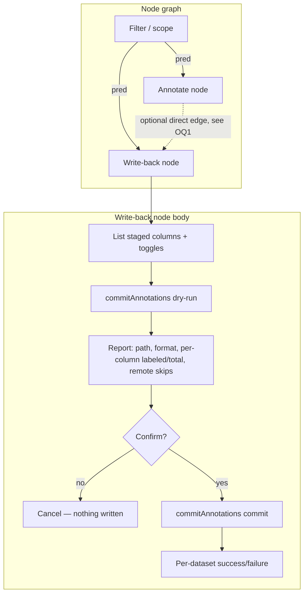

# feat: Annotation write-back node (commit .obs to zarr)

## Summary

Add a terminal "Write-back" node that commits staged annotation columns into the
source AnnData `.obs` on disk. The node is plugin-backed (like the Annotate
node), renders a per-column-toggle + dry-run + confirm panel in its body, and
reaches the already-shipped `POST /api/annotations/commit` endpoint through a new
`commitAnnotations` method on the host's `annotate` capability. Frontend-only —
no server logic changes.

---

## Problem Frame

Labels made in the browser live only in server-side DuckDB `ann_*` staging
tables. The destructive write path back into the source `.zarr` is fully built
and validated (`src/zarr/write-obs.ts`, `POST /api/annotations/commit`), but no
frontend surface calls it — a repo-wide search for `annotations/commit` in
`src/frontend/` finds nothing. Researchers can label but cannot round-trip those
labels into their AnnData without exporting parquet and hand-merging by index.
This plan closes the reach gap.

---

## Requirements

### Node & wiring

- R1. A terminal "Write-back" node whose body drives the commit; it is not a
  control on the Annotate node. (origin R1)
- R2. The node is a sink — no output port, and no data-carrying payload input.
  It takes an optional `pred` input used only for dataset-context and preview
  scoping, never as the thing it commits. (origin R2)
- R3. The commit reaches the server through a new `commitAnnotations` method on
  the host `DataApi`, gated by the `annotate` capability; the node never calls
  an `/api/*` literal directly. (origin R3)
- R4. The body lists every staged annotation column for the dataset with a
  per-column toggle (default all selected); the commit writes the selected set.
  (origin R4)
- R5. Pressing "Write to .obs on disk" runs a dry-run first; the on-disk write
  happens only after an explicit second confirmation. (origin R5)

### Commit behavior (server already enforces these — the node surfaces them)

- R6. Confirming writes the selected columns into the source AnnData `.obs` via
  `POST /api/annotations/commit`. (origin R6)
- R7. The full-width column always lands; un-annotated obs are NA. The dry-run
  count makes this legible ("1,240 of 50,000 labeled"). (origin R7)
- R8. Re-committing an already-committed column overwrites in place; no
  duplicate column or `column-order` entry. (origin R8, server-enforced)
- R9. A pre-existing (non-app) obs column is never overwritten — colliding names
  are blocked at annotation-creation time. (origin R9, server-enforced)

### Disclosure & feedback

- R10. The dry-run panel discloses, per affected dataset: target `.zarr` path,
  format (`v2`/`v3`), total obs, and for each selected column its name, dtype,
  and labeled-of-total count. (origin R10)
- R11. Remote (`http(s)://`) datasets are reported as non-writable; co-committed
  local datasets still proceed. (origin R11)
- R12. Completion surfaces a per-dataset success/failure summary. (origin R12)

---

## Key Technical Decisions

- KTD1. **Plugin-backed view node, not a built-in `Body` node.** The Write-back
  node mirrors the Annotate node (`defineWsNode` with `pluginId` + a `plugin.ts`
  descriptor + a view that receives `NodeHost`). Rationale: it needs the
  `host.api` annotation surface (`listAnnotationColumns`, the new
  `commitAnnotations`) and a non-trivial interactive panel. The Export sink's
  built-in-`Body` + `workspace-store` pattern
  (`src/frontend/nodes/utils/export/node.tsx`, `saveAsCollection` in
  `src/frontend/core/workspace/workspace-store.ts`) is the alternative — better
  for a one-button save, weaker fit for an annotation-domain panel.
- KTD2. **Commit rides the `annotate` capability on `DataApi`.** Add
  `commitAnnotations` next to the existing annotate methods in
  `src/frontend/core/host/use-dashboard-host-shim.ts`; `/api/*` stays in the
  shim (the plugins-never-touch-`/api/*` boundary). Consistent with how
  `writeAnnotationByPredicate` is wired.
- KTD3. **Terminal sink with an optional `pred` input, wired to the working-set
  scope.** The node reads `host.inputSelection` for preview counts. The edge
  carries scope only — "which columns to commit" is server-side state grouped by
  `dataset_key`, not an edge payload, so column selection lives in the node body.
  This honors "node-based and connected" within the `pred | sel | focus`
  vocabulary (no new port kind).
- KTD4. **Per-column selection uses the endpoint's existing optional `columns`
  field** (`CommitAnnotationsBodySchema`, `src/protocol/index.ts:710`). No server
  change; default all columns selected.
- KTD5. **Add a shared response type for the commit report — a discriminated
  union.** The route returns an ad-hoc `{ dryRun, datasets: [...] }` object today
  (`src/server/routes/annotate.ts:280-306`), where each `datasets` entry is one
  of two shapes: a success item (`datasetKey, path, format, nObs, columns:
[{name, kind, nNonNull}], written`) or an error/skip item (`datasetKey, path?,
error`) with no `format`/`columns`. Model it as a zod union in
  `src/protocol/index.ts` so the node body must discriminate on `error` before
  reading `columns`/`format` — otherwise remote-skip and failure rows dereference
  `undefined` and crash the render. Type-only addition; no route logic changes.

---

## High-Level Technical Design

Graph topology and the in-body commit flow:

The Write-back node is connected to the same scope that feeds Annotate (sibling
wiring). A literal `Annotate → Write-back` edge is the nicer UX but depends on
whether a view node can expose a consumable `pred` output (OQ1); sibling wiring
satisfies R2 regardless.

---

## Implementation Units

### U1. `commitAnnotations` on the host contract + shim

- **Goal:** Make `POST /api/annotations/commit` reachable from a plugin via the
  `annotate` capability.
- **Requirements:** R3, R4, R6, R10, R11, R12.
- **Dependencies:** none.
- **Files:**
  - `src/frontend/core/node/host.ts` — add the `commitAnnotations` method to the
    `DataApi` interface (annotate-capability group).
  - `src/frontend/core/host/use-dashboard-host-shim.ts` — implement it inside the
    existing `capabilities.has("annotate")` block; `fetch` `/api/annotations/commit`
    with `?dryRun=1` when `opts.dryRun`, body `{ columns? }`.
  - `src/protocol/index.ts` — add `CommitAnnotationsResponseSchema` / type as the
    discriminated union in KTD5 (success vs. error/skip `datasets` members).
  - `src/frontend/core/host/use-dashboard-host-shim.test.ts` (or the nearest
    existing shim/host test file) — new.
- **Approach:** Signature `commitAnnotations(opts: { dryRun: boolean; columns?: string[] }): Promise<CommitAnnotationsResponse>`.
  Mirror the error handling of `writeAnnotationByPredicate` (throw on `!res.ok`
  with the server `error`). Unlike the write methods, do **not** call
  `refreshMetadata()` — a commit changes on-disk `.obs`, not the DuckDB `dataset`
  VIEW, so no client schema refresh is needed.
- **Patterns to follow:** the `annotate` method block in
  `use-dashboard-host-shim.ts:170-207`; protocol schema style in
  `src/protocol/index.ts` around `CommitAnnotationsBodySchema:710`.
- **Test scenarios:**
  - Happy path: `commitAnnotations({dryRun:true})` requests
    `/api/annotations/commit?dryRun=1` and returns the parsed report.
  - `commitAnnotations({dryRun:false, columns:["a","b"]})` posts
    `{columns:["a","b"]}` to the non-dry-run URL.
  - Omitted `columns` posts a body without a `columns` key (endpoint commits all).
  - Error path: non-OK response throws with the server `error` string.
  - The method is absent on a host lacking the `annotate` capability.
- **Verification:** a plugin holding the `annotate` capability can call
  `host.api.commitAnnotations` and receive the typed report; unit tests pass.

### U2. Write-back node definition + registration

- **Goal:** Register a palette-visible terminal node backed by the Write-back view.
- **Requirements:** R1, R2.
- **Dependencies:** U3 (the view it loads); the end-to-end verification also needs U1.
- **Files:**
  - `src/frontend/nodes/write-back/node.tsx` — `defineWsNode({ id:"write-back",
type:"write-back", kind:"view", pluginId:"write-back", engineKind:"view",
inputs:[{id:"in",kind:"pred",label:"In"}], outputs:[],
cook: passthrough, stage:"stageable", inPalette:true, geometry:{…}, icon })`.
  - `src/frontend/nodes/write-back/plugin.ts` — `defineDescriptor` with
    `capabilities: new Set(["read","annotate"])`, `placement:{container:"docked"}`,
    `load` → `{ Component: WriteBackView, defaultConfig }`.
  - `src/frontend/core/workspace/nodes/index.ts` — import `writeBackNode`, add it
    to the `registerNode` array.
  - `src/frontend/core/workspace/descriptors.ts` — import + `registerDescriptor(writeBackDescriptor)`.
  - `src/frontend/nodes/write-back/node.test.ts` — new (registration/palette).
- **Approach:** Copy the Annotate two-file shape
  (`src/frontend/nodes/annotate/{node.tsx,plugin.ts}`). `pluginId` on the WsNode
  spec MUST equal the descriptor `id` (`"write-back"`). Terminal: `outputs: []`.
- **Patterns to follow:** `annotate/node.tsx`, `annotate/plugin.ts`;
  registration sites `nodes/index.ts:46-64` and `descriptors.ts:41`.
- **Test scenarios:**
  - After `registerBuiltinNodes()`, `write-back` resolves from the registry and
    is listed in the palette (`inPalette`).
  - The descriptor `id` matches the WsNode `pluginId`.
  - `Test expectation: none` for geometry/icon constants.
- **Verification:** the node appears in the Tab/right-click palette and mounts
  its body on the canvas. End-to-end (needs U1 + U3): label some obs in an
  Annotate node, open Write-back, dry-run shows correct counts, confirm writes;
  reopening the store in Python shows the new `.obs` columns (NA for unlabeled).

### U3. Write-back view body (column toggles + dry-run + confirm)

- **Goal:** The interactive panel that lists staged columns, previews, and commits.
- **Requirements:** R4, R5, R7, R10, R11, R12.
- **Dependencies:** U1.
- **Files:**
  - `src/frontend/nodes/write-back/view.tsx` — `WriteBackView({host}: NodeViewProps<…>)`.
  - `src/frontend/nodes/write-back/view.test.tsx` — new.
- **Approach:** On mount, `host.api.listAnnotationColumns()` → checkbox list
  (default all checked). "Write to .obs on disk" → `commitAnnotations({dryRun:true,
columns})` → render the per-dataset report: target `.zarr` path, format, dataset
  total obs, and per selected column its name, dtype, and labeled-of-total (matches
  R10); remote/error datasets render as non-writable rows by discriminating on the
  `error` member of the union (KTD5) before reading `columns`/`format`. Then
  "Confirm" → `commitAnnotations({dryRun:false, columns})` → per-dataset
  success/failure via `host.ui.notify` + inline status. Read
  `host.inputSelection?.predicate?.(null)` only to annotate the preview with the
  in-scope subset; the write is unscoped by predicate (full column). Use the
  shadcn `Button`/`Input`/status patterns from `annotate/view.tsx`.
- **Interaction states:** (1) dry-run pending — disable "Write to .obs on disk"
  with a "checking…" indicator until the report renders; (2) commit pending —
  disable "Confirm" on first click with a "writing…" indicator until the summary
  returns (guards against a double-commit on irreversible data); (3) toggling any
  column after a dry-run clears the rendered report and re-hides "Confirm",
  forcing a fresh dry-run so Confirm commits exactly the previewed set; (4) empty
  staging and all-datasets-remote both disable "Confirm" with an explanatory hint
  ("no columns to write" / "no local datasets to write").
- **Patterns to follow:** `annotate/view.tsx` (host wiring, busy/status state,
  shadcn controls); `ExportNodeBody` in
  `src/frontend/core/workspace/canvas/node-extras.tsx:255-318` for the
  action-button + result-chip shape.
- **Test scenarios:**
  - Covers R10. Dry-run renders one report block per dataset with path, format,
    and per-column labeled/total.
  - Covers R4. Deselecting a column excludes it from the `columns` sent to
    `commitAnnotations`.
  - Covers R5. The real commit fires only after the confirm step, never on the
    first click.
  - Covers R11. A dataset returned with the remote-store error renders as a
    non-writable row while local datasets still show a writable report.
  - Covers R12. A per-dataset thrown error surfaces in the status summary without
    masking the successful datasets.
  - Empty staging (no columns) disables the commit control with an explanatory hint.
  - Covers R5. "Confirm" is disabled while the commit request is in flight (no
    double-commit); "Write to .obs on disk" is disabled during the dry-run.
  - Toggling a column after a dry-run clears the report and re-hides "Confirm",
    forcing a fresh dry-run before the write can fire.
  - When every dataset in the report is remote/non-writable, "Confirm" is disabled
    with a hint (the render tolerates error-member rows without crashing).
- **Verification:** `view.test.tsx` passes against a mock host — dry-run render,
  toggle-invalidation, in-flight disable, and remote/error rows. The canvas-level
  end-to-end check moves to U2 (the node isn't registered until then).

---

## Acceptance Examples

- AE1. Partial labeling → NA. 1,240 of 50,000 obs labeled in `cell_type`;
  committed; `.obs/cell_type` has 50,000 entries, 1,240 non-NA; panel showed
  "1,240 of 50,000". (R7, R10)
- AE2. Subset commit. Three staged columns, one deselected; committed; only the
  two selected land, the third stays in staging. (R4)
- AE3. Re-commit. `cell_type` committed, 300 more obs labeled, committed again;
  on-disk column reflects 1,540 non-NA as one column, one `column-order` entry. (R8)
- AE4. Mixed local/remote. Two datasets, one `https://…`; committed; local
  writes, remote reports "remote stores can't be written back yet". (R11)
- AE5. Collision guard. Source `.obs` already has `leiden`; creating an
  annotation column named `leiden` is refused, so commit can't clobber it. (R9)

---

## Scope Boundaries

- No new port kind — reuse `pred | sel | focus`; the sink takes no data-carrying input.
- Predicate-scoped writes are out — the node writes full-width columns; a wired
  filter scopes only the preview counts.
- Parquet/csv export (`/api/annotations/export`, `/api/export`) unchanged — the
  "don't touch my zarr" path.
- Remote store write-back — out; the endpoint already refuses it.
- No server logic changes — only a shared response _type_ is added (KTD5).

### Deferred to Follow-Up Work

- Direct `Annotate → Write-back` edge (see OQ1) if view nodes cannot expose a
  consumable output; sibling-off-scope wiring ships either way.
- Durability hardening (fsync + temp/rename for all metadata publishes) —
  server-side, tracked in the origin brainstorm.

---

## Open Questions

- OQ1. Can a view node expose a consumable `pred` output so `Annotate →
Write-back` can be wired directly? The Annotate `node.tsx` already declares a
  `focus` output, but the descriptor declares none, and views are described as
  terminal ("chain continues by branching upstream"). Verify against
  `GraphEngine` before adding an Annotate output port. Fallback: sibling wiring
  off the shared Filter (satisfies R2). Resolve during U2.
- OQ2. Confirm-panel surface inside the node body — inline/expandable vs. a
  dialog — and node geometry (`card`/`full` sizes). Resolve during U3.
- OQ3. Editing an already-committed column after the dataset is reopened: the
  committed column becomes a real `.obs` column in the `dataset` VIEW, so
  creating a same-named staging column is then blocked. Define the re-open/re-edit
  path. (origin, deferred)

---

## Risks & Dependencies

- Depends on the shipped server path: `POST /api/annotations/commit`
  (`src/server/routes/annotate.ts:249`) and `commitObsColumns`
  (`src/zarr/write-obs.ts:307`). If the response shape changes, KTD5's type drifts.
- Commit is a real, mostly-irreversible mutation of source data. The dry-run +
  confirm gate (R5) is the primary mitigation; the write is never one click.
- The commit is dataset-global by design (all staged columns for a dataset unless
  `columns` narrows it). The dry-run's full disclosure (R10) is what keeps a
  single node's button from silently writing more than the user expects.

---

## Sources / Research

- Origin brainstorm: `docs/brainstorms/2026-07-01-annotation-zarr-commit-requirements.md`.
- Host contract + annotate capability: `src/frontend/core/node/host.ts:54` (DataApi),
  `:172` (NodeHost).
- Shim (only frontend caller of `/api/annotations/*`, never `/commit`):
  `src/frontend/core/host/use-dashboard-host-shim.ts:170-207`.
- Annotate node (two-file plugin pattern): `src/frontend/nodes/annotate/node.tsx`,
  `plugin.ts`, `view.tsx`.
- Sink-node precedent (built-in Body alternative, KTD1):
  `src/frontend/nodes/utils/export/node.tsx`, `ExportNodeBody` in
  `src/frontend/core/workspace/canvas/node-extras.tsx:255-318`, `saveAsCollection`
  in `src/frontend/core/workspace/workspace-store.ts:621-654`.
- Node registration: `src/frontend/core/workspace/nodes/index.ts:39-82`,
  `src/frontend/core/workspace/descriptors.ts:41`.
- `defineWsNode` / `WsNodeSpec` / `passthrough`:
  `src/frontend/core/workspace/node-kit.ts:144-185`.
- Commit endpoint + schema: `src/server/routes/annotate.ts:249-306`,
  `CommitAnnotationsBodySchema` at `src/protocol/index.ts:710`.
- Zarr write module: `src/zarr/write-obs.ts:307` (`commitObsColumns`), dry-run
  report `:318`, idempotent `column-order` `:344`.
