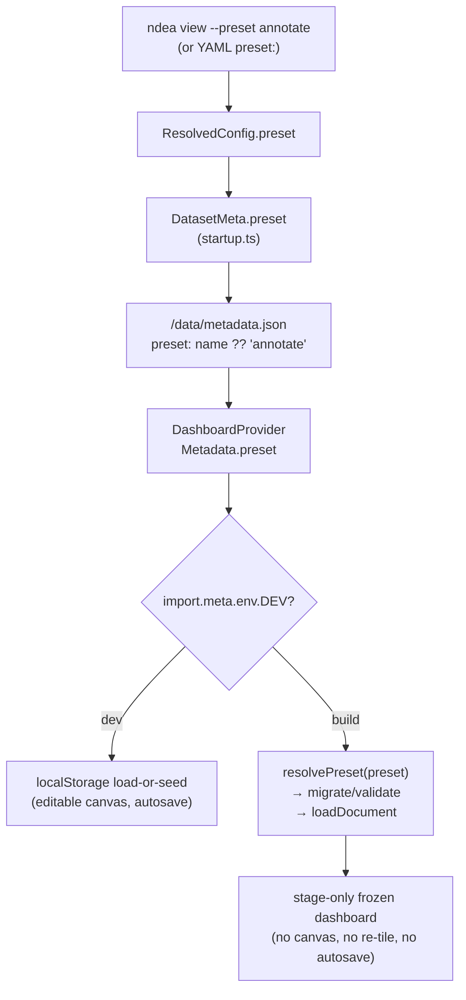

# feat: Annotate preset + build-gated node editor

## Summary

Ship an `annotate` preset: a shipped build (with `--preset annotate`, or with no
`--preset` at all) opens a fixed, tiled annotate dashboard — Scatter / Idetik /
Gallery / Table / Annotate — built from a bundled node graph. Node authoring is
compiled out of builds via `import.meta.env.DEV`, so users operate the panels but
can't add, delete, rewire, or re-tile.

---

## Problem Frame

The node system is in flux and not ready for end users, but the annotate workflow
it produces is. Today every launch opens the full node editor, dropping a
researcher who just wants to lasso, label, and view crops into a graph-authoring
surface they shouldn't touch. Two needs fall out: expose the _result_ (a ready
annotate dashboard) without the editor, and make that setup reproducible from one
launch command. This narrows the resolved preset design
(`.design/preset-replay-plan.md`, Plan v2) to the annotate case, plus a
tightening — the editor is _absent_ from builds, not merely locked — which lets
the read-only build drop Plan v2's scratch / reset / allow-list / warning
machinery (see origin: `docs/brainstorms/2026-07-06-annotate-preset-requirements.md`).

---

## High-Level Technical Design

The preset name flows CLI → server → metadata; the frontend load-or-seed seam
branches on the compile-time `import.meta.env.DEV` constant. In a build, the
bundled preset doc is authoritative and authoring surfaces are absent; in the dev
server, today's editable localStorage path is unchanged.

---

## Key Technical Decisions

- Freeze via `import.meta.env.DEV`, not a runtime mode: the editor is genuinely
  absent from the binary (R5), no runtime config plumbing; swap for a flag later
  when the node system stabilizes (see origin).
- Not mounting the wiring canvas in a build is the freeze's main lever: the Tab
  palette, right-click add-menu, knife, connect, and node-delete listeners all
  live in `WorkspaceCanvasInner` (`src/frontend/core/workspace/canvas/WorkspaceCanvas.tsx`),
  so unmounting removes them at the source — more complete than a per-affordance
  flag. Node bodies live in the body-dock (`WorkspaceBodies`) and are adopted by
  stage tiles, so the stage is unaffected.
- The preset carries its own stage layout: the bundled doc sets `disposition:
"hidden"` (stage fills the frame) and the `stageTree` tile arrangement (R8, R10).
  Build code loads and locks; it does not reconstruct the dashboard.
- Reuse the existing `persist.ts` `migrate` → `dropUnknownNodes` → `validateDoc`
  path for preset resolution — the "saved docs never load corrupt" guarantee
  applies identically to a bundled preset; no parallel validation.
- Preset name is session-global and defaults to `annotate` server-side, so a
  no-flag build (R2) needs no client default — the frontend just reads
  `metadata.preset`. The client registry starts single-entry.
- Author-and-export via a dev console snippet (reusing the existing
  `window.__ndeaWs`), not an export UI — see Open Questions.

---

## Requirements

### Launch & default

- R1. `ndea <config> --preset annotate` opens the frozen annotate dashboard.
- R2. A shipped build launched with no `--preset` opens the same annotate
  dashboard — annotate is the default.
- R3. The active preset name reaches the frontend via `/data/metadata.json`.

### Freeze / build gating

- R4. In a build the node-authoring affordances are absent: the Tab palette, the
  right-click add-node menu, node add/delete/rewire, and stage re-tiling.
- R5. Authoring is gated on `import.meta.env.DEV` — live in the dev server,
  compiled out of every build (no runtime flag).
- R6. The graph and every view body stay interactive in a build: lasso in
  Scatter, label + write-to-`.obs` in Annotate, crop viewing in Idetik/Gallery.
- R7. A build persists no graph edits — the bundled preset is authoritative on
  every launch (read-only session).

### The annotate preset

- R8. The preset is one bundled `PersistedDoc` capturing both the node graph and
  its saved stage layout, authored in the dev server and exported.
- R9. Its graph is: `obs` → `Wrangle` → `Table` + `Count`; `Wrangle` → `Scatter`
  (phate) → lasso → `Cache` → `Annotate`; `Idetik` (`fov`) + `Gallery` render
  crops for the cached scope.
- R10. It opens to the tiled dashboard layout, not the node canvas.

---

## Key Flow

- F1. Frozen launch.
  - **Trigger:** `ndea <config> [--preset annotate]` on a build.
  - **Steps:** server resolves the name (or default `annotate`) → the name rides
    `/data/metadata.json` → the frontend load-or-seed path resolves the bundled
    preset doc through migrate/validate and hydrates it → the saved stage layout
    opens → authoring is absent because `import.meta.env.DEV` is false.
  - **Outcome:** a frozen annotate dashboard the user operates but can't
    restructure.
  - **Covers:** R1–R7, R10.

---

## Implementation Units

### U1. Carry the preset name CLI → server → metadata

- **Goal:** the active preset name reaches the frontend on `/data/metadata.json`,
  selectable by `--preset` or a YAML `preset:` field, defaulting to `annotate`.
- **Requirements:** R1, R2, R3.
- **Dependencies:** none.
- **Files:**
  - `src/cli/commands/view.ts` — add a `preset` option; read it in `resolveConfig`
    (CLI flag overrides the YAML field).
  - `src/cli/config.ts` — `ResolvedConfig.preset?: string`; `ProjectConfig.preset?:
string` (top-level YAML field).
  - `src/cli/startup.ts` — set `datasetMeta.preset` from `config.preset` (the
    `DatasetMeta` literal ~L371).
  - `src/server/state.ts` — `DatasetMeta.preset?: string`.
  - `src/server/routes/meta.ts` — emit `result.preset = config.preset ?? "annotate"`.
  - `src/protocol/index.ts` — `MetadataSchema`: `preset: z.string().optional()`.
  - `src/server/__tests__/app.test.ts` — assert the metadata payload.
- **Approach:** session-global name riding the existing `DatasetMeta` (the `config`
  `handleMetadata` already receives). CLI `--preset` beats YAML `preset:`. The
  `annotate` default lands server-side so R2 needs no client-side default.
- **Patterns to follow:** mirror the existing `--obs-columns` flag and the
  `port`/`host` YAML `settings` threading in `view.ts` / `config.ts`.
- **Test scenarios:**
  - Covers R3. GET `/data/metadata.json` with no `--preset` → `preset: "annotate"`.
  - `--preset foo` → `preset: "foo"` (server passes the name through verbatim;
    unknown-name handling is client-side, U2).
  - YAML `preset: bar` with no CLI flag → `preset: "bar"`; a CLI `--preset`
    overrides the YAML field.
- **Verification:** the metadata endpoint reflects the resolved name across the
  no-flag, CLI, and YAML paths.

### U2. Preset registry + bundled annotate doc

- **Goal:** resolve a preset name to a validated, ready-to-hydrate `WsState` from a
  bundled doc; ship the authored annotate graph as that doc.
- **Requirements:** R8, R9, R10.
- **Dependencies:** none.
- **Files:**
  - `src/frontend/core/workspace/presets.ts` (new) — `resolvePreset(name): WsState | null`.
  - `src/frontend/core/workspace/annotate.doc.json` (new) — the exported `PersistedDoc`.
  - `src/frontend/core/workspace/__tests__/presets.test.ts` (new).
- **Approach:** `resolvePreset` maps a known name to a statically-imported JSON
  `PersistedDoc` and runs it through the SAME `migrate` → `dropUnknownNodes` →
  `validateDoc` path `loadFromStorage` uses (reuse those exports from
  `persist.ts`), returning the `state` on ok or `null` (with a `console.warn`) on
  invalid or unknown name. A single-module `Record<string, PersistedDoc>`; no
  `presets.json` catalog yet.
  - Authoring the doc (execution): in `vp run dev`, build the R9 graph, arrange the
    stage tiles, set disposition to `hidden`, then serialize via the devtools
    console — `copy(JSON.stringify({ version: 2, state: window.__ndeaWs.store.state }))`
    — and commit the result as `annotate.doc.json`. Keep the annotate `Wrangle`
    identity (no PRQL filter): a wrangle predicate compiles only when its body mounts
    (`WranglePane` → `ws.setWranglePred`) and a build stages none of the non-view
    nodes, so a filter authored into it would silently not apply in a build (see Open
    Questions).
- **Patterns to follow:** reuse `migrate` / `validateDoc` / `dropUnknownNodes`
  from `src/frontend/core/workspace/persist.ts` — identical guarantees to the
  localStorage load path.
- **Test scenarios:**
  - Covers R8. `resolvePreset("annotate")` returns a non-null `WsState`; the bundled
    doc passes validation via the resolver.
  - Covers R9. the resolved state's node types include `obs`, `wrangle`, `table`,
    `count`, `scatter`, `cache`, `annotate`, `fov`, `gallery`; edges connect
    `obs→wrangle`, `wrangle→{table,count,scatter}`, `scatter→cache→annotate`.
  - Covers R10. the resolved state has `disposition === "hidden"` and a `stageTree`
    placing the five view tiles.
  - `resolvePreset("unknown")` → `null` (no throw).
- **Verification:** the resolver round-trips the committed doc into a valid state;
  loading it (U3) yields the tiled dashboard.

### U3. Freeze builds: load the preset, compile out authoring

- **Goal:** in a build, load the resolved preset as the authoritative session doc,
  persist nothing, and remove every authoring/canvas affordance; leave dev
  unchanged.
- **Requirements:** R1, R2, R4, R5, R6, R7, R10; F1.
- **Dependencies:** U1, U2.
- **Files:**
  - `src/frontend/core/workspace/workspace-context.tsx` — load branch + autosave gate.
  - `src/frontend/core/workspace/WorkspaceShell.tsx` — gate the canvas mount, the
    disposition control, the ⇧F handler, the strip wiring chrome, and the authoring
    hint text on `import.meta.env.DEV`.
  - `src/frontend/core/workspace/stage/StagePane.tsx` — gate the re-tile affordances
    (`SplitButton`, sash drag, tile drag-swap, pull-to-canvas, empty-slot
    fill/dismiss) and the tile-header `FlagButton` (node bypass / display-off) on
    `import.meta.env.DEV`.
- **Approach:**
  - Load-or-seed: `if (import.meta.env.DEV)` keep today's localStorage path; `else`
    `const s = resolvePreset(metadata.preset ?? "annotate") ?? resolvePreset("annotate");
s ? w.loadDocument(s) : seedWorkspace(w)` — a typo'd or unknown `--preset` in a
    build falls back to the annotate default, never the canvas-less `seedWorkspace`
    layout (`seedWorkspace` builds the editable seed graph with a `strip` disposition,
    which renders a dead strip gap once the canvas is unmounted and the disposition
    control gated). Gate the autosave effect with an early `if (!import.meta.env.DEV)
return;` — a build persists nothing (R7); the bundled doc is authoritative each
    launch.
  - Shell: wrap the `<WorkspaceCanvas />` render, the `disposition === "strip"`
    wiring-chrome block, the StatusBar disposition `ButtonGroup`, the ⇧F keydown
    effect, and the authoring hint text in `import.meta.env.DEV`. Not mounting the
    canvas removes Tab / right-click / knife / connect / delete in one move. The
    doc's `disposition: "hidden"` renders the frame stage-only (R10); with the
    control gated the user can't leave it.
  - Stage: gate the re-tile affordances and the tile-header `FlagButton` — bypass /
    display-off mutates persisted graph state, an authoring affordance that lives in
    the tile header _outside_ the canvas, so unmounting the canvas does not remove it
    (R4). Body interactions — lasso, cache pin, annotate label + write-to-`.obs`
    commit, crop viewing — are node-body actions, not authoring, and stay untouched
    (R6); the tile header's doc and fullscreen buttons are view actions and stay.
- **Execution note:** verify the `!DEV` behavior in a compiled build (`vp run build`
  → run the binary); the dev-server vitest run can't exercise the `import.meta.env.DEV`
  gate.
- **Patterns to follow:** `import.meta.env.DEV` is already used in
  `workspace-context.tsx` (the `__ndeaWs` block) and `core/gpu/device-manager.ts`.
- **Test scenarios:**
  - Covers R6/R7 (dev path unchanged). In the vitest env (`import.meta.env.DEV ===
true`) the load-or-seed and autosave behavior is unchanged — a saved doc still
    hydrates, seeding still runs on a miss, autosave still fires. Existing
    workspace-context / persist tests continue to pass.
  - The build-freeze behaviors (R4, R5, R10, F1) have no runnable unit test — vitest
    runs with `DEV` true and the gate is a build-time constant. Their coverage is the
    compiled-build verification below; the load branch's core logic (does the doc
    hydrate into a valid graph) is already covered by U2's resolver test.
- **Verification:** a compiled binary opens the tiled annotate dashboard with no
  authoring surfaces and no persistence — Tab / right-click / knife do nothing, tiles
  can't split / swap / resize, no bypass / display-off toggle is reachable — while
  lasso → cache → annotate → commit and crop viewing all work; a typo'd `--preset`
  falls back to annotate (not a canvas-less layout); and if the shipped Wrangle ever
  carries a filter, the wrangled subset (not the full obs set) reaches Table/Scatter.
  `vp run dev` still opens the editable canvas.

---

## Scope Boundaries

### Deferred to Follow-Up Work

- A dev "export preset" button — near-term authoring uses the console snippet (U2).
- A dev "load preset into the editor" affordance for iterating on a committed doc —
  near-term the dev localStorage is the working copy; restore a committed doc by
  hand if needed.
- A `presets.json` catalog + per-preset registry items — arrives with a second
  preset; the single-module resolver (U2) covers the one-preset case.

### Deferred for later (from origin)

- The `--dev` in-build authoring escape hatch — revisit when the node system
  stabilizes; then swap the compile-time gate for a runtime flag.
- Plan v2's per-preset scratch, "reset to preset," editable allow-list, and
  dev-in-flux warning — unneeded while builds are read-only.
- Multiple presets — near-term ships only `annotate`, as the default.

### Outside this feature (from origin)

- Remote/fetched presets, a preset marketplace, and a preset-manager UI.
- Supernode / composable / nested presets (Plan v2's "later" layer).
- Editing a preset inside a build — presets are authored in the dev server and
  exported; builds never author.

---

## Open Questions

- A quiet `Preset: annotate` badge in the build chrome (Plan v2 signalling) — the
  plan omits it (read-only build, nothing to unlock). Add later if the preset name
  should be visible.
- Wrangle filter in a build. A `Wrangle`'s predicate compiles only when its body
  mounts (`WranglePane` → `ws.setWranglePred`), and a build stages none of the
  non-view nodes, so a filter authored into the annotate `Wrangle` would apply in dev
  (canvas always mounted) but silently not in a build — a works-in-dev / silent-in-build
  divergence. Near-term the shipped Wrangle stays identity (U2). If a preset ever needs
  a wrangle filter, either compile the predicate on load (in `loadDocument`, from
  `node.config.prql`) or stage the Wrangle tile — decide when that need arrives.
- The annotate preset's `Cache` node loads live (a cache pin is not persisted —
  see `loadDocument` in `workspace-store.ts`), so on a fresh launch Idetik/Gallery
  show crops for the full wrangled scope until the user lassos and caches. Confirm
  this initial state reads correctly during the U3 build verification; if a
  pre-scoped initial view is wanted, that needs a persisted-pin mechanism (not in
  scope).

---

## Risks & Dependencies

- Depends on Plan v2's shape (`.design/preset-replay-plan.md`): the load-or-seed
  seam, `PersistedDoc` + `validateDoc` + `migrate`. All verified present; the
  preset path is a small addition on the existing seam.
- The freeze correctness hinges on the canvas being the _sole_ home of the Tab /
  right-click / knife / connect listeners. Verified in `WorkspaceCanvas.tsx` today;
  if a future change moves an authoring listener up into `WorkspaceShell` or a
  body, the DEV gate must move with it. Called out in the U3 verification.

---

## Sources / Research

- Origin: `docs/brainstorms/2026-07-06-annotate-preset-requirements.md`.
- Prior design: `.design/preset-replay-plan.md` (Plan v2).
- Load-or-seed + persistence seam: `src/frontend/core/workspace/workspace-context.tsx`,
  `src/frontend/core/workspace/persist.ts` (`migrate` / `validateDoc` /
  `dropUnknownNodes` / `loadFromStorage`).
- Authoring surfaces: `src/frontend/core/workspace/canvas/WorkspaceCanvas.tsx` (Tab,
  right-click `AddNodeMenu`, knife, connect); `src/frontend/core/workspace/stage/StagePane.tsx`
  (`SplitButton`, sash, tile swap, pull-to-canvas); `src/frontend/core/workspace/WorkspaceShell.tsx`
  (disposition control, ⇧F, wiring chrome).
- Metadata wire: `src/server/routes/meta.ts`, `src/server/state.ts` (`DatasetMeta`),
  `src/cli/startup.ts` (~L371), `src/protocol/index.ts` (`MetadataSchema`),
  `src/frontend/dashboard/DashboardProvider.tsx` (reads `/data/metadata.json`).
- Node types (R9) confirmed in `src/frontend/core/workspace/types.ts` (`WsNodeType`):
  `obs`, `wrangle`, `table`, `count`, `scatter`, `cache`, `annotate`, `fov`, `gallery`.
