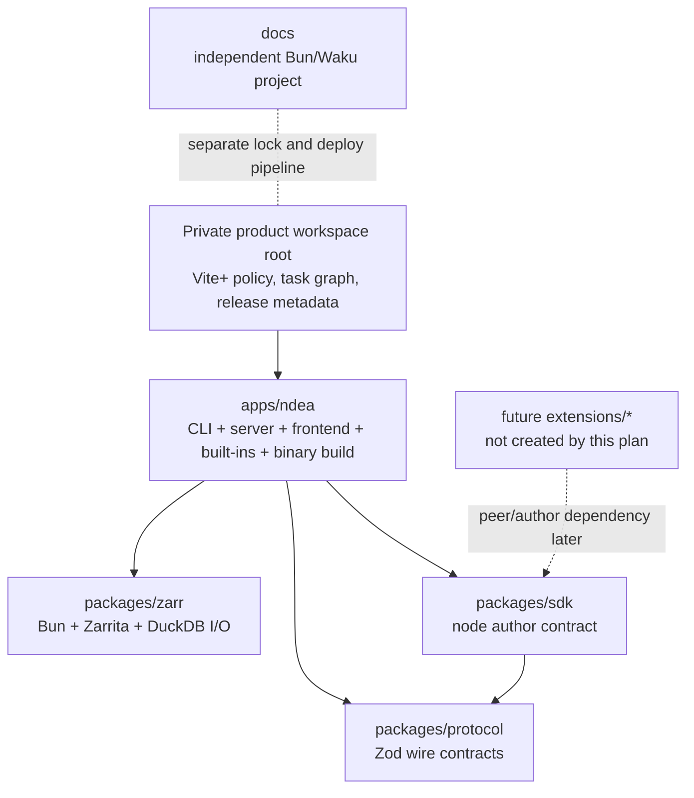
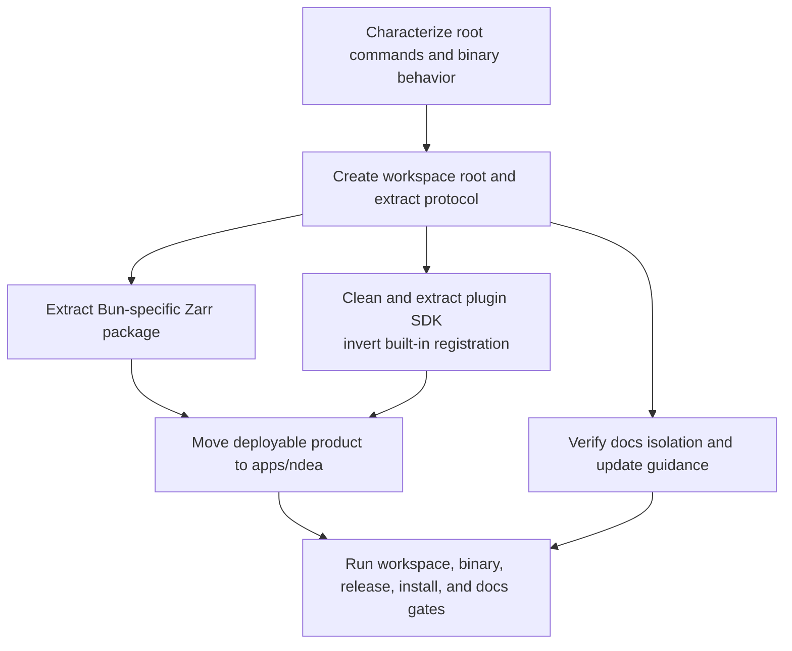

# refactor: Convert repository to a Vite+ monorepo

## Summary

Convert the product into a private Bun workspace orchestrated by Vite+, with one deployable `ndea` application and three earned package seams: protocol, Bun-specific Zarr I/O, and the node plugin SDK. Preserve the current single-binary product, root developer commands, release/install behavior, and independently deployed docs; prepare extension boundaries without designing the future extension runtime.

---

## Problem Frame

The root package now owns four different concerns: the Bun CLI/server application, the React frontend, reusable Zarr I/O, and shared protocol contracts. `vite.config.ts`, `tsconfig.json`, dependencies, tests, generated files, and release scripts therefore share one boundary even though their runtimes differ. `docs/` is already an independent Waku deployment with a separate lockfile and CI install; the product workspace must not pull it under root Vite/Vitest overrides.

A future extension ecosystem needs explicit dependency direction and narrow supported exports. It does not need an installer, loader, marketplace, or broad public API today. Pi and Oh My Pi support extension growth because their composition package depends inward on smaller packages; extensions depend on a public host contract rather than host internals. The useful lesson is the dependency graph, not either repository's package count.

This migration carries forward the local “extract after evidence” rule from `docs/brainstorms/2026-06-26-nodes-as-internal-plugins-requirements.md`. Built-in frontend nodes remain app-local, plugin-like modules. Packages exist only where current callers already prove a seam.

---

## Requirements

### Workspace and package boundaries

- R1. Root becomes a private Bun workspace over `apps/*` and `packages/*`, with one pinned Bun package manager, one workspace lock, one root Vite+ policy, and explicit workspace dependencies.
- R2. `apps/ndea` remains the only product composition root: CLI, Bun.serve server, React shell, built-in nodes, static assets, and custom single-binary builder ship together.
- R3. `@ndea/protocol`, `@ndea/zarr`, and `@ndea/sdk` expose narrow package entrypoints; no package imports from `apps/ndea` or another package's private source paths.
- R4. Runtime-specific TypeScript configs preserve browser, Bun/server, and runtime-neutral environments instead of sharing today's combined DOM/Bun/WebGPU type set.
- R5. `docs/` remains an independent Bun/Waku project with its own lock, install, build, and Pages deployment; root workspace discovery and overrides exclude it.

### Product and distribution compatibility

- R6. `ndea` keeps the same CLI commands, default `ndea <path>` behavior, HTTP/WebSocket routes, frontend behavior, and root output path `dist/ndea`.
- R7. Production remains Bun-native: Bun.build bundles the frontend, generated manifests embed assets and DuckDB libraries, and `bun build --compile` produces one platform-specific executable.
- R8. Product version has one source of truth in the application package; tag checks, generated CLI version, manifests, canary builds, releases, installers, rollback, and GC read that value.
- R9. Existing root workflows remain recognizable: `vp run dev <dataset>`, `vp check`, `bun test`, `vp run build`, and `vp run gen` continue to work from repository root.

### Extension readiness

- R10. The node author contract becomes an independently importable SDK while registry construction, host implementation, app state, GPU implementation, and built-in registration remain in `apps/ndea`.
- R11. App composition imports and registers built-ins; reusable core code never enumerates built-ins.
- R12. This migration creates no extension discovery, lifecycle, trust, package-installation, sandbox, compatibility-negotiation, or marketplace contract.

### Migration safety

- R13. Each migration unit leaves a buildable, testable repository; leaf packages move before the app's path-sensitive build and release surfaces.
- R14. Tests move with ownership, while cross-package and compiled-binary behavior stays at the application boundary.
- R15. Long-running, release, signing, native, generated-file, and custom single-binary tasks remain uncached until their environment, inputs, outputs, permissions, and platform behavior are proven safe.

---

## Key Technical Decisions

- KTD1. **Use Vite+ as the monorepo UX over Bun workspaces; add no second orchestrator.** Contributors use Vite+'s recursive, transitive, filtered, parallel, checked, and cached task surface. Bun remains the runtime, package manager, workspace linker, catalog owner, and lockfile owner underneath. Vite+ derives task order from ordinary `workspace:*` manifest edges, so Nx, Turborepo, and a second task graph would duplicate its ergonomics.
- KTD2. **Keep root thin and policy-oriented.** Root owns workspace declarations, shared dependency versions/overrides, Vite+ lint/format/staged policy, orchestration aliases, release metadata, CI, and the root lock. App-specific React/Tailwind/TypeGPU/proxy config lives with `apps/ndea`.
- KTD3. **Extract only three packages now.** Protocol is a Zod-only leaf; Zarr already has a public barrel and no production server imports; the node SDK already declares an author-facing seam and its own compatibility version. Server, web, graph runtime, UI, and built-ins have one consumer or app back-edges, so they remain in the application.
- KTD4. **Move the application last.** Protocol, Zarr, and SDK imports become package-clean while current build paths remain stable. Only then does the mechanical move to `apps/ndea` update Bunli, worker paths, generated manifests, aliases, native embedding, and release scripts in one controlled unit.
- KTD5. **Application package owns product version.** A private tooling root should not masquerade as the shipped product. `apps/ndea/package.json` becomes the value read by version generation and release checks; root delegates without duplicating the version.
- KTD6. **Internal packages export source, privately, through allowlisted entrypoints.** Bun and Vite can consume TypeScript workspace sources directly. No package build or npm publication enters this migration. Future publication can add `vp pack`, files lists, semver, and release policy when an external consumer exists.
- KTD7. **The plugin SDK is narrower than a future extension API.** It exposes node specs, descriptors, host-facing types, JSON/config vocabulary, and compatibility version. Its package manifest owns that SDK version independently from the app version; generated/runtime constants derive from it. The app keeps registry instances, stateful services, UI controllers, device implementations, and discovery. A future `@ndea/extension-api` may compose this SDK with events and host actions after concrete extension requirements exist.
- KTD8. **Keep custom build scripts behind `vp run`, never `vp build`.** Vite+ reserves `vp build` for its built-in Vite build, which would bypass the current Bun single-binary pipeline. Package scripts remain uncached by default; dev and custom binary/release tasks also declare caching off.
- KTD9. **Keep `docs/` outside the product workspace.** It contains product content, brainstorms, and plans as well as a separately deployed Waku app. Its lock currently shields Waku from the root Vite/Vitest replacements; preserve that boundary instead of moving it or forcing one resolution domain.

---

## High-Level Technical Design

### Target dependency topology



Cardinal rule: arrows point inward. `packages/**` never imports `apps/**`; the SDK never imports registry instances, app aliases, stores, components, or GPU implementations.

### Migration flow



Leaf extraction precedes relocation. This avoids changing package boundaries and every `$bunfs`/generated path in one diff.

---

## Output Structure

```text
.
├── apps/
│   └── ndea/
│       ├── package.json
│       ├── tsconfig.json
│       ├── vite.config.ts
│       ├── components.json
│       ├── index.html
│       ├── scripts/
│       └── src/
│           ├── cli/
│           ├── server/
│           └── frontend/
├── packages/
│   ├── protocol/
│   │   ├── package.json
│   │   ├── tsconfig.json
│   │   └── src/
│   ├── zarr/
│   │   ├── package.json
│   │   ├── tsconfig.json
│   │   └── src/
│   └── sdk/
│       ├── package.json
│       ├── tsconfig.json
│       └── src/
├── docs/                       # independent package, lock, app, content, plans
├── .bunli/                     # committed root-generated CLI metadata
├── bunli.config.ts             # root generation compatibility surface
├── scripts/                    # root release/install helpers only
├── dist/                       # unchanged product output location
├── package.json                # private workspace root
├── bun.lock                    # product workspace lock; docs keeps its lock
├── tsconfig.base.json
├── tsconfig.json               # aggregate check surface
└── vite.config.ts              # shared Vite+ policy and orchestration
```

No empty `extensions/`, `extension-api`, `graph-runtime`, `server`, `web`, or `ui` package lands during this migration.

---

## Implementation Units

### U1. Establish workspace root and extract protocol

- **Goal:** Prove Bun/Vite+ workspace discovery with the cleanest existing leaf while the deployable app remains at root.
- **Requirements:** R1, R3, R4, R9, R13.
- **Dependencies:** None.
- **Files:** `package.json`, `bun.lock`, `vite.config.ts`, `tsconfig.json`, `tsconfig.base.json`, `packages/protocol/package.json`, `packages/protocol/tsconfig.json`, `packages/protocol/src/index.ts`, `packages/protocol/src/index.test.ts`, `src/server/protocol.ts`, protocol consumers under `src/frontend/**`.
- **Approach:** Make root private; pin Bun; declare workspace paths; centralize only versions shared by multiple workspaces. Move protocol intact, expose one allowlisted root entry, declare Zod locally, and replace relative cross-boundary imports with `@ndea/protocol`. Keep root commands as compatibility aliases.
- **Execution note:** Before the first edit, capture an unchanged compatibility baseline for root commands, CLI help/defaults/exit codes, generated Bunli output, representative HTTP/WS responses, served asset manifest, product and SDK versions, and an isolated compiled-binary worker run. Later units compare against this baseline; intentional differences require explicit approval.
- **Patterns to follow:** Vite+ root config with root-relative overrides; Bun `workspace:*` dependencies; Pi's narrow exports rather than OMP's wildcard host exports.
- **Test scenarios:**
  1. Parse each existing representative request/response payload through `@ndea/protocol` and preserve success/failure behavior.
  2. Import protocol from both browser and Bun/server type environments without pulling Bun, Node, React, or WebGPU globals into the package.
  3. Run a Vite Task go/no-go probe covering recursive/transitive check order, root self-pruning, fail-on-no-match filters, clean environment propagation, uncached custom tasks, and docs exclusion. Stop task-graph expansion if a required invariant fails.
- **Verification:** Root install creates one linked protocol workspace; root static checks and protocol tests pass; no remaining app import reaches `packages/protocol/src/**` by relative path.

### U2. Extract Bun-specific Zarr I/O

- **Goal:** Turn the existing Zarr public surface into an honest Bun-targeted workspace package.
- **Requirements:** R2, R3, R4, R7, R13, R14.
- **Dependencies:** U1.
- **Files:** `packages/zarr/package.json`, `packages/zarr/tsconfig.json`, `packages/zarr/src/**`, `src/index.ts`, Zarr consumers under `src/cli/**` and `src/server/**`, `scripts/build.ts`, `src/server/__tests__/zarr-ingest.test.ts`.
- **Approach:** Move `src/zarr/**` behind `@ndea/zarr`; keep Bun.file/Bun.write, Zarrita, Flechette, DuckDB, and worker behavior explicit. Delete the now-redundant root facade. Split `src/zarr/__tests__/anndata.test.ts` so package tests cover Zarr/Arrow/DuckDB behavior and the server-dependent ingestion case lives with the app. Update the compile entrypoint and runtime URL atomically from one explicit column-worker path contract; do not defer this intermediate binary requirement to the app move.
- **Patterns to follow:** Existing `src/zarr/index.ts` allowlist; OMP's runtime-specific leaf packages; no false runtime-neutral abstraction.
- **Test scenarios:**
  1. Open representative AnnData, MuData, OME-Zarr, and sharded stores through the package entrypoint and preserve parsed discriminants and data access.
  2. Read the v3 shard index through suffix-range access and preserve CRC32C decoding.
  3. Ingest Zarr frames into the app's DuckDB store without creating a package-to-app dependency.
  4. Compile and execute the moved column worker from an isolated binary location.
- **Verification:** Zarr package tests pass independently; app integration tests consume only `@ndea/zarr`; production package code imports no app/server module; binary worker smoke passes.

### U3. Extract plugin SDK and invert registration

- **Goal:** Make today's internal node author contract the first extension-ready package without freezing a general extension system.
- **Requirements:** R3, R10, R11, R12, R13, R14.
- **Dependencies:** U1.
- **Files:** `packages/sdk/package.json`, `packages/sdk/tsconfig.json`, `packages/sdk/src/**`, `src/frontend/core/node/{sdk,types,host,json,version}.ts`, `src/frontend/core/node/registry.ts`, `src/frontend/core/workspace/descriptors.ts`, `src/frontend/core/workspace/nodes/index.ts`, `src/frontend/main.tsx`, `src/frontend/nodes/**`, node/registry tests under `src/frontend/core/node/**`.
- **Approach:** Move only author-facing contracts. Replace app aliases and concrete GPU/service types with SDK-owned structural contracts or protocol imports. Declare every React, Zod, Mosaic, and protocol type visible in public declarations as a real dependency or peer. Keep registry, host construction, buses, workspace state, lazy view loading, and built-in implementations app-local. Make the app entrypoint register SDK consumers and built-ins through one idempotent bootstrap; reusable code stops importing the built-in catalog. Preserve node IDs, config versions, built-in-first conflict handling, registration order, and persisted document behavior.
- **Patterns to follow:** Current node SDK compatibility version; local node anatomy requirements; OMP/Pi separation between public extension types and host composition; Pi's allowlisted exports.
- **Test scenarios:**
  1. Define a minimal node and descriptor through `@ndea/sdk`, then register and mount it through the app host.
  2. Reject incompatible SDK versions with the same diagnostic as today.
  3. Register every built-in exactly once in deterministic palette order; preserve persisted node IDs and config parsing.
  4. Import the SDK in isolation without registration side effects or resolution of app aliases, stores, components, registry singletons, or GPU implementations.
- **Verification:** SDK tests run independently; app registry/anatomy/host-routing/workspace persistence tests pass; dependency checks show SDK → protocol only among internal workspaces and no reusable package → app edge.

### U4. Move the deployable product to `apps/ndea`

- **Goal:** Make the CLI/server/frontend product an explicit composition workspace after package boundaries are stable.
- **Requirements:** R2, R4, R6, R7, R8, R9, R13-R15.
- **Dependencies:** U1-U3.
- **Files:** `apps/ndea/package.json`, `apps/ndea/tsconfig.json`, `apps/ndea/vite.config.ts`, `apps/ndea/components.json`, `apps/ndea/index.html`, `apps/ndea/scripts/**`, `apps/ndea/src/**`, root `package.json`, root `vite.config.ts`, `bunli.config.ts`, `.bunli/commands.gen.ts`, `.fallowrc.json`, `scripts/sync-version.ts`, `scripts/build.ts`, `.github/scripts/{build-binary,check-bunli-gen,verify-tag-version,stamp-canary-version}.sh`, `.github/workflows/canary.yml`.
- **Approach:** Move remaining `src/{cli,server,frontend}` together so internal relative relationships stay intact. Move frontend plugins/alias/proxy settings out of root Vite+ policy. Move app build/dev/version generation beside the app, but keep Bunli config and committed generated metadata at root so `vp run gen` remains stable. Treat generated Bunli metadata as an explicit binary input; compiled completion commands resolve an embedded stable path rather than the launch directory. Keep root aliases, installer/release assets, and `dist/ndea`. Break `server/ingest-cache.ts` → `cli/version.ts` by supplying app metadata from composition rather than letting server import CLI. Give the builder explicit repository and app roots; centralize remaining worker entry names/URLs instead of leaving runtime code to infer `$bunfs` paths. Update stable and canary version readers/writers in this unit so no release path observes split ownership.
- **Execution note:** Characterize CLI, static serving, generated-file restoration, and binary behavior before relocation; compare after the move.
- **Patterns to follow:** OMP's one CLI/binary composition package; existing root build pipeline; Vite+ package-local app config.
- **Test scenarios:**
  1. Start root dev with a dataset and confirm backend, frontend proxy, HMR, and automatic browser URL behave as before.
  2. Generate Bunli metadata from root, confirm committed output imports the moved commands without drift, and prove `ndea completions` plus dynamic completion work from an isolated binary directory.
  3. Build each supported native target and verify app version, worker startup, DuckDB loading, embedded frontend assets, and static fallback.
  4. Launch the executable from an empty directory, start on an ephemeral port, fetch `/`, fetch every emitted JS/CSS/WASM asset, call `/api/health`, then exercise column-read and crop workers against a fixture.
  5. Run update, rollback, doctor, and GC tests against the app-owned product version.
- **Verification:** Root commands preserve their interfaces; `dist/ndea` remains the output; generated stubs restore after success and failure; isolated single-file smoke proves no workspace files or `node_modules` are required.

### U5. Preserve the docs deployment boundary

- **Goal:** Keep the existing docs package independent while making its boundary and real build workflow explicit.
- **Requirements:** R1, R5, R9, R13.
- **Dependencies:** U1.
- **Files:** `package.json`, `bun.lock`, `docs/package.json`, `docs/bun.lock`, `docs/tsconfig.json`, `docs/waku.config.ts`, `docs/source.config.ts`, `docs/press.config.tsx`, `.github/workflows/docs.yml`, `CONTRIBUTING.md`.
- **Approach:** Exclude `docs` from root workspaces and catalogs. Retain its nested lock, working-directory install, Waku build, Pages artifact path, content, plans, and brainstorms. Update contributor guidance to describe the current Bun/Waku flow instead of the stale Zensical/`uvx` instructions.
- **Test scenarios:**
  1. A frozen root install resolves only product workspaces and leaves `docs/bun.lock` unchanged.
  2. A frozen install from `docs/` uses its nested lock and does not inherit root Vite/Vitest replacements.
  3. Docs type generation and production build emit `docs/dist/public` with working index and nested routes.
- **Verification:** Both frozen installs leave both locks clean; docs CI keeps its scoped install/build and deploys the same Pages artifact.

### U6. Harden orchestration, CI, and release gates

- **Goal:** Make workspace behavior explicit and keep every distribution contract green.
- **Requirements:** R1, R6-R9, R13-R15.
- **Dependencies:** U4, U5.
- **Files:** `vite.config.ts`, `package.json`, workspace package manifests, `.github/workflows/{ci,canary,release,verify-release,docs}.yml`, `.github/scripts/**`, `manifest.json`, `README.md`, `CONTRIBUTING.md`, `AGENTS.md`, `.fallowrc.json`.
- **Approach:** Declare real workspace dependencies so recursive/transitive check/test tasks order correctly. Source-exported internal packages define no artificial build task; root `vp run build` delegates only to the app's custom Bun binary build. Keep shared lint/format/staged rules at root with workspace-relative overrides; run package-local type environments and Bun tests through explicit workspace tasks. Preserve root command aliases and root-relative dataset resolution. Mark dev/watch/gen/release/native/custom-binary tasks uncached; declare output-affecting environment only where tasks use Vite Task's clean environment. Add dependency-direction enforcement and CI filters that fail when a renamed package matches nothing. Make installer launch/version verification blocking rather than `continue-on-error`.
- **Test scenarios:**
  1. Recursive checks/tests run dependencies before dependents, while the root production build invokes only the app; parallel mode is used only for independent dev servers.
  2. Missing CI package filters fail rather than warn and exit successfully.
  3. Release builds on macOS ARM64, Linux x64, and Linux ARM64 load native DuckDB, serve embedded assets, and report the tag-matched app version.
  4. Canary, stable/pre-release manifests, checksums, install, update, rollback, and GC preserve existing layouts and channels.
  5. Dependency audit rejects package-to-app imports, cross-workspace relative imports, and unexported deep imports.
- **Verification:** Root and package checks pass; all Bun tests pass; generated CLI metadata has no drift; full binary/release/install/docs matrices pass with no public command or artifact-path change.

---

## Acceptance Examples

- AE1. Given a contributor at repository root, when they run the current dev command with a Zarr path, then the same Bun backend and Vite frontend start with working API/WS proxies.
- AE2. Given an app import of a shared schema, when Vite Task checks or tests transitively, then `@ndea/protocol` is discovered from the app's `workspace:*` dependency and runs before its dependent task.
- AE3. Given a built-in node, when the app starts, then app composition registers it through `@ndea/sdk`; the SDK package never imports the built-in or app registry.
- AE4. Given a release checkout on a supported runner, when the custom build runs, then `dist/ndea` starts outside the repository, loads DuckDB and both workers, serves the embedded SPA, and returns a healthy API response.
- AE5. Given clean product and docs checkouts, when each frozen install and build runs in its own dependency domain, then neither lock changes and both outputs remain stable.

---

## System-Wide Impact

- **Developers:** Root commands remain stable; package-local commands and filters become available for focused work.
- **Application users:** No intended change. CLI, server routes, frontend, binary path, install channels, and version semantics stay fixed.
- **Release engineering:** Version ownership and source paths move; platform-specific native builds, checksums, manifests, and symlink install layout remain.
- **Extension authors:** No supported third-party system ships yet. The node SDK becomes a real package boundary, which future work can test from an external fixture.
- **Documentation:** Docs retains its path, nested lock, dependencies, content, and deploy workflow; contributor guidance names the real Bun/Waku commands.

---

## Risks and Mitigations

- **Embedded path drift:** `scripts/build.ts`, `src/zarr/readers.ts`, and `src/server/crop-pool.ts` encode generated or `$bunfs` paths. Move app last; prove workers and SPA through an isolated compiled-binary smoke.
- **Version split-brain:** Release scripts now read root `package.json`. Move ownership atomically to the app package and make every tag/manifest/generator check read one source.
- **Task cache corruption:** Vite-config tasks cache by default and run with a clean environment. Keep custom build, native, release, signing, dev, and generation tasks uncached until explicit input/output/env behavior is verified.
- **False package seams:** SDK and built-ins currently have back-edges; a directory move alone would hide cycles behind aliases. Invert registration and enforce no packages-to-app edges.
- **Docs resolution regression:** Root Vite overrides can affect Waku if docs joins the workspace. Exclude docs from root workspaces and verify each frozen install leaves the other lock untouched.
- **Deep-import leakage:** Workspace source imports can bypass package exports and make later refactors costly. Ban cross-workspace relative/deep imports at lint or architecture-check time.
- **Over-generalized Zarr package:** Current I/O depends on Bun and native DuckDB. Name and document that contract; defer neutral core/adapter work until another runtime needs it.
- **Extension overreach:** OMP/Pi loaders solve trust, ordering, installation, errors, and arbitrary-code execution. Keep all such contracts out of this migration.

---

## Alternative Approaches Considered

- **Big-bang scaffold with `vp create vite:monorepo` or full migration:** Rejected. Official scaffold creates a vanilla app and opinionated library; it does not preserve this custom Bun/React/native-binary system.
- **Split server, web, graph, UI, core, and every node into packages now:** Rejected. Current imports show one product consumer and app back-edges. Package count would exceed stable seams and conflict with the local extract-after-evidence rule.
- **Leave deployable app at workspace root forever:** Rejected as final state. It works during extraction, but a private tooling root should not also own product dependencies, version, and source.
- **Replace custom Bun build with `vp build`:** Rejected. `vp build` invokes Vite/Rolldown and skips the asset embedding, native DuckDB, worker, and single-executable pipeline.
- **Design the extension runtime during migration:** Rejected. Package boundaries reduce future cost; loader/lifecycle/trust/publication choices need concrete extension requirements.

---

## Deferred to Follow-Up Work

- General `@ndea/extension-api`, event lifecycle, discovery, manifests, package manager, trust policy, error isolation, and compatibility negotiation.
- First-party `extensions/*` workspaces and an external fixture package that peer-depends on the host/API.
- Independent publication and release-semver policy for protocol, Zarr, or plugin SDK packages; the plugin SDK's internal compatibility version remains package-owned under KTD7.
- Unifying docs with the product workspace after Waku no longer conflicts with root Vite/Vitest resolution.
- `@ndea/graph-runtime`, `@ndea/ui`, `@ndea/server`, `@ndea/web`, or built-ins packages after a second consumer proves each boundary.
- Runtime-neutral Zarr core plus Bun/browser storage adapters.
- Remote Vite Task cache; enable only after local cache correctness and OS/architecture separation are proven.

---

## Sources and Research

- [Vite+ monorepo guide](https://viteplus.dev/guide/monorepo) — root config, workspace-relative overrides, package app commands.
- [Vite+ run guide](https://viteplus.dev/guide/run) and [run config](https://viteplus.dev/config/run) — manifest-derived dependency order, recursive/transitive tasks, clean environments, and cache behavior.
- [Vite+ official monorepo template](https://github.com/voidzero-dev/vite-plus/tree/5d61de0b4b0b75bf3fa1b2f4da407fd244c3c6dc/packages/cli/templates/monorepo) — private root and `apps/*`/`packages/*` structure; used as structural evidence, not a migration template.
- [Bun workspaces](https://bun.sh/docs/pm/workspaces) and [catalogs](https://bun.sh/docs/pm/catalogs) — `package.json#workspaces`, `workspace:*`, one install/lock, shared versions.
- [Oh My Pi](https://github.com/can1357/oh-my-pi/tree/20c0a2e4101d8507e7cbbaf547baa4f9f2340b73) — Bun workspace graph, source-exported packages, composition package, custom compiled binary, and concrete sibling extension package.
- [OMP extension guide](https://github.com/can1357/oh-my-pi/blob/20c0a2e4101d8507e7cbbaf547baa4f9f2340b73/docs/extensions.md) — declaration/runtime split and public host contract; runtime details remain future work.
- [Pi](https://github.com/earendil-works/pi/tree/8479bd84743e8889f728acb21a62794102db0529) — smaller inward package graph, narrow exports, extension fixtures, and composition-root tests. The historical `badlogic/pi-mono` URL now redirects here.
- `docs/brainstorms/2026-06-26-nodes-as-internal-plugins-requirements.md` — local proportional structure and extract-after-evidence rule.
- `package.json`, `vite.config.ts`, `tsconfig.json`, `scripts/build.ts`, `src/cli/startup.ts`, `src/server/app.ts`, `src/protocol/index.ts`, `src/zarr/index.ts`, and `src/frontend/core/node/sdk.ts` — current seams and migration constraints.
