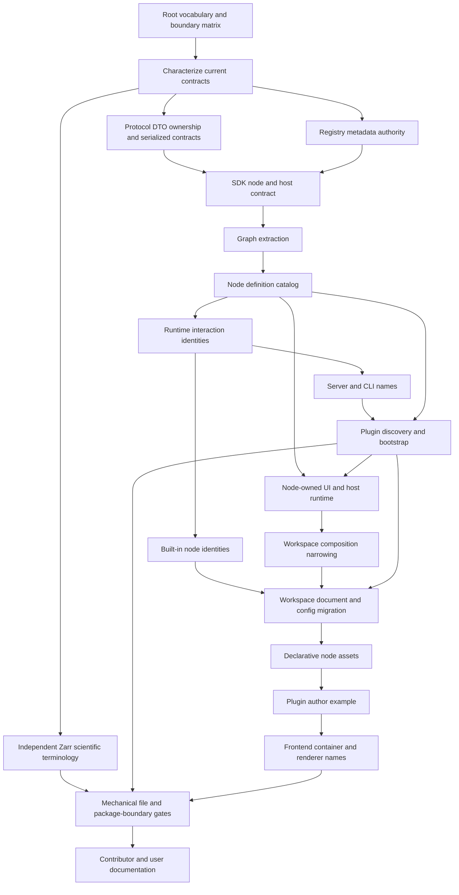

# refactor: Standardize monorepo terminology and identifiers

## Summary

Establish one layer-aware vocabulary and ownership model across the monorepo, then migrate ambiguous types, classes, functions, variables, files, protocol models, persisted Workspace state, and product documentation. Decouple reusable graph/node/runtime contracts from Workspace composition. Replace speculative descriptor/plugin fragments with a deliberate extensibility system: trusted client plugin packages, one canonical node-definition catalog, and user-authored declarative node assets. Preserve successful product and scientific behavior. Permit only versioned naming migrations, corrections toward characterized executable contracts, and explicit recovery errors for unreadable documents, node configs, or unresolved exact node definitions. Apply clean cutovers to compile-time identifiers, preserve storage and scientific formats, and enforce only objective rules with existing Vite+/Oxlint tooling.

---

## Problem Frame

The monorepo now has useful package boundaries but lacks a repository-wide language contract. The same concepts carry different names across `@ndea/protocol`, `@ndea/sdk`, `@ndea/zarr`, and `apps/ndea`; unrelated concepts also share generic names such as `selection`, `state`, `config`, `store`, `panel`, and `viewer`.

The highest-risk ambiguity is the selection/identity cluster. “Selection” currently means a Mosaic predicate, an authored row set, selected graph nodes, an obsolete persisted Selection node, and the active composition of Collections. The same single-observation path appears as `focus`, `highlight`, `obsId`, `rowId`, and a stringified `__row_index__`. These are different contracts: SQL predicate, row set, focused row, durable observation identity, graph-editor state, and rendering emphasis.

Node terminology has overlapping authorities. The SDK exposes `NodeSpec`, `NodeMeta`, `NodeDescriptor`, `NodeModule`, and `NodeInstance`; the app adds `WsNodeSpec`, persisted `WsNode`, compatibility `NodeDef`, and `pluginId`. Registry merging can hide disagreement: Scatter’s descriptor and graph halves declare different output ports, while the image viewer is called `image-viewer`, `fov`, and `Idetik` at different layers.

Workspace prefixes also encode the wrong dependency direction. `WsValue`, `WsNodeSpec`, `WsCookFn`, `WsNodeType`, `WsNode`, and `WsEdge` describe graph/node contracts but live under `core/workspace`; built-in nodes import outward through that product-composition layer. `Workspace` then owns graph topology, evaluator mirroring, coordination, Canvas/Stage state, persistence, node host construction, and Body lifetime in one class. Dashboard host services wrapped by a Workspace Proxy create two routing authorities.

The current extension seam is only nominal. `NodeDescriptor.load()` requires an in-tree chunk, `tryRegisterExternalDescriptor()` has no discovery caller, module failures remain cached as opaque rejected promises, and a mutable global map has no source provenance, atomic activation, disposal, disable/reload boundary, or missing-plugin recovery. React leaks into the SDK. A real custom-node system must replace these fragments rather than rename them.

The existing `.design/VOCABULARY.md` provides strong Workspace, Canvas, Stage, Body, Wire, and Port terms, but current behavior has overtaken parts of it. It still treats Selection as a node despite Cache superseding it, says Canvas is never hidden while code persists a `hidden` disposition, and leaves Stage/Dashboard and focus/highlight unresolved. Root guidance and package descriptions still use “dashboard” after the product moved to a Node Workspace.

Protocol and storage names require restraint. HTTP bodies, metadata, binary headers, SQL views, sidecars, YAML, and scientific stores intentionally use different conventions. AnnData, MuData, OME-Zarr, OME-NGFF, HCS, FOV, TCZYX, `obs`, `var`, `obsm`, `obs_name`, `dtype`, CSR/CSC, DuckDB, and Zarr metadata keys are external domain language. Uniform spelling across these boundaries would reduce correctness, not improve consistency.

Research also found contract drift that must be resolved before renaming: `EmbeddingStatusSchema` omits the runtime `not_started` state; `NdeaProtocol` disagrees with HTTP collection and var-column behavior; several app-local DTOs duplicate protocol types; CLI docs omit `--preset`; and tests contain stale command expectations. Renaming against an already-divergent contract would make defects harder to distinguish from migration regressions.

---

## Requirements

### Vocabulary and identifier model

- R1. One contributor-visible vocabulary source defines canonical product, graph, node, interaction, identity, protocol, scientific, storage, and repository terms, with current executable contracts taking precedence over stale design sketches.
- R2. Terminology ownership follows package boundaries: protocol owns serialized request/response and plugin wire language; SDK owns plugin/node-author, public port-value, module, and host language; Zarr owns scientific/storage language; and the app owns graph evaluation, plugin catalog/runtime, node-asset, Workspace, UI, server-session, and CLI composition language.
- R3. Predicate, row set, focus, Collection, graph selection, row index, observation name, GPU point index, dataset key, dataset location, plate location, and mount each have one definition and distinct identifiers.
- R4. TypeScript uses readable, role-specific names: PascalCase types/classes/components, camelCase functions and values, SCREAMING_SNAKE_CASE constants, stable lowercase kebab-case IDs, and documented acronym/brand exceptions.
- R5. Generic names such as `State`, `Config`, `Store`, `Context`, `Meta`, `Panel`, and `Viewer` are qualified when they cross a module boundary or collide with another exported concept.

### Semantic and architectural consistency

- R6. `Node` remains the graph and authoring noun. Plugin, node definition, node module, node host, node runtime, Body, node asset, node instance, node catalog, unresolved node, and custom node have the exact meanings defined by the root vocabulary.
- R7. One SDK `NodeDefinition` per exact node type ref owns identity, ports, config/migrations, capabilities, requirements, evaluation, lazy module, and portable presentation hints. App catalog normalization adds provenance and product policy without copying author metadata.
- R8. `pred`, `sel`, and `focus` remain the machine-level port/discriminant values; their full names are predicate, row-set selection, and focused observation.
- R9. Cache is the canonical checkpoint node; the retired Selection node exists only at a versioned persistence migration boundary and does not remain in current runtime unions or palettes.
- R10. Workspace, Canvas, Stage, tile, Body, placement, and disposition are canonical product terms; Dashboard, panel, and dock language remains only where it names a genuine compatibility/container API.

### Contract and migration safety

- R11. Compile-time-only symbol and file renames migrate every caller atomically, leaving no re-export aliases, deprecated wrappers, or parallel names.
- R12. Persisted workspace documents, user-authored YAML, SQL/cache/sidecar schemas, binary formats, CLI automation, and serialized protocol keys change only through explicit versioning or boundary normalization that preserves user data.
- R13. Scientific and on-disk vocabulary remains unchanged unless an upstream specification requires a correction.
- R14. Shared request and response contracts live in `@ndea/protocol`; app-local duplicates and unvalidated response casts are removed.
- R15. Existing runtime/protocol mismatches are characterized and resolved before affected names migrate.
- R16. Product identities remain stable: repository `nd-embedding-atlas`, executable and state prefix `ndea`, package scope `@ndea/*`, package entrypoints, release asset names, and published URLs do not change in this refactor.

### Guardrails and completion

- R17. Tests defend behavior, serialized shapes, migrations, routing, and public imports; no new test merely searches source text for banned words.
- R18. Objective file rules use existing Vite+/Oxlint support. The refactor adds no second linter, broad custom naming parser, or subjective terminology scanner.
- R19. Generated CLI metadata, root guidance, package descriptions, user docs, design references, and code comments use the final vocabulary after behavior and contracts pass.
- R20. Every workspace passes its focused tests and checks; the app still builds one binary, the docs still build independently, and representative Workspace/CLI/server flows behave unchanged.
- R21. Each persisted node config carries an explicit version and migrates through its owning node specification independently from the application release version.
- R22. This refactor preserves DuckDB, Collection, annotation, ingest-cache, and sidecar identities. If an affected terminology change requires a physical storage migration, that slice pauses for a dedicated durability prerequisite.
- R23. Failed Workspace-document access, backup/rewrite, or node-config migration preserves the raw/active artifact, suppresses seed/autosave replacement, and surfaces a recovery error.

### Plugin, node asset, and ownership model

- R24. A plugin is a trusted installable code package; a node definition is one registered exact type; a node asset is a declarative reusable subgraph; a node instance is one Workspace occurrence. `extension` remains an ecosystem prose term, not a catch-all code prefix.
- R25. `@ndea/protocol` owns versioned plugin-manifest/bootstrap/diagnostic schemas. `@ndea/sdk` re-exports the manifest author view and owns `PluginFactory`, registration-only `PluginAPI`, exact node refs, framework-neutral `NodeModule`, `NodeHost`, compatibility, and named version contracts. SDK imports no app module or React runtime.
- R26. A manifest declares manifest schema version, plugin package version, SDK range, one self-contained client ESM entry, optional static-asset allowlist, host/platform compatibility, license, and high-risk permission reasons. `ndea plugin validate` and startup use one parser before code executes.
- R27. Startup discovers explicit project-YAML paths plus enabled packages from a versioned config under the user NDEA plugin root, validates canonical roots/assets once, and publishes one bootstrap catalog. Workspace documents contain semantic node refs, never install paths. The browser imports factories before React/Workspace boot, commits each contribution batch atomically, and freezes a session-local `NodeCatalog`.
- R28. Built-ins register through one native plugin factory and the same definition validator. `ndea/*` IDs are reserved; each external plugin may register only `${pluginId}/*` node type IDs. Duplicate exact refs fail with source-aware diagnostics and cannot shadow native definitions.
- R29. A default-exported factory receives `PluginAPI` only during setup and may return one session disposer. V1 contributes custom nodes—not Workspace access, mutable registries, generic events, commands, panels, server routes, SQL/storage hooks, themes, or filesystem objects.
- R30. Plugin packages may register multiple exact `{ nodeTypeId, nodeTypeVersion }` definitions. Palette creation may choose the latest compatible version; persisted instances resolve the exact version and never upgrade by ambiguous name.
- R31. Each definition owns config schema/version and deterministic stepwise migration before runtime/Body creation. Missing, disabled, incompatible, or failed definitions render unresolved placeholders that preserve raw config, topology, placement, labels, and interaction state.
- R32. Catalog/module metadata may cache per browser session; hosts, runtimes, Bodies, device leases, and closures remain per Workspace session and node instance. One failed plugin cannot erase successful batches.
- R33. V1 plugins are documented trusted same-origin JavaScript. `PluginPermission`, `NodeCapability`, `DataCapability`, and `NodeAvailability` are distinct disclosure/service/fitness contracts; none claims to sandbox malicious code. Executable plugin code never embeds in a Workspace.
- R34. A node asset stores a versioned acyclic inner graph, promoted ports/parameters, exact dependencies, docs/presentation, hidden/internal status, and linked/embedded provenance. Users create assets from subgraphs, edit definitions explicitly, and publish new versions without silently mutating existing instances.
- R35. Node assets may nest but never recurse. `GraphEngine` expands an asset to deterministic outer-instance-scoped inner IDs; the current Subnet proxy/storage representation does not become the public asset format unchanged.
- R36. No abbreviated `Ws*` type, function, hook, field, or local prefix remains. Full `Workspace*` names survive only for genuine document, composition, layout, persistence, or provider owners.
- R37. Dependency direction is `@ndea/sdk` → app graph/plugin/node core → Workspace composition → Canvas/Stage UI. `core/graph`, `core/plugin`, `core/node`, `core/node-asset`, and `nodes/**` never import `core/workspace`.
- R38. One typed native-plugin tuple derives built-in registration, exact type refs, palette enumeration, and fitness tests. Manual type unions/order lists, descriptor boot, graph-definition boot, declaration merging, dual registration, and compatibility projections disappear.
- R39. One app host factory assembles capability-gated services. One module/host/Body/device/cleanup lifetime survives Canvas ↔ Stage ↔ fullscreen moves. Dashboard shim plus Workspace Proxy, inert services, and hosted fallbacks disappear after behavioral proof.
- R40. Workspace remains the transaction façade that keeps persisted topology and graph evaluation synchronized. Coordination receives a narrow scope/cell adapter; extraction never exposes independently mutable document/evaluator stores.
- R41. Current graph records derive definition metadata; duplicate persisted `pluginId`/`kind` and retired Selection/FOV identities migrate away. Threshold uses a proven Wrangle migration or an ordinary compatibility module. Unknown/future/plugin-missing/failure states preserve data, and the final cutover/deletion manifest proves every removal and reverse-import boundary.
- R42. The settled holistic product/design/architecture story generates a self-contained, accessible HTML presentation from a versioned Markdown blueprint. It covers product purpose, scientific data flow, monorepo layers, Workspace/graph/node model, plugin/custom-node architecture, node assets, persistence/recovery, trust, and roadmap without becoming a second design authority.

---

## Key Technical Decisions

- KTD1. **Consistency is layer-aware, not one spelling everywhere.** TypeScript identifiers use TypeScript conventions; HTTP/YAML/SQL/on-disk names follow their boundary contracts; external scientific names remain exact. Adapters normalize at seams only where a clean internal model earns the translation.
- KTD2. **Promote the existing vocabulary into a root contract.** Move `.design/VOCABULARY.md` to root `VOCABULARY.md`, reconcile it with current code and accepted requirements, and expand it beyond the Node Workspace to package, identity, protocol, and scientific terminology. `AGENTS.md` and `CONTRIBUTING.md` point contributors to it.
- KTD3. **Use current contracts and executable fitness checks as source precedence.** Current serialized/public behavior comes first, current code and tests second, accepted recent requirements and plans third, and older mechanism/path sketches last. The vocabulary is refreshed before it governs renames.
- KTD4. **Clean-cut compile-time names; migrate durable names.** Internal TypeScript names, imports, and files change in one cutover. Persisted documents use `DOC_VERSION` plus per-node config migrations; external YAML aliases normalize at parse time; SQL/cache/sidecar schemas, binary versions, and scientific storage keys remain stable; HTTP/CLI names stay unchanged unless a compatibility ledger classifies and tests a semantic correction.
- KTD5. **Make identity types explicit.** `RowIndex`, durable `obs_name`, collection membership, dataset key, GPU point index, and node instance ID remain separate domains. Extend the existing branded-ID pattern where strings currently erase those distinctions.
- KTD6. **Make focus the state/coordination noun.** Focus means the existing single-observation identity and retains its current live/persisted representation through this naming refactor. Highlight means visual emphasis only. Row-set selection remains separate, and graph selection names selected editor objects explicitly. A future durable-observation redesign must not hide inside this cutover.
- KTD7. **Make one node definition authoritative.** SDK `NodeDefinition` contains non-overlapping identity/spec/evaluation/module/presentation-hint facets. App catalog normalization adds provenance and policy without copying fields. Dual graph/descriptor halves and compatibility `NodeDef` projections disappear.
- KTD8. **Preserve exact scientific/storage language.** Zarr and protocol code may expose external spellings such as `obs`, `obsm`, `dataset_key`, `encoding-type`, or `column-order` at their boundaries. Internal surrounding names become clearer without translating or copying large data structures merely for casing.
- KTD9. **Automate only mechanical conventions.** Enable Oxlint’s existing `unicorn/filename-case` rule for the allowed PascalCase, `useX` hook, and kebab-case filename set. Oxlint cannot infer file roles, so component/hook/module role assignment remains contributor-review policy. Do not use the coarse `id-match` rule for semantic naming, add ESLint, or build a custom TypeScript naming linter.
- KTD10. **Hold storage ownership stable.** Collections, annotations, ingest caches, sidecars, SQL identities, and position-bound derived tables keep their current schemas and lifecycle. Atomic Zarr publication, durable authored-state separation, cache discovery/versioning, observation-reorder identity, and transactional Collection/annotation writes require dedicated plans. If one blocks a terminology slice, pause that slice and complete its prerequisite first.
- KTD11. **Move ownership before spelling.** Extract graph, plugin, node-runtime, and node-asset contracts from Workspace before final renames. Keep Workspace as a transaction façade, not the owner of reusable node language.
- KTD12. **Combine OMP and DCC strengths.** Use OMP-style factory/load separation, Blender-style manifest/validate/register/dispose discipline, and Houdini/Blender-style versioned reusable subgraphs. Keep V1 to trusted client custom nodes.
- KTD13. **Freeze a catalog snapshot.** Discovery, import, and validation collect isolated batches before one immutable session catalog exists. Production enable/disable/reload creates a new session; active Workspaces never observe partial registration.
- KTD14. **Separate version axes.** Manifest schema, plugin package, SDK range, node type, node config, node asset, and Workspace document versions retain distinct names and migration rules.
- KTD15. **Keep code plugins and node assets distinct.** Plugins install executable primitives. Node assets package user-authored graphs and alone may link/embed with a Workspace.
- KTD16. **Remove React from the SDK Body contract.** `NodeModule` exposes framework-neutral element/mount/dispose lifecycle. App adapters mount built-in React Bodies once; external plugins may own any framework inside their element. Existing DOM adoption preserves WebGPU/React state.
- KTD17. **Generate the presentation from reviewed sources.** Write a slide-by-slide Markdown blueprint first, then generate one offline HTML deck with embedded assets/styles/scripts. `DESIGN.md`, `PRODUCT.md`, `VOCABULARY.md`, and the canonical plan remain authoritative; drift checks reject an outdated deck.

---

## High-Level Technical Design

### Authority and migration flow

The migration follows dependency direction. Vocabulary decisions and characterization land first. Protocol, Zarr, and registry-authority work then proceed independently; Zarr does not block the SDK/app critical path. Graph extraction and catalog construction precede plugin loading or host/runtime changes. Persisted Workspace state changes only after the catalog, runtime, and narrowed composition model exist. Node assets build on canonical persistence. File casing, generated artifacts, and prose update last, after behavior passes.

### Naming boundary matrix

| Boundary                   | Canonical shape                                                             | Migration posture                                          |
| -------------------------- | --------------------------------------------------------------------------- | ---------------------------------------------------------- |
| Product/repository         | `nd-embedding-atlas`, `ndea`, `@ndea/*`                                     | Preserve                                                   |
| TypeScript symbols         | Role-specific PascalCase/camelCase/constant casing                          | Clean cutover                                              |
| Files                      | PascalCase component modules; `useX` hooks; kebab-case other source modules | Rename after semantic work                                 |
| Stable IDs/discriminants   | Lowercase kebab-case; `pred`/`sel`/`focus` where already contractual        | Preserve or version                                        |
| HTTP/WS/YAML               | Protocol-owned serialized keys; intentional boundary casing                 | Preserve by default; normalize at parser seam              |
| Persisted Workspace        | Versioned document and node/config keys                                     | One-way `DOC_VERSION` migration                            |
| SQL/cache/sidecar          | Current query/storage schema                                                | Preserve; separate prerequisite for any physical migration |
| Binary formats             | Existing versioned header/layout                                            | Never rename within a version                              |
| Scientific/on-disk         | Upstream AnnData/MuData/OME-Zarr/NGFF terms                                 | Freeze                                                     |
| Plugin manifests/bootstrap | Protocol-owned versioned schema; exact IDs/versions/paths                   | Validate before import                                     |
| Node type identity         | Exact `{ nodeTypeId, nodeTypeVersion }`                                     | Persist exact; never silently resolve latest               |
| Node assets                | Versioned declarative graph with linked/embedded provenance                 | Explicit publish/upgrade                                   |
| Prose/UI                   | Full canonical nouns; uppercase standard acronyms                           | Clean cutover after code                                   |

### Canonical extension vocabulary

| Term            | Exact meaning                                                                 |
| --------------- | ----------------------------------------------------------------------------- |
| Plugin          | Trusted installable code package with one manifest and client factory         |
| Plugin factory  | Registration-only setup function; may return one session disposer             |
| Node definition | Versioned author contract for one node type                                   |
| Node module     | Lazy executable implementation of a definition                                |
| Node host       | Capability-gated services for one live node instance                          |
| Node runtime    | Per-instance compute/lifecycle object                                         |
| Body            | One mounted UI element adopted across product surfaces                        |
| Node asset      | Versioned declarative reusable subgraph created by a user                     |
| Node instance   | One exact-version occurrence in a Workspace graph                             |
| Node catalog    | Immutable session snapshot of validated native, plugin, and asset definitions |
| Unresolved node | Preserved instance whose exact definition is unavailable or failed            |
| Custom node     | User-facing umbrella for a plugin definition or node asset                    |

`DataCapability`, `NodeCapability`, `PluginPermission`, and `NodeAvailability` remain separate. Manifest, plugin, SDK, node type, config, asset, and document versions never collapse into a generic `version`.

---

## Scope Boundaries

### In scope

- All production and test TypeScript under `apps/ndea` and `packages/{protocol,sdk,zarr}`.
- Exported/internal types, classes, interfaces, functions, variables, stable IDs, file names, package descriptions, generated CLI metadata, comments, and docs.
- Protocol ownership gaps and contract mismatches that block safe terminology migration.
- Workspace-to-graph/node/plugin ownership extraction; one catalog and one node-host/runtime path.
- Trusted client plugin manifest validation, project/user discovery, static serving, browser bootstrap, failure isolation, and public example.
- User-authored declarative node assets, exact versioning, linked/embedded provenance, cycle validation, and unresolved-node recovery.
- A generated, self-contained HTML presentation of the holistic design and architecture.
- Versioned migration of persisted Workspace fields and retired node types when their semantic names change.
- Objective naming rules supported by current Vite+/Oxlint configuration.

### Deferred to follow-up work

- Broader API versioning, HTTP endpoint redesign, or global JSON casing normalization.
- Physical DuckDB/cache/sidecar schema or ownership changes, durable authored-state separation, observation-reorder rebinding, and prior-cache discovery/versioning.
- Atomic Zarr `.obs` publication, resumable multi-dataset annotation commits, and transactional Collection PATCH semantics. These defects remain in dedicated plans; if one blocks a terminology unit, pause only that unit and complete the prerequisite before resuming.
- Remote plugin marketplace, package dependency solver, signing/notarization, automatic download/update, and publication service.
- Untrusted plugin sandbox/Worker/iframe RPC and enforceable ambient browser permissions.
- Server-side plugin code, custom routes/SQL/storage hooks, commands, panels, themes, generic events, and non-node contribution types.
- Production hot mutation of an active Workspace catalog; reload creates a new session snapshot.
- Product/repository/CLI/package-scope renaming.

### Outside this refactor

- Package reorganization beyond the existing protocol/SDK/app boundaries, generic service frameworks, successful-path behavior changes beyond characterized contract corrections and the planned custom-node/asset surfaces, visual redesign, and unrelated performance refactors.
- Renaming standards-owned scientific fields, axes, metadata attributes, array encodings, or database concepts for cosmetic uniformity.
- Compatibility aliases for private compile-time APIs after all monorepo callers migrate.

---

## System-Wide Impact

- **Contributors:** one visible terminology source and role-based naming rules replace inference from scattered design notes.
- **SDK authors:** node/descriptor/host names become clearer; compile-time changes are breaking but atomic while packages remain private.
- **Plugin authors:** one manifest, SDK barrel, registration-only factory, framework-neutral Body lifecycle, validator, and example replace private app imports and implied conventions.
- **Users:** persisted graphs and node configs migrate explicitly; users can load trusted custom-node plugins and publish declarative node assets. Project YAML, Collections, annotations, CLI automation, caches, sidecars, and scientific data retain their external/storage contracts.
- **Data lifecycle:** a versioned backup preserves each pre-migration Workspace document through rollback; failed document/config migration leaves raw bytes untouched and blocks seed/autosave replacement.
- **Recovery:** missing, disabled, incompatible, or failed exact node definitions render unresolved placeholders and preserve graph data until the matching definition returns.
- **Protocol consumers:** request/response ownership becomes centralized; serialized spellings remain stable unless an existing semantic defect requires a separately characterized change.
- **Operations and release:** executable, state directories, release manifests/assets, installer/update behavior, and documentation URLs remain stable.
- **Documentation:** Node Workspace language replaces generic dashboard prose, while scientific guides retain upstream terminology.
- **Security posture:** V1 plugin permissions disclose intent and gate host services, but trusted same-origin code is not sandboxed. Executable plugin code never embeds in Workspace documents.

---

## Implementation Units

Execution order: U1 → U2; then U3, U13, and U14 may proceed independently. U4 → U15 → U16 → U5 establishes the critical model. U6, U9, and U17 may then proceed independently; U11 follows U6; U20 follows U11/U16; U18 follows U17/U20; U19 follows U18; U10 follows U9/U19/U20; U21 → U22 follows U10. U12 follows U10/U18/U19; U23 follows U12/U22; U7 closes the refactor after every semantic unit, including U13 and U15–U23, passes.

U8 remains a retired historical ID; preserve existing unit IDs rather than renumbering the plan.

### U1. Establish the canonical vocabulary and naming rules

- **Goal:** Make one current, contributor-visible source authoritative before any rename begins.
- **Requirements:** R1–R10, R13, R16.
- **Dependencies:** None.
- **Files:**
  - `.design/VOCABULARY.md` — move and replace with the current root contract.
  - `VOCABULARY.md` — canonical terminology, identity, abbreviation, casing, and boundary matrix.
  - `AGENTS.md`
  - `CONTRIBUTING.md`
  - `PRODUCT.md`
  - `DESIGN.md`
  - `.design/IMPLEMENTATION-PLAN.md` — retain as historical design input and point to the new authority.
- **Approach:** Reconcile stable Node Workspace terms with current behavior. Define package-management Workspace versus product Workspace; plugin versus node definition/module/asset/instance/catalog; Cache versus retired Selection node; predicate/row set/focus/Collection/graph selection; row index versus observation name; dataset key/location/mount; capability versus permission versus availability; every named version axis; and accepted scientific/acronym forms. Make `image-viewer` the canonical node type and persisted ID, `Image Viewer` the palette/header label, FOV the scientific acquisition unit, and Idetik renderer/display branding; legacy `fov` node IDs migrate to `image-viewer`. Allow terms to target end-user/UI, operator/CLI, protocol/API-consumer, plugin/node-author/SDK, and contributor/implementation audiences; give each audience the exact copy or boundary spelling it sees. Maintain a finite cutover manifest of every renamed symbol, file, barrel export, stable ID, and caller set with canonical replacement and owning unit. Record retired terms and replacements without compile-time aliases.
- **Patterns to follow:** The existing `.design/VOCABULARY.md` concise definition style; the package ownership boundaries in `AGENTS.md`; the accepted Cache and node-authoring decisions in recent requirements and plans.
- **Test expectation:** None — this unit changes documentation and decision authority, not runtime behavior.
- **Verification:** Every planned rename maps to a concept, owner, applicable audiences, boundary posture, cutover-manifest row, and owning unit. Current behavior no longer contradicts vocabulary for Cache, Canvas disposition, Stage/Dashboard, focus/highlight, Image Viewer/FOV/Idetik, plugins, node assets, trust, capabilities, identities, or versions. Repository paths and product identities remain unchanged.

### U2. Build the rename-impact ledger and resolve blocking contract drift

- **Goal:** Map each planned contract-affecting rename to its current shape, compatibility posture, owner, and baseline before that boundary changes.
- **Requirements:** R11, R12, R14, R15, R17, R20, R22.
- **Dependencies:** U1.
- **Files:**
  - `VOCABULARY.md`
  - `packages/protocol/src/index.ts`
  - `packages/protocol/src/index.test.ts`
  - `apps/ndea/src/server/__tests__/app.test.ts`
  - `apps/ndea/src/server/__tests__/collections-routes.test.ts`
- **Execution note:** Add characterization coverage before modifying the affected contracts.
- **Approach:** Add a ledger row for every planned serialized, persisted, CLI/YAML, or storage-adjacent rename: current shape, canonical shape, owner, consumers, compatibility class (`type-only`, `additive`, `boundary-normalized`, or `breaking`), migration posture, and owning unit. Existing wire inputs remain accepted and outputs remain unchanged unless a separately versioned breaking contract is approved. For each serialized-output row, capture a deterministic structural golden from the raw handler response before schema parsing; any approved delta names its version and changed keys. Reconcile only blocking drift: `EmbeddingStatusSchema`, the non-authoritative `NdeaProtocol` map, collection-create response types, and optional var-column fields. Move SDK, Zarr, Workspace/config, and CLI/YAML characterization into U4, U13, U10, and U11; add WebSocket coverage only if the ledger identifies a changed WebSocket contract.
- **Patterns to follow:** Protocol schema parsing in `packages/protocol/src/index.test.ts`; full route behavior in collections tests; boundary ownership in the naming matrix.
- **Test scenarios:**
  1. Each embedding lifecycle response (`not_started`, loading, ready, error) parses through the shared schema and matches the HTTP route.
  2. Collection creation and var-column loading use the same request/response shape in HTTP handlers, frontend consumers, and any retained method map.
  3. Every ledger entry names an executable baseline and owning unit; no storage identity is scheduled for change.
  4. Old-only, canonical-only, equal-alias, and conflicting-alias fixtures prove the declared compatibility class wherever boundary normalization is approved.
  5. Raw pre/post handler-response goldens match exactly before the same payloads pass protocol schemas; intentional deltas identify version approval and changed keys.
- **Verification:** Every affected contract has a current/canonical shape, compatibility class, owner, migration posture, and baseline. Only drift that blocks a named later unit is repaired here.

### U3. Centralize protocol DTO ownership

- **Goal:** Give shared serialized contracts one owner without globally normalizing wire casing.
- **Requirements:** R2, R3, R11, R12, R14, R15, R17, R20.
- **Dependencies:** U1, U2.
- **Files:**
  - `packages/protocol/src/index.ts`
  - `packages/protocol/src/index.test.ts`
  - `apps/ndea/src/server/protocol.ts`
  - `apps/ndea/src/server/routes/meta.ts`
  - `apps/ndea/src/server/routes/config.ts`
  - `apps/ndea/src/server/routes/trajectory.ts`
  - `apps/ndea/src/frontend/types.ts`
  - `apps/ndea/src/frontend/components/collections/useCollections.ts`
  - `apps/ndea/src/frontend/components/collections/ExportCollectionDialog.tsx`
  - `apps/ndea/src/frontend/nodes/scatter/gpu/hooks/useVarColumn.ts`
  - `apps/ndea/src/frontend/nodes/scatter/gpu/hooks/useVarSearch.ts`
  - `apps/ndea/src/frontend/nodes/scatter/gpu/hooks/useLayerNames.ts`
  - `apps/ndea/src/frontend/nodes/scatter/gpu/hooks/useTrajectoryLoader.ts`
  - `apps/ndea/src/frontend/core/host/use-dashboard-host-shim.ts`
- **Approach:** Extend the established `NameSchema` plus inferred `Name` pattern to responses duplicated or cast in the app. Remove app-local DTOs and response `as` casts with the same semantic role; parse at real fetch callsites. Keep serialized fields exact at the protocol boundary and use small adapters only when an internal domain model needs different names.
- **Patterns to follow:** `CollectionSchema`/`Collection`, discriminated commit-report schemas, U2 raw-output goldens, and production fetch/parse callsites.
- **Test scenarios:**
  1. Representative metadata, config, trajectory, collection, annotation, and export responses parse through protocol-owned schemas with exact serialized keys.
  2. Optional wire fields remain optional after type centralization; omitted values do not become silent rename losses.
  3. Each named frontend fetch path rejects malformed payloads through the protocol schema instead of accepting an unchecked cast.
- **Verification:** Protocol has one DTO authority per shared route; production consumers parse through it; raw output still matches U2’s compatibility goldens.

### U13. Protect Zarr scientific and storage vocabulary

- **Goal:** Clarify internal Zarr names while preserving scientific APIs, on-disk metadata, and write behavior.
- **Requirements:** R2, R3, R11–R13, R17, R20, R22.
- **Dependencies:** U1, U2.
- **Files:**
  - `packages/zarr/src/index.ts`
  - `packages/zarr/src/types.ts`
  - `packages/zarr/src/anndata.ts`
  - `packages/zarr/src/mudata.ts`
  - `packages/zarr/src/data-frame.ts`
  - `packages/zarr/src/write-obs.ts`
  - `packages/zarr/src/__tests__/anndata.test.ts`
  - `packages/zarr/src/__tests__/write-obs.test.ts`
- **Approach:** Preserve AnnData/MuData/OME-Zarr discriminants, axis terms, metadata attributes, `obs`/`var`/`obsm`, DuckDB brand casing, and Zarr public scientific APIs. Remove stale “axial” wording and clarify only internal names that do not describe external formats. Do not change write ordering, publication behavior, or physical keys.
- **Patterns to follow:** `ParsedStore.kind`, current `@ndea/zarr` barrel exports, real-store fixtures, and the storage freeze in KTD8/KTD10.
- **Test scenarios:**
  1. AnnData, MuData, and OME-Zarr stores retain discriminants, axes, modality keys, `obs_name`/`var_name`, and v2/v3 metadata through open/read/write round trips.
  2. A barrel-only `@ndea/zarr` consumer still opens stores, ingests default `obs_base`/`var_base`, and commits `.obs` columns.
- **Verification:** Zarr exports and on-disk data remain scientifically and byte-for-byte semantically compatible; U13 does not block U4’s SDK cutover.

### U14. Make registry metadata authority explicit

- **Goal:** Resolve descriptor/graph disagreement as an isolated behavior correction before any SDK naming cutover.
- **Requirements:** R7, R15, R17, R20.
- **Dependencies:** U1, U2.
- **Files:**
  - `apps/ndea/src/frontend/core/node/registry-types.ts`
  - `apps/ndea/src/frontend/core/node/registry.ts`
  - `apps/ndea/src/frontend/core/node/node-registry.test.ts`
  - `apps/ndea/src/frontend/core/node/registry.test.ts`
  - `apps/ndea/src/frontend/nodes/scatter/plugin.ts`
  - `apps/ndea/src/frontend/nodes/scatter/node.tsx`
  - `apps/ndea/src/frontend/nodes/image-viewer/plugin.ts`
  - `apps/ndea/src/frontend/nodes/image-viewer/node.tsx`
- **Approach:** Characterize today’s descriptor/graph merge. Make descriptor/spec metadata authoritative and reject disagreement in ports, capabilities, requirements, kind, or display metadata. Preserve all current names in this preparatory unit so review can isolate the behavior correction from U4’s compile-time cutover.
- **Patterns to follow:** Descriptor-major registration, existing SDK-version checks, and node-anatomy fitness tests.
- **Test scenarios:**
  1. Every built-in registers once and resolves one authoritative metadata set.
  2. Conflicting graph and descriptor declarations fail registration with a precise field-specific error instead of merging.
- **Verification:** Registry authority is deterministic and tested before U4 renames SDK, host, module, or caller symbols.

### U4. Normalize the SDK node/host contract

- **Goal:** Publish one portable plugin/node-author contract without product layout, mutable app registries, or React runtime coupling.
- **Requirements:** R2, R5–R8, R11, R14, R17, R20, R24–R26, R29–R33, R37–R39.
- **Dependencies:** U1–U3, U14.
- **Files:**
  - `packages/protocol/src/plugin.ts` — add canonical serialized manifest types/schema.
  - `packages/sdk/src/plugin.ts` — add factory and registration-only API.
  - `packages/sdk/src/node.ts` — add exact refs, definition, port-value, compute, config migration, and availability contracts.
  - `packages/sdk/src/module.ts` — add framework-neutral runtime/Body lifecycle.
  - `packages/sdk/src/host.ts`
  - `packages/sdk/src/index.ts`
  - `packages/sdk/src/index.test.ts`
  - `packages/sdk/src/version.ts`
  - `packages/sdk/package.json` — remove React peer/runtime dependency; retain required type peers only.
  - SDK barrel-only positive and expected-failure fixtures.
- **Approach:** Define manifests once in protocol and re-export the author view from SDK. Establish `PluginFactory`, registration-only `PluginAPI`, exact node type refs, one `NodeDefinition`, stable predicate/row-set/focus port values and compute types, config migration, `NodeAvailability`, capability/permission distinctions, branded runtime identity, and named version helpers. `NodeModule` returns per-instance runtime and mounted Body handles; `MountedNodeBody` owns one `HTMLElement` plus idempotent disposal. Remove `NodeMeta`/descriptor duplication, React component types/peer, product placement, unused render facade, declaration merging, mutable registration helpers, and generic `NodeInstance` if no characterized caller remains. Clean-cut package callers later through U15–U18; publish no aliases.
- **Patterns to follow:** Protocol `NameSchema`/inferred-type ownership, existing branded IDs, capability-gated `NodeHost`, and the OMP registration-only setup/runtime split.
- **Test scenarios:**
  1. A barrel-only factory registers a transform definition and a mounted view definition with no app/private/React import.
  2. Manifest, plugin, SDK, node type, config, asset, and document versions cannot substitute for one another at compile time.
  3. Capability, permission, dataset capability, and availability types remain distinct; a definition cannot request an undeclared optional host service.
  4. Retired SDK exports and deep imports fail expected-failure fixtures.
- **Verification:** SDK exposes the exact stable author surface through one barrel, imports no app or React runtime, and leaves app graph/catalog/layout policy app-local.

### U15. Extract graph vocabulary and evaluation from Workspace

- **Goal:** Move reusable graph records, evaluation, cook helpers, and engine adapters into `core/graph`.
- **Requirements:** R1–R8, R11, R17, R20, R36, R37, R40.
- **Dependencies:** U1, U2, U4.
- **Files:**
  - `apps/ndea/src/frontend/core/workspace/types.ts`
  - `apps/ndea/src/frontend/core/workspace/node-kit.ts`
  - `apps/ndea/src/frontend/core/workspace/workspace-store.ts`
  - `apps/ndea/src/frontend/core/graph/`
  - graph/node evaluator tests and every `WsValue`/`WsNode`/`WsEdge` consumer.
- **Approach:** Introduce full, role-specific graph node/edge/type names. Move stable predicate/selection/focus port-value and compute contracts to SDK; keep graph records, evaluator state, and app adapters under `core/graph`. Keep runtime types separate from persisted DTOs. Preserve push/pull emissions, fan-in, cache boundaries, sink registration, edge legality, and Workspace document/evaluator atomicity while moving contracts. Rename genuine Workspace state with full words.
- **Patterns to follow:** Framework-agnostic `GraphEngine`, existing cook helpers, edge-bound host routing, and the ownership matrix.
- **Test scenarios:**
  1. GraphEngine push/pull, cache, authored emissions, fan-in, diamonds, abort epochs, and sink registration match the characterized baseline.
  2. SDK-authored compute receives public port values without importing Workspace or app persistence.
  3. Graph/document actions still commit topology and evaluator projection through one Workspace transaction.
- **Verification:** `core/graph` imports no Workspace, React, Canvas, Stage, or persistence module. No reusable graph symbol retains a `Ws` prefix.

### U16. Build the immutable node definition catalog

- **Goal:** Replace dual halves, compatibility projections, manual lists, and mutable globals with one validated catalog substrate.
- **Requirements:** R2, R5–R8, R11, R17, R20, R24, R27–R32, R37, R38, R41.
- **Dependencies:** U1–U4, U14, U15.
- **Files:**
  - `apps/ndea/src/frontend/core/plugin/{catalog,registration}.ts`
  - `apps/ndea/src/frontend/core/node/{registry,registry-types,load-module}.ts`
  - Workspace descriptor/boot files.
  - `apps/ndea/src/frontend/nodes/**/{node,plugin,module}.ts{x}`
  - `apps/ndea/src/frontend/core/workspace/node-defs.ts`
  - catalog, registry, and node-anatomy tests.
- **Approach:** Reconcile each built-in’s exact type ref, title, role, ports, capabilities, config, evaluation, module, and portable presentation hints into one SDK definition. Express built-ins as one native plugin factory over a typed tuple. Collect contributions into isolated batches; validate reserved namespaces, compatibility, definition shape, config migrators, required host services, and exact-ref conflicts; then freeze focused maps/selectors. App normalization adds provenance, availability, Canvas/Stage policy, geometry, and palette policy without repeating author fields. Delete half merge, Proxy `NodeDef`, declaration merging, `tryRegisterExternalDescriptor`, global mutation, manual current-ID/order lists, and unused exports.
- **Patterns to follow:** U14’s field-specific disagreement diagnostics, OMP capability provenance, and Blender reverse-order registration disposal.
- **Test scenarios:**
  1. Every current built-in registers once through the native factory; exact-ref/type inference and palette enumeration derive from the tuple.
  2. Duplicate/conflicting exact refs report both sources and commit neither invalid batch nor partial definitions.
  3. Reserved `ndea/*`, invalid migration, undeclared capability, incompatible SDK range, and post-freeze mutation fail deterministically.
  4. Scatter, charts, Table, Annotate, and Image Viewer expose the characterized canonical ports and metadata.
- **Verification:** One immutable catalog resolves every current built-in. No `NODE_DEFS`, dual boot path, compatibility projection, or Workspace import remains in catalog/node tests.

### U5. Separate runtime interaction identities

- **Goal:** Remove selection/focus/highlight ambiguity from live coordination and editor state without changing interaction behavior.
- **Requirements:** R3–R8, R10, R11, R17, R20, R36, R37, R39.
- **Dependencies:** U1–U4, U15, U16.
- **Files:**
  - `apps/ndea/src/frontend/lib/branded-types.ts`
  - `apps/ndea/src/frontend/core/workspace/types.ts`
  - `apps/ndea/src/frontend/core/workspace/workspace-store.ts`
  - `apps/ndea/src/frontend/core/coordination/coordination.ts`
  - `apps/ndea/src/frontend/core/coordination/coordination.test.ts`
  - `apps/ndea/src/frontend/core/buses/selection-bus.ts`
  - `apps/ndea/src/frontend/core/buses/broadcast-bus.ts`
  - `apps/ndea/src/frontend/core/buses/highlight-bus.ts`
  - `apps/ndea/src/frontend/core/host/`
  - `apps/ndea/src/frontend/dashboard/`
  - `apps/ndea/src/frontend/hooks/useHighlight.ts`
  - `apps/ndea/src/frontend/hooks/useHighlightedPointMeta.ts`
  - `apps/ndea/src/frontend/nodes/table/`
  - `apps/ndea/src/frontend/nodes/scatter/`
  - `apps/ndea/src/frontend/nodes/gallery/`
  - `apps/ndea/src/frontend/nodes/annotate/`
  - `apps/ndea/src/frontend/nodes/image-viewer/`
- **Approach:** Remove terse `Ws*` identifiers rather than expanding them indiscriminately. Name graph selection as selected node/edge IDs, use branded row indices for live focus and row sets, reserve `obs_name` for durable observation identity, and keep GPU point indices separate. Make focus canonical in coordination/host state and highlight rendering-only. Preserve current representations at persistence and protocol seams until U10 migrates names explicitly.
- **Patterns to follow:** Existing branded IDs, cross-view bus tests, and edge-bound host-routing tests.
- **Test scenarios:**
  1. Table focus passes one `RowIndex` to the Image Viewer and never becomes `obs_name` or GPU point index accidentally.
  2. No focus, first focus, replacement focus, clear, and focus-wire deletion preserve current table emphasis and Image Viewer readout/content/pause behavior while leaving row sets and graph selection unchanged.
  3. Lasso row sets, Mosaic predicates, active Collection filters, focused rows, and graph selection remain independent under clear/set/subscribe flows.
  4. Node click, marquee multi-selection, edge selection, and the existing Escape clear chain affect only editor selection and target the intended node set or edge.
- **Verification:** Live state exposes no ambiguous generic selection field; predicate, row set, focus, highlight, Collection filter, and graph selection route through distinct contracts.

### U17. Move node UI and behavior behind NodeHost

- **Goal:** Make built-in node modules independent of Workspace and own their Bodies/commands.
- **Requirements:** R3–R8, R10, R11, R17, R20, R25, R29, R32, R37–R39.
- **Dependencies:** U4, U5, U15, U16.
- **Files:**
  - `apps/ndea/src/frontend/nodes/**`
  - `apps/ndea/src/frontend/core/workspace/canvas/{node-extras,WranglePane}.tsx`
  - host hooks, Body runtime, and Scatter/Gallery/Table focus/GPU hooks.
- **Approach:** Move Dataset/Cache/Export/Collection/Count/Subnet/Wrangle Bodies to their node folders. Replace direct Workspace reads/writes with declared host config/data/predicate/row-set/focus APIs. Create one app-local React Body adapter and one reusable host-focus hook; SDK modules return framework-neutral mounted Body handles. Remove duplicate Scatter subscriptions, stale global Table highlight, obsolete gallery “panel” language, and hosted-node fallback branches after characterization.
- **Patterns to follow:** Capability-gated `NodeHost`, current Body adoption, and node-owned config.
- **Test scenarios:**
  1. `nodes/**` compiles without Workspace imports or private catalog access.
  2. Built-in React and fixture non-React Bodies use the same host/mount/dispose contract.
  3. Focus set/replace/clear/disconnect and predicate/row-set flows remain independent.
- **Verification:** Every built-in node depends only on SDK plus focused graph/node helpers; node-specific UI and actions no longer live in Workspace Canvas modules.

### U18. Unify node runtime, host assembly, and Body lifetime

- **Goal:** Preserve one live Body while removing the Dashboard host shim plus Workspace Proxy stack.
- **Requirements:** R3, R7, R10, R11, R17, R20, R25, R29, R31–R33, R37, R39, R40.
- **Dependencies:** U4, U5, U16, U17, U20.
- **Files:**
  - `apps/ndea/src/frontend/core/host/use-dashboard-host-shim.ts`
  - `apps/ndea/src/frontend/core/workspace/body-dock.tsx`
  - `apps/ndea/src/frontend/core/graph/graph-host.ts`
  - `apps/ndea/src/frontend/core/node/runtime/`
  - buses/stores, GPU device context, host/runtime tests.
- **Approach:** Build one module/host/Body owner under `core/node/runtime`; inject data, graph, coordination, UI, lifecycle, and capability services once. Track module state as `unloaded | loading | ready | failed` rather than retaining opaque rejected promises. Keep Workspace Body/Header sockets and activation as presentation adapters. Delete the runtime Proxy, shadowed global focus/view-sync/render paths, inert capabilities, and unmanaged hosted GPU fallback. Dispose instances before plugin registrations in reverse order.
- **Patterns to follow:** Existing one-Body DOM adoption, explicit device leases, and OMP runtime initialization/disposal separation.
- **Test scenarios:**
  1. One module load, host, Body, device lease, and dispose survives Canvas → Stage → fullscreen moves without remount.
  2. Module/factory failure is observable, retry/reload posture is explicit, and other nodes continue.
  3. Missing capabilities fail before mount; no optional service becomes a silent no-op.
- **Verification:** One host path and one Body lifetime remain; Dashboard shim, Workspace Proxy, transform-only fake host, and shadowed global buses are gone.

### U19. Narrow Workspace composition without a service rewrite

- **Goal:** Leave Workspace with document/editor/layout/persistence ownership and one transaction façade.
- **Requirements:** R1–R7, R10–R12, R17, R20, R27, R31, R32, R36–R40.
- **Dependencies:** U5, U15, U16, U18.
- **Files:**
  - `apps/ndea/src/frontend/core/workspace/{workspace-store,workspace-context,types,feedback,presets}.ts{x}`
  - Canvas/Stage modules.
  - `apps/ndea/src/frontend/core/coordination/`
  - Workspace transaction and interaction tests.
- **Approach:** Rename remaining genuine `WsState`/`useWsSelector` concepts with full Workspace language. Extract graph runtime and node runtime dependencies; give coordination a narrow scope/cell adapter; move node-specific commands/Bodies out. Keep topology plus evaluator mutations atomic through the Workspace façade. Split pure layout/editor operations only where it shortens the class without adding a service graph or independently mutable stores. Preserve unresolved-node records instead of destructive unknown-node cleanup.
- **Patterns to follow:** Existing public Workspace actions, one-store transaction writes, and the body-adoption presentation adapter.
- **Test scenarios:**
  1. Add/connect/remove/pin/stage/preset/load actions update document and evaluator atomically.
  2. Predicate, row set, focus, graph selection, coordination scope, placement, and disposition remain independent.
  3. Unknown exact definitions remain in state and render unresolved without evaluator corruption.
- **Verification:** Workspace owns no reusable definition/module/graph-value/plugin contract. `core/graph`, `core/plugin`, `core/node`, `core/node-asset`, and `nodes/**` import no Workspace module.

### U9. Normalize built-in node and Image Viewer identity

- **Goal:** Remove retired and competing node identities from the current runtime before persisted documents migrate.
- **Requirements:** R6–R11, R17, R20, R28, R30, R36, R38, R41.
- **Dependencies:** U1–U5, U15, U16.
- **Files:**
  - `apps/ndea/src/frontend/core/plugin/catalog.ts`
  - `apps/ndea/src/frontend/core/node/native-plugin.ts`
  - `apps/ndea/src/frontend/core/workspace/types.ts`
  - `apps/ndea/src/frontend/core/workspace/canvas/node-extras.tsx`
  - `apps/ndea/src/frontend/core/workspace/cache-node.test.ts`
  - `apps/ndea/src/frontend/core/workspace/presets.ts`
  - `apps/ndea/src/frontend/core/workspace/presets.test.ts`
  - `apps/ndea/src/frontend/nodes/image-viewer/`
- **Approach:** Keep Cache as the only current checkpoint node and remove the retired Selection type from runtime unions, registries, and palettes. Use `image-viewer` as the type/ID and `Image Viewer` as the visible name; reserve FOV for scientific acquisition data and Idetik for renderer branding. Update presets and registry metadata only after U4 establishes one node authority.
- **Patterns to follow:** Cache requirements, built-in registry fitness tests, and the vocabulary’s layer map.
- **Test scenarios:**
  1. Cache loads live, pins a row set, becomes stale when upstream changes, and recaches without Selection-node semantics.
  2. Registry, palette, preset, port, and header surfaces expose one Image Viewer identity; FOV remains present only in scientific fields and Idetik only in renderer/display APIs.
  3. Every current built-in type resolves through the registry; retired `selection` and `fov` IDs resolve only inside U10 migration fixtures.
- **Verification:** Current runtime unions and palettes contain Cache and `image-viewer`, never the retired Selection or `fov` node identities.

### U10. Migrate Workspace documents and node configs

- **Goal:** Move legacy graphs to exact node-definition refs and the canonical runtime model without losing topology, layout, config, or interaction state.
- **Requirements:** R3, R8–R12, R17, R20–R24, R30–R35, R39–R41.
- **Dependencies:** U1–U5, U9, U15, U16, U19, U20.
- **Files:**
  - `packages/sdk/src/node.ts`
  - `packages/sdk/src/index.ts`
  - `packages/sdk/src/index.test.ts`
  - `apps/ndea/src/frontend/core/plugin/catalog.ts`
  - `apps/ndea/src/frontend/core/plugin/catalog.test.ts`
  - `apps/ndea/src/frontend/core/workspace/types.ts`
  - `apps/ndea/src/frontend/core/workspace/persist.ts`
  - `apps/ndea/src/frontend/core/workspace/persist.test.ts`
  - `apps/ndea/src/frontend/core/workspace/persist-roundtrip.test.ts`
  - `apps/ndea/src/frontend/core/workspace/workspace-context.tsx`
  - `apps/ndea/src/frontend/core/workspace/presets.ts`
  - `apps/ndea/src/frontend/core/workspace/presets.test.ts`
  - `apps/ndea/src/frontend/core/workspace/body-dock.tsx`
  - `apps/ndea/src/frontend/nodes/utils/dataset/node.tsx`
  - `apps/ndea/src/frontend/nodes/collection/node.tsx`
  - `apps/ndea/src/frontend/nodes/image-viewer/node.tsx`
- **Execution note:** Write failing legacy-document and node-config migration tests before changing any persisted key.
- **Approach:** Define a strict persisted schema separate from runtime state, then apply explicit stepwise `vN → vN+1` migrations for exact `{ nodeTypeId, nodeTypeVersion }`, node IDs, edge ports, layout, and config. Remove copied `pluginId`/`kind`; derive provenance and metadata from the catalog while preserving authored labels. Add a `NodeDefinition`-owned config migrator plus a persistence-only dispatch keyed by legacy type/config version; treat unversioned configs as an explicit legacy version, map Selection → Cache and FOV → Image Viewer, migrate config, then validate before runtime creation. Characterize Threshold-to-Wrangle PRQL semantics; migrate when equivalent or retain an ordinary compatibility definition without its parallel host/engine path. Missing, disabled, incompatible, or failed exact definitions create unresolved records and placeholder Bodies rather than destructive cleanup. Before the first canonical rewrite, require a successful raw-document write to a versioned backup retained through rollback. `ok` hydrates and only a confirmed `miss` seeds; invalid, future, colliding, unavailable/read-failed, backup-failed, and rewrite-failed results preserve raw/active bytes, suppress seed/autosave/rewrite, and surface recovery. Validate the complete result before atomic rewrite. Preserve existing focus and row-set values; do not redesign observation identity or storage schemas.
- **Patterns to follow:** `migrate()` before `validateDoc()`, persistence round-trip tests, per-spec config parsing, and explicit load-result discriminants.
- **Test scenarios:**
  1. A legacy document containing `selection`, `selSet`, retired Selection nodes, focus scopes, Stage layout, and `fov` nodes migrates once to Cache and `image-viewer` without losing nodes, edges, config, row sets, focus, placement, disposition, or selected editor objects.
  2. Running migration twice is idempotent; future/corrupt/colliding documents preserve raw data, block seed/autosave, and report recovery instead of becoming a new empty Workspace.
  3. Legacy dataset, Collection, and Image Viewer config keys migrate through their owning specs; missing optional renamed fields cannot validate and then surface as `undefined`.
  4. Multiple session-specific storage keys migrate deterministically; interrupted migration leaves the canonical key absent and the original plus backup readable.
  5. Upgrade creates a pre-migration backup; launching the previous reader against that backup restores the pre-cutover graph during the documented rollback window.
  6. Each `full`/`strip`/`hidden` disposition with default and explicit `embedded`/`staged` placement survives load, pin/pull, and disposition changes with the same Canvas visibility, Stage membership, Body identity, graph selection, and focus.
  7. Unversioned, supported-step, missing-migrator, and future-version configs for retired `selection` and `fov` nodes dispatch predictably before current-spec validation.
  8. Deterministic denied-read and quota/write failures at backup and active keys never seed or rewrite the active document; recovery state remains visible and autosave stays suppressed.
  9. Two versions of one node type coexist; palette creation chooses the declared latest compatible version while persisted instances resolve exactly.
  10. Removing, disabling, or failing a plugin preserves unresolved instances, edges, config, labels, placement, and interaction state; restoring the exact plugin rehydrates them.
  11. Threshold migration proves quoted columns, numeric thresholds, nulls, upstream composition, editing, and round trips—or retains the ordinary compatibility definition.
- **Verification:** Old graphs load and save only the canonical exact-ref shape; current records contain no duplicate plugin provenance or retired IDs; missing/failed/future definitions cannot trigger destructive fallback; storage-backed Collection, annotation, cache, and sidecar schemas remain untouched.

### U6. Qualify server session and storage-wrapper names

- **Goal:** Make server types, classes, values, and modules describe their owner and role without renaming physical storage contracts.
- **Requirements:** R4, R5, R11–R17, R20, R22.
- **Dependencies:** U1–U5.
- **Files:**
  - `apps/ndea/src/server/`
  - `apps/ndea/src/cli/config.ts`
  - `apps/ndea/src/cli/startup.ts`
- **Approach:** Qualify colliding `ViewerState`, `DatasetConfig`, `DatasetMeta`, and broad `Config`/`Store` names by owner and purpose. Reassess `EmbeddingStore`, which owns the analytical DuckDB session, without colliding with Zarr stores or renaming its SQL tables/views. Keep route paths, serialized keys, Collection/annotation identities, cache keys, and sidecars stable unless U2’s ledger approves a separately tested contract correction.
- **Patterns to follow:** Server route ownership, protocol schemas, and the SQL/storage freeze in KTD8/KTD10.
- **Test scenarios:**
  1. Session construction, metadata assembly, DuckDB views, Collection/annotation behavior, and every route registration remain unchanged after type/class renames.
  2. Representative route output still parses through `@ndea/protocol`; SQL/cache/sidecar names remain byte-for-byte identical.
- **Verification:** Server exports need no ambiguous aliases; no storage schema, route, serialized key, or data lifecycle changes.

### U11. Normalize CLI and YAML boundary names

- **Goal:** Give runtime configuration one internal shape while preserving every supported project-file and CLI spelling.
- **Requirements:** R4, R5, R11, R12, R15–R17, R20, R24, R26, R27.
- **Dependencies:** U1, U2, U6.
- **Files:**
  - `apps/ndea/src/cli/config.ts`
  - `apps/ndea/src/cli/startup.ts`
  - `apps/ndea/src/cli/commands/`
  - `apps/ndea/src/cli/__tests__/config.test.ts`
  - `apps/ndea/src/cli/__tests__/router.test.ts`
  - `.bunli/commands.gen.ts`
- **Approach:** Normalize existing YAML aliases at parse boundaries without removing supported spellings: equal aliases converge, conflicting aliases reject, and one spelling becomes canonical in generated examples. Add one canonical top-level project plugin-path list resolved relative to the YAML file; this new field needs no legacy alias. Qualify runtime config types after parsing. Preserve existing commands, flags, environment variables, output keys, exit codes, paths, and default `view` fall-through. Reconcile stale test/docs expectations through U2’s compatibility ledger. Regenerate Bunli metadata from command sources; never hand-edit generated output.
- **Patterns to follow:** Existing CLI alias normalization, Zod parsing, and generated-file drift checks.
- **Test scenarios:**
  1. YAML array/dictionary dataset forms, OME-Zarr/HCS aliases, relative paths, preset, settings, channels, and CLI-over-YAML precedence resolve to the same runtime configuration.
  2. Old-only, canonical-only, equal-alias, and conflicting-alias files follow the ledger’s compatibility posture; conflicts fail with the owning keys named.
  3. CLI help, default fall-through, commands, flags, environment variables, machine output, exit codes, and generated completions remain stable.
  4. Project plugin paths resolve relative to the YAML file, preserve declared order, reject non-string/escaping entries, and never enter persisted Workspace documents.
- **Verification:** Internal CLI/config names are unambiguous; every supported external spelling and generated command contract remains compatible.

### U20. Add plugin discovery, validation, and bootstrap

- **Goal:** Load trusted custom-node packages through one inspectable server-to-browser path before Workspace boot.
- **Requirements:** R2, R6, R7, R11, R12, R17, R20, R24–R33, R37–R39.
- **Dependencies:** U3, U4, U6, U11, U16.
- **Files:**
  - `packages/protocol/src/plugin.ts`
  - `packages/protocol/src/index.ts`
  - `packages/protocol/src/index.test.ts`
  - `apps/ndea/src/cli/{config,startup}.ts`
  - `apps/ndea/src/cli/commands/` — add `plugin validate|list|enable|disable`.
  - `apps/ndea/src/server/{app,static}.ts`
  - `apps/ndea/src/server/plugins/{config,manifest,discovery,assets,bootstrap}.ts`
  - `apps/ndea/src/frontend/core/plugin/{loader,runtime,diagnostics}.ts`
  - `apps/ndea/src/frontend/main.tsx`
  - `apps/ndea/scripts/build.ts`
  - `vite.config.ts`
  - `.bunli/commands.gen.ts`
  - plugin bootstrap/static/path/CLI tests and fixture packages.
- **Approach:** Complete the protocol manifest/bootstrap/diagnostic schemas begun in U4. Store ordered user plugin roots and enabled state in a versioned config under the NDEA state root; project YAML adds session-local paths and never mutates user state. `list|enable|disable` inspect or update this config atomically and take effect in the next session; remote install remains deferred. Discover configured roots without recursive code execution; canonicalize roots and preserve deterministic source order. Validate containment, manifest fields, SDK range, platform, permission reasons, `${pluginId}/*` node namespaces, one self-contained ESM client entry, and optional static-asset allowlist. Serve only approved files under reserved content-addressed same-origin URLs and proxy them through Vite dev; request handlers never rescan disk. Frontend imports default factories, closes each registration API after setup, commits valid batches atomically, records per-source failures, freezes the catalog, and only then mounts React/loads Workspace. Reload creates a new session. Keep built-in chunks embedded and external files outside `$bunfs`.
- **Patterns to follow:** OMP path discovery versus session-bound loading, Blender manifest/validate/register/unregister, current `startup(config)` composition root, and Bun static serving.
- **Test scenarios:**
  1. A valid fixture plugin loads through project and user sources in dev and compiled-host static tests.
  2. Missing, malformed, incompatible, path-traversing, undeclared-asset, conflicting, and throwing plugins report source-aware diagnostics without blocking valid plugins.
  3. No plugin code executes before protocol validation; no Workspace persistence reads before catalog freeze; no request rescans disk.
  4. Plugin assets resolve under Vite proxy, disk static serving, and compiled binary hosting while built-ins remain embedded.
  5. `ndea plugin validate <path>` uses the startup parser; `list|enable|disable` round-trip the versioned user config atomically, apply on the next session, and keep stable machine/human diagnostics plus generated completions.
- **Verification:** Valid contributions form one immutable session catalog. Invalid plugins execute no code or commit no partial definitions; startup and the single-binary host retain their existing data/server behavior.

### U21. Add declarative node assets and user authoring

- **Goal:** Let users turn subgraphs into reusable, versioned custom nodes without executable plugin code.
- **Requirements:** R6, R7, R10–R12, R17, R20, R24, R30, R31, R33–R35, R40, R41.
- **Dependencies:** U10, U15, U16, U19, U20.
- **Files:**
  - `apps/ndea/src/frontend/core/node-asset/{schema,library,compiler,resolver,migrations}.ts`
  - `apps/ndea/src/frontend/nodes/utils/subnet/node.tsx`
  - Subnet/proxy authoring UI and Workspace persistence.
  - palette, unresolved-node UI, and asset tests.
- **Approach:** Define a declarative asset format with globally unique asset/type identity, semantic asset version, stable local inner IDs, promoted ports and parameter-to-inner-config bindings, exact node/asset dependencies, docs/presentation, hidden/internal status, and `linked | embedded` provenance. Support user/project libraries plus optional Workspace embedding. Add “Create Node Asset” from a selected subgraph/Subnet, explicit “Edit Definition,” and publish-new-version flow. Validate port compatibility and dependency cycles. Expand instances into deterministic outer-instance-scoped GraphEngine IDs while persisting only the outer instance plus asset definition/reference. Keep current Subnet as an authoring/grouping aid; migrate its persisted proxy seams only after behavioral equivalence.
- **Patterns to follow:** Houdini definition/instance/library/version separation, Blender node-group interfaces and recursion ban, GraphEngine’s flat lazy evaluator, and U10 recovery.
- **Test scenarios:**
  1. A user creates, saves, reopens, links/embeds, edits, and publishes a node asset with promoted ports/parameters.
  2. Nested assets execute through deterministic inner IDs; direct and indirect recursion fail with a dependency trace.
  3. Existing instances remain pinned while new palette placement selects the declared latest compatible version.
  4. Missing linked assets preserve outer instances and recover from an embedded fallback or when the exact linked asset returns.
  5. Hidden utility assets remain resolvable but do not clutter the palette.
- **Verification:** Node assets are portable declarative data, never executable plugin code. Authoring and runtime preserve graph behavior, exact versions, and recovery invariants.

### U22. Prove the plugin author experience and close extension boundaries

- **Goal:** Make the custom-node contract usable without internal imports or undocumented build assumptions, then prevent architectural relapse.
- **Requirements:** R1–R7, R11, R16–R20, R24–R41.
- **Dependencies:** U4, U10, U16–U18, U20, U21.
- **Files:**
  - `examples/plugins/custom-node/`
  - root workspace configuration.
  - `ndea plugin validate` fixtures.
  - SDK/plugin/node-asset docs.
  - package/export/boundary tests and deletion manifest.
- **Approach:** Build one minimal transform and one mounted custom view through only `@ndea/sdk`. Include manifest, one self-contained client ESM build, config migration, availability reason, permission disclosure, lifecycle/disposal, and failure fixture. Use the same example in dev, production static serving, compiled-host tests, and SDK barrel checks. Document trusted-code posture, canonical vocabulary, all version axes, project/user install paths, and linked versus embedded assets. Close every deletion row: `Ws*`, `NodeDef`, `NODE_DEFS`, persisted `pluginId`, half merge, mutable registration, Dashboard shim/Proxy, retired IDs, deep imports, and reverse Workspace dependencies.
- **Patterns to follow:** Blender build/validate packaging, OMP factory ergonomics, existing workspace-boundary fixtures, and the root vocabulary.
- **Test scenarios:**
  1. A new author builds, validates, and loads the example using public workspace commands and barrel imports only.
  2. Negative fixtures reject app/private/deep imports, reserved IDs, duplicate refs, incompatible SDK ranges, invalid migrations, undeclared capabilities, escaped assets, and post-freeze mutation.
  3. Documentation commands, paths, product terms, permission/trust copy, and generated CLI metadata match executable behavior.
- **Verification:** The example works through the complete host in dev and compiled-host tests. Every cutover/deletion row closes; no compatibility alias or parallel registry/runtime remains.

### U12. Qualify frontend container and renderer names

- **Goal:** Remove generic or obsolete Dashboard/panel/viewer identifiers from app composition while preserving real Dockview and renderer contracts.
- **Requirements:** R4–R7, R10, R11, R17, R20, R24, R36–R39.
- **Dependencies:** U1, U4, U5, U9, U10, U16, U18–U20.
- **Files:**
  - `apps/ndea/src/frontend/App.tsx`
  - U18 deletion/cutover callers of `apps/ndea/src/frontend/core/host/use-dashboard-host-shim.ts`
  - `apps/ndea/src/frontend/core/workspace/body-dock.tsx`
  - `apps/ndea/src/frontend/core/workspace/WorkspaceShell.tsx`
  - `apps/ndea/src/frontend/components/collections/`
  - `apps/ndea/src/frontend/components/ui/`
  - `apps/ndea/src/frontend/lib/channel-hash.ts`
  - `apps/ndea/src/frontend/stores/PanelStateStore.ts`
  - `apps/ndea/src/frontend/stores/panelRegistry.ts`
  - `apps/ndea/src/frontend/nodes/annotate/`
  - `apps/ndea/src/frontend/nodes/gallery/`
  - `apps/ndea/src/frontend/nodes/image-viewer/`
  - `apps/ndea/src/frontend/nodes/scatter/`
  - `apps/ndea/src/frontend/nodes/table/`
- **Approach:** Qualify `PanelState`, panel registries, viewer contexts, and remaining Dashboard-era language by owner and purpose after U18 removes the host shim/Proxy. Use Workspace/Stage/tile/Body in product code; retain panel/container only for real Dockview or host-container APIs and Viewer only for the Image Viewer/Idetik boundary. Migrate every caller atomically and delete obsolete compatibility names.
- **Patterns to follow:** App-local composition ownership, U1’s audience map, and U9’s Image Viewer identity.
- **Test scenarios:**
  1. Workspace shell, unified node host, Dockview registry, plugin Body, and Image Viewer renderer state mount, move, and dispose exactly once under canonical names.
  2. Body identity and GPU state survive Canvas/Stage moves after internal host/container names change.
- **Verification:** Frontend composition imports no longer need ambiguous aliases; genuine third-party container and renderer language remains localized.

### U23. Generate the holistic design HTML presentation

- **Goal:** Turn the settled product and architecture design into one reviewable, offline HTML presentation.
- **Requirements:** R1, R2, R6, R10, R16, R19, R20, R24, R33–R42.
- **Dependencies:** U1, U12, U22.
- **Files:**
  - `DESIGN.md`
  - `PRODUCT.md`
  - `VOCABULARY.md`
  - `docs/plans/2026-07-12-001-refactor-monorepo-terminology-standardization-plan.md`
  - `docs/presentations/ndea-design-presentation.md` — add slide-by-slide source blueprint.
  - `docs/presentations/ndea-design-presentation.html` — generated self-contained deck.
  - `scripts/build-design-presentation.ts` — add deterministic generator/drift check.
  - root Vite+ task configuration.
- **Approach:** Treat the four reviewed source documents as authority. Write a 12–18 slide Markdown blueprint with exact content, purpose, layout, typography, visuals, transitions, and speaker notes for each slide. Tell one narrative: scientific problem → data/runtime flow → monorepo ownership → Workspace/Canvas/Stage → graph/node model → OMP + Houdini + Blender synthesis → plugin manifest/catalog/runtime → user-authored node assets → exact versioning/recovery/trust → phased roadmap. Generate one 16:9 responsive HTML file with embedded CSS/JS/SVG/assets, keyboard/touch navigation, progress/slide index, deep-linkable slide IDs, presenter/print styles, semantic headings, visible focus, screen-reader labels, reduced-motion support, and no CDN/network dependency. Stamp source hashes in generated metadata; the build/drift task fails when authoritative inputs change without regeneration.
- **Patterns to follow:** Presentation Architect slide specification, root vocabulary/audience matrix, architecture Mermaid diagrams translated to accessible SVG/HTML, and existing Vite+ generated-artifact gates.
- **Test scenarios:**
  1. Generator output is deterministic and changes when any authoritative source hash changes.
  2. The deck opens from `file://` with networking disabled; all navigation, diagrams, code samples, and styles remain available.
  3. Keyboard, touch, deep links, print/PDF, viewport resizing, visible focus, semantic order, alternative text, and reduced motion work across representative slides.
  4. Content review maps every claim to a source section and uses canonical plugin/node/asset/trust/scientific language.
  5. Root generation drift, docs checks, and link validation include the blueprint and HTML output.
- **Verification:** A deterministic offline deck communicates the full design without contradicting authoritative docs. The HTML is generated, accessible, responsive, printable, and covered by the existing drift workflow.

### U7. Enforce mechanical rules and finish documentation

- **Goal:** Prevent predictable drift after semantic migration while keeping subjective terminology a review responsibility.
- **Requirements:** R1–R7, R10, R11, R16–R20, R24–R42.
- **Dependencies:** U1–U6, U9–U23.
- **Files:**
  - `vite.config.ts`
  - `AGENTS.md`
  - `CONTRIBUTING.md`
  - `README.md`
  - `PRODUCT.md`
  - `DESIGN.md`
  - `VOCABULARY.md`
  - `apps/ndea/package.json`
  - `packages/protocol/package.json`
  - `packages/sdk/package.json`
  - `packages/zarr/package.json`
  - `scripts/check-workspace-boundaries.ts`
  - `scripts/fixtures/package-boundaries/` — add positive and expected-failure compile fixtures.
  - `apps/ndea/src/frontend/components/collections/collectionsSheetContext.ts`
  - `apps/ndea/src/frontend/components/collections/CollectionsSheetBody.tsx`
  - `apps/ndea/src/frontend/components/collections/CollectionsSheetProvider.tsx`
  - `apps/ndea/src/frontend/stores/panelRegistry.ts`
  - `apps/ndea/src/frontend/components/ui/slide-panel.tsx`
  - `docs/content/index.mdx`
  - `docs/content/cli.mdx`
  - `docs/content/contributing.mdx`
  - `.bunli/commands.gen.ts`
- **Approach:** Close every U1/U22 cutover-manifest row before enabling final gates. Rename ordinary camelCase modules such as `collectionsSheetContext.ts` and `panelRegistry.ts` to kebab-case after their semantic symbols settle; update all importers atomically. Use PascalCase component modules and `useX` hooks. Enable `unicorn/filename-case` with the minimum allowed case set and generated/vendor ignores; document that Oxlint rejects disallowed shapes while review assigns semantic roles. Extend the boundary gate with canonical barrel consumers, exact export-surface fixtures, and expected TypeScript failures for every retired public symbol, forbidden deep import, SDK app/React import, Workspace reverse import, mutable post-freeze registration, and package-boundary violation—no banned-word source scan. Update product descriptions, pre-monorepo paths, Node Workspace/plugin/node-asset language, CLI/plugin docs, trust/permission/availability copy, audience-specific UI/accessibility copy, and generated metadata.
- **Patterns to follow:** Existing Vite+ lint configuration, `.bunli` generation/drift gate, docs’ isolated Waku build, and current root/package documentation structure.
- **Test scenarios:**
  1. Filename lint rejects ordinary camelCase modules and accepts the configured PascalCase, `useX` hook, and kebab-case set; review confirms each accepted file uses the role-appropriate form.
  2. Package-boundary fixtures compile each package’s exact canonical barrel surface and enforce expected failure for every retired public symbol and forbidden deep-import class in the cutover manifest.
  3. Audience-specific walkthroughs check UI copy, CLI/help language, protocol docs, SDK author terms, and contributor guidance; the UI path covers palette/node titles, ports, Collection actions/empty states, status/tooltips, keyboard hints, migration errors, accessible names, and representative lasso/focus/graph/Canvas-to-Stage flows.
  4. Final verification runs each protocol, SDK, Zarr, and app focused check/test command plus root boundary, generation-drift, binary-build, docs build/type-check, and representative smoke gates.
  5. Architecture fixtures reject Workspace reverse imports, SDK app/React imports, plugin deep imports, mutable post-freeze registration, reserved-ID overrides, and retired node/registry/host symbols.
- **Verification:** Every cutover-manifest row is closed. Focused checks enforce the allowed filename set; semantic file-role assignment remains review-owned. Generated CLI metadata matches source. Package barrels expose only canonical names and reject retired symbols, deep imports, and reverse dependencies. Audience-facing docs and copy use the mapped vocabulary and trusted-code boundary. Valid plugins/node assets pass focused smoke tests. The app still produces `dist/ndea`.

---

## Acceptance Examples

- AE1. **Compile-time clean cutover:** Given the final workspace, when a consumer imports any internal package barrel, then only canonical names exist; no deprecated aliases or deep-import escape hatches compile.
- AE2. **Persisted graph safety:** Given a v2 document with selected graph nodes, focus scopes, a retired Selection node, Stage layout, and an FOV/image-viewer node, when it loads, then one migration produces the canonical document without dropping nodes, edges, config, placement, or interaction state.
- AE3. **Interaction separation:** Given a lasso row set, a focused table row, selected graph nodes or an edge, and an active Collection filter at the same time, when any one changes or the editor clears selection, then the others retain their values and route through their own contracts.
- AE4. **Protocol authority:** Given a representative response from every renamed server contract, when the frontend parses it through `@ndea/protocol`, then the schema accepts the exact server keys and rejects a missing required key or unknown status literal.
- AE5. **Scientific fidelity:** Given AnnData, MuData, and OME-Zarr fixtures, when they are opened, ingested, queried, annotated, and written back after the refactor, then standard axis names, metadata attributes, discriminants, identities, and data values remain unchanged.
- AE6. **CLI/YAML stability:** Given each supported project-file alias and CLI override, when `ndea view` resolves configuration, then runtime values, precedence, help, completions, state locations, and exit behavior match the pre-refactor contract.
- AE7. **Contributor guardrail:** Given an ordinary camelCase source module, when repository checks run, then filename lint fails; the configured PascalCase, `useX` hook, and kebab-case shapes pass, while review enforces role-to-shape assignment.
- AE8. **Rollback-safe document upgrade:** Given a supported legacy Workspace document, when migration succeeds, then the app preserves a versioned pre-migration backup through the supported rollback window and saves only the canonical document to the active key.
- AE9. **Load-state safety:** Given `ok`, confirmed `miss`, invalid, future-version, interrupted, colliding, unavailable/read-failed, and write-failed Workspace states, when startup processes each key, then only confirmed `miss` seeds; every failure preserves active bytes, suppresses autosave/rewrite, and reports recovery.
- AE10. **Recoverable migration failure:** Given a corrupt legacy Workspace document or node config, when migration fails, then the raw artifact remains unchanged, startup reports the failure, and no empty replacement overwrites it.
- AE11. **Dependency direction:** Given a built-in or plugin node definition, when package boundaries compile, then it imports SDK plus focused graph/node helpers only; any Workspace reverse import fails.
- AE12. **Single authority:** Given Scatter, charts, Table, Annotate, Image Viewer, and an external definition, when the catalog freezes, then each exact type ref has one identity/port/config/capability/module authority and conflicting batches commit nothing.
- AE13. **Runtime lifetime:** Given a GPU Scatter or fixture plugin Body, when it moves Canvas → Stage → fullscreen, then one module, host, Body element, device lease, and disposer survive until one final cleanup.
- AE14. **Manifest before execution:** Given invalid schema, SDK range, platform, path, permission, or asset entries, when startup validates a plugin, then no plugin code executes and diagnostics name the source/field.
- AE15. **Plugin isolation:** Given valid plugins around one throwing/conflicting plugin, when bootstrap runs, then valid batches load, the failed batch leaves no definitions, and Workspace waits for catalog freeze.
- AE16. **Public authoring surface:** Given the example plugin, when it builds, validates, and loads in dev and compiled-host tests, then its transform and mounted view use only `@ndea/sdk` plus declared bundled dependencies.
- AE17. **Exact version and recovery:** Given two versions of a node type and a Workspace pinned to the older one, when the newer version becomes the creation default or the plugin disappears, then the old instance never substitutes; it becomes unresolved and rehydrates when the exact definition returns.
- AE18. **Node asset authoring:** Given a selected subgraph, when a user promotes ports/parameters and publishes an asset, then it can nest, link/embed, reopen, and version while old instances stay pinned; recursive dependencies fail with a cycle trace.
- AE19. **Trust and capability language:** Given plugin details and an unavailable node, when product/SDK copy renders, then permission, node capability, dataset capability, availability, and trusted-code status remain distinct and no sandbox promise appears.
- AE20. **Holistic HTML presentation:** Given the reviewed design sources, when the presentation task runs, then one deterministic self-contained HTML deck opens offline, navigates by keyboard/touch/deep link, prints cleanly, meets accessibility/reduced-motion checks, and fails drift when a source changes.

---

## Traceability

| Contract       | Owning units                           | Primary proof                                                           |
| -------------- | -------------------------------------- | ----------------------------------------------------------------------- |
| R1             | U1, U7, U15, U19, U22                  | Root vocabulary, ownership cuts, and final cutover manifest             |
| R2             | U1, U3, U4, U13, U15, U16, U20         | Protocol/SDK/Zarr/app owner matrix and boundary fixtures                |
| R3             | U1, U3, U5, U10, U13, U15              | Identity definitions, interaction tests, and persisted migration        |
| R4–R5          | U1, U5–U7, U11, U12                    | Identifier/file rules and owner-qualified cutovers                      |
| R6             | U1, U4, U7, U9, U16–U22                | Canonical plugin/node/asset/runtime vocabulary                          |
| R7             | U1, U4, U5, U9, U14–U18, U20–U22       | One NodeDefinition authority and catalog/runtime proof                  |
| R8             | U1, U4, U5, U9, U10, U15               | Port vocabulary, compute types, host routing, migration                 |
| R9             | U1, U9, U10                            | Cache-only runtime plus Selection-to-Cache migration                    |
| R10            | U1, U5, U7, U9, U10, U12, U17–U19, U21 | Product/container/Body/layout vocabulary and flows                      |
| R11            | U2–U7, U9–U22                          | Cutover manifest, atomic callers, migrations, and negative fixtures     |
| R12            | U2, U3, U6, U10, U11, U13, U19–U21     | Compatibility ledger and versioned boundary posture                     |
| R13            | U1, U6, U13                            | Frozen scientific vocabulary across Zarr and server seams               |
| R14            | U2–U4, U6                              | Protocol-owned DTOs, production parsers, and SDK imports                |
| R15            | U2, U3, U6, U11, U14                   | Compatibility ledger and isolated blocking corrections                  |
| R16            | U1, U6, U7, U11, U22                   | Preserved product/release/CLI identities                                |
| R17            | U2–U7, U9–U22                          | Behavior, boundary, migration, routing, plugin, asset, and import tests |
| R18–R19        | U7, U22                                | Oxlint filename set, generated metadata, and audience documentation     |
| R20            | U2–U7, U9–U22                          | Final verification matrix                                               |
| R21            | U4, U10                                | Definition-owned config version/migration tests                         |
| R22            | U2, U6, U10, U13                       | Storage freeze and unchanged SQL/cache/sidecar assertions               |
| R23            | U10                                    | Load-state, backup, quarantine, and autosave suppression                |
| R24            | U1, U4, U7, U10–U12, U16, U20–U22      | Plugin/definition/asset/instance vocabulary                             |
| R25–R26        | U4, U20, U22                           | Protocol manifest schema, SDK author surface, validator                 |
| R27            | U11, U16, U19, U20                     | Project/user discovery and pre-Workspace catalog freeze                 |
| R28            | U9, U16, U20                           | Native factory, reserved IDs, and conflict diagnostics                  |
| R29            | U4, U17, U18, U20, U22                 | Registration-only API and disposer lifecycle                            |
| R30            | U9, U10, U16, U21                      | Exact type refs, coexisting versions, palette default                   |
| R31            | U4, U10, U18–U21                       | Config migration and unresolved-node recovery                           |
| R32            | U5, U16–U20                            | Session versus instance scope and failure isolation                     |
| R33            | U4, U10, U18, U20–U22                  | Trusted-code posture and distinct permissions/capabilities              |
| R34–R35        | U10, U21                               | Declarative asset schema, authoring, expansion, and cycle tests         |
| R36            | U1, U5, U7, U9, U12, U15, U19, U22     | Full Workspace names and no `Ws*` residue                               |
| R37            | U4, U7, U15–U20, U22                   | SDK → graph/plugin/node → Workspace dependency gates                    |
| R38            | U4, U9, U16, U20, U22                  | Native tuple, one catalog, and deleted parallel authorities             |
| R39            | U4, U5, U10, U17–U20                   | One host/Body/device/disposal path                                      |
| R40            | U15, U18, U19, U21                     | Workspace transaction façade and narrow coordination adapter            |
| R41            | U9, U10, U16, U22                      | Durable metadata/legacy migration and deletion ledger                   |
| R42            | U7, U23                                | Reviewed blueprint, deterministic offline HTML, and drift check         |
| KTD1           | U1–U3, U11, U13                        | Boundary matrix and parser adapters                                     |
| KTD2           | U1, U7                                 | Root vocabulary contract and contributor references                     |
| KTD3           | U1, U2                                 | Source precedence and compatibility ledger                              |
| KTD4           | U2–U7, U9–U22                          | Atomic package/app/file cutovers and versioned documents/configs        |
| KTD5           | U1, U3–U5, U9, U10, U13, U15, U16      | Branded identities across package/runtime/persistence/scientific seams  |
| KTD6           | U1, U4, U5, U10                        | Focus/highlight vocabulary and transition tests                         |
| KTD7           | U1, U4, U9, U14–U16                    | One definition/catalog authority                                        |
| KTD8           | U1, U3, U6, U13                        | Scientific/storage freeze                                               |
| KTD9           | U1, U7                                 | Allowed filename set plus review-owned role assignment                  |
| KTD10          | U2, U3, U6, U10, U13                   | Storage-impact ledger and no-schema-change checks                       |
| KTD11          | U15–U19                                | Ownership extraction before final spelling                              |
| KTD12          | U4, U16–U22                            | OMP + Blender + Houdini extensibility model                             |
| KTD13          | U16, U20                               | Atomic batches and immutable catalog snapshot                           |
| KTD14          | U1, U4, U10, U20, U21                  | Named version axes and exact persisted refs                             |
| KTD15          | U10, U20, U21                          | Executable plugins versus declarative node assets                       |
| KTD16          | U4, U17, U18, U22                      | Framework-neutral SDK and Body adoption                                 |
| KTD17          | U7, U23                                | Source-derived presentation blueprint/generator                         |
| AE1            | U3, U4, U7, U13                        | Barrel consumers and exhaustive negative import compilation             |
| AE2            | U9, U10                                | Retired-node and Image Viewer migration fixture                         |
| AE3            | U5                                     | Independent interaction-transition suite                                |
| AE4            | U2, U3, U6                             | Shared-schema parsing of handler output                                 |
| AE5            | U13                                    | AnnData/MuData/OME-Zarr round trips                                     |
| AE6            | U7, U11                                | CLI/YAML compatibility and generated metadata                           |
| AE7            | U7                                     | Filename lint fixtures                                                  |
| AE8, AE9, AE10 | U10                                    | Backup, load-state, and migration-failure fixtures                      |
| AE11           | U15, U17, U19, U22                     | Negative reverse-import compilation                                     |
| AE12           | U14, U16, U20                          | Catalog authority and atomic conflict tests                             |
| AE13           | U17, U18                               | Body/host/device lifecycle tests                                        |
| AE14–AE15      | U20                                    | Pre-import validation, batch isolation, and bootstrap ordering          |
| AE16           | U20, U22                               | Public example in dev and compiled-host tests                           |
| AE17           | U10, U16, U20                          | Exact-version and missing-plugin recovery                               |
| AE18           | U21                                    | Node-asset authoring/version/cycle suite                                |
| AE19           | U1, U4, U7, U22                        | Trust/capability/availability vocabulary walkthrough                    |
| AE20           | U7, U23                                | Offline presentation, accessibility, print, and drift checks            |

---

## Final Verification Matrix

| Gate                           | Existing task or scenario                                                                                        | Covers                                                                                         |
| ------------------------------ | ---------------------------------------------------------------------------------------------------------------- | ---------------------------------------------------------------------------------------------- |
| All workspace checks           | Recursive `check` tasks in protocol → SDK/Zarr → app dependency order                                            | TypeScript, Oxlint, Oxfmt, R4–R5, R18, AE7                                                     |
| All workspace tests            | Recursive `test` tasks across protocol, SDK, Zarr, and app                                                       | Protocol, SDK, Zarr, app behavior and migrations                                               |
| Package architecture           | Extended root workspace-boundary gate                                                                            | SDK → graph/plugin/node → Workspace direction, barrel-only imports, no app/deep-import leakage |
| Generated CLI drift            | Existing Bunli generation and CI drift gate                                                                      | R19, AE6                                                                                       |
| Production binary              | Existing root product build                                                                                      | Existing single-file `dist/ndea` output                                                        |
| Documentation                  | Independent docs build and type-check tasks                                                                      | Waku output, links, user/contributor vocabulary                                                |
| Workspace migration smoke      | Load representative v1/v2/current/future/corrupt documents through the production load seam                      | AE2, AE8–AE10                                                                                  |
| Product interaction smoke      | Exercise row focus, row set, Collection filter, graph selection, Cache, and Canvas/Stage transitions             | AE3 and UI language                                                                            |
| Scientific smoke               | Open/read/write deterministic AnnData, MuData, and OME-Zarr fixtures                                             | AE5                                                                                            |
| Plugin validation/bootstrap    | Validate and load valid, malformed, incompatible, conflicting, throwing, and path-escape fixture plugins         | AE12, AE14–AE17                                                                                |
| Plugin host matrix             | Load the public transform/view example through Vite dev, disk static serving, and compiled-host static tests     | AE13, AE16                                                                                     |
| Node asset smoke               | Create, publish, nest, link/embed, version, remove, and restore a declarative asset                              | AE17–AE18                                                                                      |
| Extension language walkthrough | Inspect manifest diagnostics, permission/trust copy, palette availability, unresolved nodes, and SDK docs        | AE19                                                                                           |
| Design presentation            | Generate and open the self-contained deck offline; run keyboard/touch/deep-link/print/accessibility/drift checks | R42, AE20                                                                                      |

---

## Risks and Mitigations

- **Mass rename hides behavior changes.** Keep units semantic and boundary-sized; characterize first; review behavior separately from mechanical file/import churn.
- **Optional Zod fields silently disappear after a key rename.** Parse actual handler output through shared schemas and test old-only/new-only/conflicting shapes whenever a serialized migration is approved.
- **Persisted graphs lose unknown or plugin-backed nodes.** Migrate before validation; preserve unresolved exact refs and raw config; never use `dropUnknownNodes()` as an intentional rename or missing-plugin mechanism.
- **Node config renames validate but lose values.** Persist config versions, apply each spec’s migration before schema parsing, and replace the document config with the parsed/transformed result.
- **Storage durability defects get mistaken for naming work.** Freeze SQL/cache/sidecar identities and lifecycle here. If a terminology slice requires changing them, stop that slice and land a dedicated durability plan first.
- **SQL/cache/sidecar identifiers act as de facto APIs.** Preserve them even when an internal TypeScript wrapper changes name.
- **Scientific terms get “cleaned up” incorrectly.** Freeze standards-owned terms in `VOCABULARY.md` and keep real AnnData/MuData/OME-Zarr fixtures in the verification set.
- **Generated CLI or release metadata drifts.** Regenerate from source in the same unit and retain existing CI drift gates.
- **Fixture-dependent tests provide false confidence.** Tests needed for renamed contracts must create deterministic fixtures or fail when fixtures are absent; they must not return early.
- **A new naming checker becomes a second lint system.** Limit automation to supported Oxlint rules and existing architectural fitness checks. Keep semantic decisions in vocabulary, types, and review.
- **Historical design docs override current behavior.** Apply the source-precedence decision and update cross-references; preserve dated docs as history rather than forcing current code back to obsolete mechanisms.
- **PluginAPI becomes a second Workspace.** Keep setup registration-only and `NodeHost` capability-gated; reject generic service lookup, raw stores, and catch-all events.
- **Trusted code is mistaken for sandboxed code.** State the boundary in manifests, settings, docs, and unresolved diagnostics. Permissions disclose intent; they do not neutralize same-origin JavaScript.
- **External UI duplicates host React or breaks hooks.** Keep SDK Body lifecycle framework-neutral. External plugins own their element/framework; built-in React stays behind an app adapter.
- **Plugin assets escape declared roots.** Canonicalize once at startup, enforce containment and reserved routes, serve only manifest-approved files, and never rescan during requests.
- **Async plugin load races Workspace restore.** Make catalog freeze a bootstrap gate. Failures yield diagnostics and unresolved nodes, never late mutation.
- **Version fields collapse into “latest.”** Keep named manifest/plugin/SDK/node/config/asset/document versions and exact persisted refs; test coexisting versions.
- **Node assets recurse or multiply work.** Reject dependency cycles before catalog commit, namespace inner IDs deterministically, and preserve GraphEngine lazy sink/cache behavior.
- **A marketplace expands the threat model prematurely.** Ship explicit project/user discovery and local validation first. Defer remote resolution, signing, and automatic updates.
- **The presentation becomes a stale second design authority.** Generate it from a reviewed Markdown blueprint, stamp authoritative source hashes, and fail drift when sources change without regeneration.

---

## Documentation and Operational Notes

The refactor changes no product name, executable, install path, state directory, package scope, release channel, manifest URL, asset name, or docs base URL. Any discovered desire to rename those identities becomes separate product/release work.

`VOCABULARY.md` becomes the durable review contract. `CONTRIBUTING.md` carries mechanical identifier/file rules; `AGENTS.md` carries the terse agent-facing version; user docs use product language but do not expose internal naming policy. Historical requirements and plans link forward to the vocabulary instead of being rewritten as if they were current source.

Plugin author docs state the trusted-code boundary, manifest and permission schema, exact version axes, project/user discovery paths, build/validate workflow, public SDK barrel, framework-neutral Body lifecycle, failure diagnostics, and enable/disable/reload semantics. Node-asset docs distinguish definitions from instances, edit from use, publish from mutation, latest creation default from exact persisted resolution, and linked from embedded provenance.

The HTML presentation is a generated communication artifact, not a new source of truth. Review and edit its Markdown blueprint against `DESIGN.md`, `PRODUCT.md`, `VOCABULARY.md`, and this plan; regenerate HTML through the root task.

---

## Sources and Research

### Repository evidence

- `.design/VOCABULARY.md` — existing binding Workspace vocabulary and unresolved naming debt.
- `.design/2026-06-25-cache-node-requirements.md` — Cache supersedes Selection and Collections own durable named sets.
- `docs/brainstorms/2026-06-25-evolutionary-node-design-requirements.md` — one NodeSpec/registry authority and rejected parallel definitions.
- `docs/brainstorms/2026-06-26-nodes-as-internal-plugins-requirements.md` — proportional node anatomy and node/plugin distinction.
- `docs/brainstorms/2026-06-26-host-seam-single-channel-requirements.md` — NodeHost as the sole cross-view channel.
- `docs/plans/2026-07-11-001-refactor-vite-plus-monorepo-plan.md` — earned package seams, dependency direction, and preserved compatibility surfaces.
- `packages/protocol/src/index.ts`, `packages/sdk/src/{types,host,index}.ts`, and `packages/zarr/src/index.ts` — current public package vocabulary.
- `apps/ndea/src/frontend/core/workspace/{types,persist,node-kit,node-defs}.ts` — persisted graph language and compatibility seams.
- `apps/ndea/src/frontend/core/node/registry.ts` — current two-half registry merge and SDK compatibility check.
- `apps/ndea/src/frontend/core/{graph,node,workspace,coordination,buses}` and `apps/ndea/src/frontend/nodes/**` — current dependency inversion, host/runtime duplication, Body ownership, and Subnet seam.
- `apps/ndea/src/server/{state,store,app}.ts` — generic server nouns, query/storage identities, and actual route authority.
- `apps/ndea/src/{cli/config,cli/startup,server/static,frontend/main}.ts{x}` and `apps/ndea/scripts/build.ts` — plugin discovery/bootstrap/static-serving and single-binary constraints.
- `docs/plans/2026-07-12-002-refactor-decouple-nodes-from-workspace-plan.md` — detailed derivative research, removals, custom-node architecture, and merge map.

### External guidance

- [Oxlint: `unicorn/filename-case`](https://oxc.rs/docs/guide/usage/linter/rules/unicorn/filename-case) — built-in filename casing rule already available through the configured Unicorn plugin.
- [Oxlint: `eslint/id-match`](https://oxc.rs/docs/guide/usage/linter/rules/eslint/id-match) — regex-only identifier matching with incomplete TypeScript surface coverage; evidence against using it as the semantic naming system.
- [OMP SDK](https://omp.sh/docs/sdk), [extension docs](https://github.com/can1357/oh-my-pi/blob/main/docs/extensions.md), and `packages/coding-agent/src/{capability,extensibility/extensions,extensibility/plugins}` — factory registration, discovery/loading separation, source provenance, failure isolation, runtime initialization, and plugin management.
- [SideFX digital assets](https://www.sidefx.com/docs/houdini/assets/intro.html), [creation/versioning](https://www.sidefx.com/docs/houdini/assets/create.html), [namespaces](https://www.sidefx.com/docs/houdini/assets/namespaces.html), [editing](https://www.sidefx.com/docs/houdini/assets/edit.html), [packages](https://www.sidefx.com/docs/houdini/ref/plugins.html), and [lifecycle handlers](https://www.sidefx.com/docs/houdini/hom/locations.html) — definition/instance/library/version, linked/embedded assets, locks, packages, and migrations.
- Blender official [extension manifest source](https://projects.blender.org/blender/blender-manual/src/branch/main/manual/advanced/extensions/getting_started.rst), [node-group source](https://projects.blender.org/blender/blender-manual/src/branch/main/manual/interface/controls/nodes/groups.rst), and [custom-node template](https://projects.blender.org/blender/blender/src/branch/main/scripts/templates_py/custom_nodes.py) — manifest validation/permissions, register/unregister, stable IDs/labels, explicit group interfaces, nesting, and recursion rejection.
