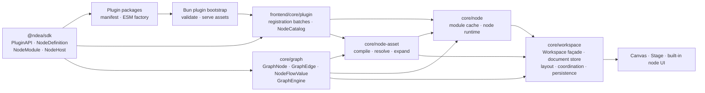

# refactor: Decouple nodes and establish plugin architecture

## Summary

Remove Workspace ownership from reusable node, graph, registry, and runtime contracts. Keep Workspace as the product composition boundary for documents, Canvas/Stage layout, coordination, presets, and persistence. Replace the current stack of `Ws*` types, dual registry halves, `NodeDef` projection, Dashboard host shim, Workspace host Proxy, and legacy runtime aliases with one dependency direction:

`@ndea/sdk` → app graph/node core → Workspace composition → Canvas/Stage UI.

Build one deliberate extensibility model on that boundary:

- OMP-style factory registration and load/runtime separation.
- Blender-style manifests, validation, activation/disposal, stable IDs, and explicit contribution surfaces.
- Houdini/Blender-style versioned node assets: user-authored subgraphs promoted to reusable nodes.

Prefer deletion over renamed compatibility layers. Preserve product behavior, one-body/one-host lifecycle, persisted graphs, protocol/storage identities, scientific vocabulary, and the single-binary host. V1 supports trusted client plugins that contribute custom nodes; it does not create a marketplace, sandbox, generic event platform, or arbitrary server plugin API.

---

## Problem Frame

The current language encodes the wrong owner. `WsValue`, `WsNodeSpec`, `WsCookFn`, `WsNodeType`, `WsNode`, and `WsEdge` describe graph/node contracts, yet they live under `core/workspace`. Every built-in node imports `defineWsNode` and wire helpers from that Workspace-owned facade. Nominal `core/node` tests import outward through Workspace boot files. Reusable node definitions therefore depend on the product composition that should consume them.

Four compatibility architectures compound the inversion:

1. SDK `NodeSpec`/`NodeMeta`/`NodeDescriptor`, app `WsNodeSpec`, and legacy `NodeDef` each represent overlapping metadata.
2. Graph specs and lazy `plugin.ts` descriptors register as two structural halves in one map; merge order hides conflicting IDs, ports, titles, kinds, and capabilities.
3. A Dashboard/global-bus `NodeHost` is wrapped by a Workspace Proxy that replaces focus, row-set, view-sync, ordering, highlight, and API behavior.
4. Retired `selection`, `fov`, and `threshold` runtime forms remain because persistence has not migrated them.

`Workspace` itself spans more than 1,000 lines and owns graph topology, evaluator mirroring, authored emissions, Cache state, Collection actions, telemetry, coordination, Canvas editor state, Stage layout, DOM body adoption, node host construction, and deprecated transform runtime. The right response is not a global rename or service framework. The code needs ownership-aligned seams and deliberate deletion.

The current SDK and registry hint at plugins without supporting them. `NodeDescriptor.load()` requires an in-tree chunk, `tryRegisterExternalDescriptor()` has no discovery caller, module promises are cached globally, and a mutable process-wide map has no source provenance, atomic activation, disable/reload boundary, or missing-plugin recovery. React also leaks into the portable SDK. A real custom-node platform must replace these speculative fragments rather than preserve them.

---

## Requirements

### Language and ownership

- ND-R1. No abbreviated `Ws*` type, function, hook, field, or local prefix remains. Full `Workspace*` names survive only for genuine Workspace document, composition, layout, persistence, or provider contracts.
- ND-R2. `@ndea/sdk` owns portable node-author contracts and public port-value/compute types; app `core/graph` owns graph records and evaluation; app `core/plugin` owns catalog construction; app `core/node` owns live node runtime; `core/workspace` owns product composition.
- ND-R3. `core/node`, `core/graph`, and `nodes/**` never import `core/workspace`. Workspace may depend on every lower app layer.
- ND-R4. Unrelated concepts receive distinct names: node type ID, graph record ID, runtime instance ID, module kind, graph node kind, mount placement, Body placement, Canvas disposition, and persisted document state.

### Single node authority

- ND-R5. One immutable SDK `NodeDefinition` per exact node type ref owns identity, ports, config/migrations, capabilities, requirements, evaluation, module, and portable presentation hints. App catalog normalization may add source and product policy without repeating author metadata.
- ND-R6. One typed native-plugin tuple derives built-in registration, current node-type refs, palette enumeration, and fitness tests. Manual `WsNodeType`, `ALL_TYPES`, `REGISTRATION_ORDER`, descriptor boot, and graph-definition boot lists disappear.
- ND-R7. SDK `NodeDefinition` is the static author contract; `NodeModule` is the lazy implementation contract. Canvas/Stage placement decisions, catalog construction, and product instance policy remain app-local.
- ND-R8. Node modules and Bodies use SDK host capabilities and node-owned config. They never call `useWorkspace` or import Workspace Canvas implementation files.

### Runtime and composition

- ND-R9. One app node-host factory assembles capability-gated services once. Workspace supplies explicit graph/coordination adapters; no Dashboard shim plus Workspace Proxy stack remains.
- ND-R10. One mounted Body, host, device lease, and cleanup lifetime survives Canvas ↔ Stage ↔ fullscreen moves and disposes once.
- ND-R11. Workspace remains the transaction façade that keeps document topology and GraphEngine projection synchronized. Extraction must not expose independently mutable graph/document stores.
- ND-R12. Coordination depends on a narrow scope/cell adapter, not the complete Workspace state store.

### Persistence and removal

- ND-R13. Runtime graph records derive registry metadata. Persisted `pluginId` and copied `kind` migrate away; authored label overrides, topology, edge evidence, config, placement, layout, and interaction state remain intact.
- ND-R14. Legacy `selection` → `cache` and `fov` → `image-viewer` migrate before retired IDs leave current unions/registry/palette.
- ND-R15. Deprecated Threshold either migrates with proven semantic equivalence to Wrangle or becomes an ordinary compatibility NodeModule. Its one-off engine/host architecture is deleted in either case.
- ND-R16. Unknown, future, corrupt, unavailable, or write-failed persisted documents enter recovery. No destructive `dropUnknownNodes`, seed, autosave, or active-key rewrite follows a failed migration/access operation.
- ND-R17. Dead/speculative surfaces are removed after caller proof; load-bearing predicate, row-set, coordination, body-adoption, and fixed Collection/annotation storage seams remain.
- ND-R18. The final boundary and cutover manifests prove every move/deletion, exact package export surface, absence of retired public names, and zero reverse Workspace imports.

### Plugins and custom nodes

- ND-R19. A plugin is an installable package with a validated manifest and trusted client ESM factory. A node definition is one registered type. A node asset is a declarative reusable subgraph. A node instance is one Workspace occurrence. Code and product copy use these terms consistently.
- ND-R20. `@ndea/protocol` owns serialized plugin-manifest/bootstrap/diagnostic schemas. `@ndea/sdk` re-exports the manifest author view and owns `PluginFactory`, `PluginAPI`, `NodeDefinition`, framework-neutral `NodeModule`, `NodeHost`, compatibility, and version contracts. It imports no app module and no React runtime.
- ND-R21. Plugin manifests declare distinct manifest version, plugin version, SDK range, one self-contained client ESM entry, optional static-asset allowlist, host/platform compatibility, license, and high-risk permissions. `ndea plugin validate` and startup use the same protocol validator before executing code.
- ND-R22. Server startup discovers explicit project-YAML plugin paths plus enabled packages under the user NDEA plugin root, validates canonical paths and assets, and publishes one bootstrap catalog. Workspace documents contain semantic node refs, never install paths. The browser imports factories before React/Workspace boot, validates each contribution batch atomically, and freezes a session-local `NodeCatalog`.
- ND-R23. Built-ins register through one native plugin factory and the same definition validator. `ndea/*` IDs are reserved; duplicate external exact type refs fail with source-aware diagnostics and cannot shadow built-ins.
- ND-R24. Each default-exported plugin factory receives a registration-only `PluginAPI`; the API closes when factory setup resolves and the returned disposer runs at session teardown. V1 exposes custom-node contributions, labels, and diagnostics—not Workspace, mutable registries, generic events, commands, panels, server routes, SQL hooks, themes, or filesystem objects.
- ND-R25. Plugin packages may register multiple exact `{ nodeTypeId, nodeTypeVersion }` definitions. Palette creation may choose the latest compatible version; persisted instances resolve their exact version and never upgrade by ambiguity.
- ND-R26. Each definition owns config schema/version and deterministic migrations. Migration completes before runtime/Body creation. Missing, disabled, incompatible, or failed definitions produce unresolved-node placeholders that preserve raw config, topology, placement, and interaction state.
- ND-R27. Plugin code/catalog metadata may cache per browser session; runtime hosts, Bodies, device leases, and closures remain per Workspace session and node instance. One failed plugin does not invalidate successful contribution batches.
- ND-R28. V1 plugins are documented trusted same-origin code. Capability/permission declarations communicate and gate supported host services but do not claim a sandbox. Executable code never embeds in Workspace documents.
- ND-R29. A node asset stores a versioned acyclic inner graph, promoted ports/parameters, exact dependencies, docs/presentation, and linked/embedded provenance. Users can create it from a subgraph, edit its definition explicitly, and publish a new version without silently mutating existing instances.
- ND-R30. Node assets may nest but never recurse. The flat `GraphEngine` expands an asset into deterministic outer-instance-scoped inner IDs; the current Subnet proxy/storage shape does not become the public asset format.

---

## Key Technical Decisions

- ND-KTD1. **Ownership before spelling.** Move contracts to the correct layer before final names settle. A renamed `workspace/node-kit` would preserve the defect.
- ND-KTD2. **One definition, no half merge.** SDK `NodeDefinition` contains non-overlapping identity/spec/evaluation/module/presentation-hint facets. App catalog normalization adds provenance and policy without copying fields. No structural half detection or spread precedence remains.
- ND-KTD3. **Keep SDK small and author-facing.** Retain plugin/definition/host/module/asset contracts, branded identities, explicit compatibility, and version helpers. Remove product layout policy, unused render facade, declaration-merging registry types, mutable app registries, and speculative aliases.
- ND-KTD4. **Keep Workspace as façade, not owner of node contracts.** Do not replace the product façade with a service graph. Extract graph/runtime responsibilities and pure state operations while retaining one transaction seam for document + evaluator mutation.
- ND-KTD5. **One host path.** Build one explicit capability-gated host/runtime handle. Inject Workspace coordination and graph services once; delete inert host facets, global mirrors shadowed by Workspace, and the runtime Proxy.
- ND-KTD6. **Preserve Body adoption; remove React from SDK.** `NodeModule` exposes a framework-neutral element/mount/dispose lifecycle. App adapters mount built-in React Bodies once; external plugins may own any framework inside their element. DOM reparenting preserves React/WebGPU state.
- ND-KTD7. **Delete the Threshold exception.** Characterize config/predicate equivalence first. Prefer a `threshold` → `wrangle` persisted migration; otherwise keep a normal NodeModule compatibility implementation without `registerEngine`, transform-host maps, or fake host services.
- ND-KTD8. **Separate runtime models from persisted DTOs.** TypeScript moves do not bump document version. Removing fields, changing IDs, or renaming persisted keys uses explicit stepwise migration, backup, validation, and recovery.
- ND-KTD9. **One deliberate extension platform.** Adapt OMP registration/runtime separation, Blender manifest/activation discipline, and Houdini/Blender reusable subgraphs. Keep V1 narrow: trusted client custom nodes only.
- ND-KTD10. **Catalog snapshot, not mutable global registry.** Discovery, import, and validation collect batches before one immutable session catalog exists. Enable/disable/reload rebuilds a session; active production Workspaces never observe half-registered state.
- ND-KTD11. **Separate five version axes.** Manifest schema, plugin package, SDK range, node type/config, node asset, and Workspace document versions retain distinct names and migration rules.
- ND-KTD12. **Code plugins and node assets are different.** Plugins install executable primitives; node assets package user-authored graphs. Only declarative assets may link/embed with a Workspace.

---

## Target Architecture



Arrows mean “may depend on.” Reverse imports fail the architecture gate.

### Ownership matrix

| Concern                        | Owner                                  | Canonical contract                                                                                                                     |
| ------------------------------ | -------------------------------------- | -------------------------------------------------------------------------------------------------------------------------------------- |
| Plugin wire format             | `@ndea/protocol`                       | `PluginManifest`, bootstrap entry, and diagnostics schemas                                                                             |
| Plugin author/runtime contract | `@ndea/sdk`                            | Re-exported manifest view, trusted ESM `PluginFactory`, `PluginAPI`, definitions, compatibility helpers                                |
| Plugin activation              | `frontend/core/plugin`                 | Registration batch, disposer, immutable session `NodeCatalog`                                                                          |
| Static author metadata         | `@ndea/sdk`                            | `NodeDefinition`: exact type ref, title, evaluation role, ports, config schema/version/migrator, capabilities, requirements, docs/icon |
| Lazy implementation            | SDK contract; catalog definition value | Framework-neutral `NodeModule`: Body/runtime factories and defaults; no repeated metadata                                              |
| Runtime identity               | SDK                                    | Branded node-instance ID, separate from type ID and graph-record ID                                                                    |
| Graph model/evaluation         | `core/graph`                           | Graph node/edge records, `NodeFlowValue`, cook algebra, legality, evaluator                                                            |
| Native contributions           | app plugin composition                 | One native plugin factory registering the typed built-in tuple                                                                         |
| Node catalog                   | `frontend/core/plugin`                 | Exact type-ref map, provenance, compatibility, availability, focused selectors                                                         |
| Live node runtime              | `core/node`                            | Module/host/body lifetime, capability adapters, idempotent teardown                                                                    |
| Declarative node assets        | `core/node-asset`                      | Versioned inner graph, promoted interface/parameters, dependencies, compiler, linked/embedded library                                  |
| Node-specific UI/commands      | `nodes/<type>`                         | Config, Body/module, node-specific behavior; no Workspace imports                                                                      |
| Product transaction façade     | `core/workspace`                       | Add/connect/remove/pin/stage/load operations that coordinate document and evaluator                                                    |
| Workspace document/editor      | `core/workspace`                       | Full-word Workspace state, Canvas editor selection, layout, placement, coordination                                                    |
| Persistence                    | `core/workspace`                       | Versioned DTOs and migration/recovery adapters separate from runtime types                                                             |

### Public contract shape

The exact property spelling may settle during ND-U2, but the ownership and lifecycle do not:

```ts
export type PluginFactory = (api: PluginAPI) => void | (() => void) | Promise<void | (() => void)>;

export interface PluginAPI {
  registerNode(definition: NodeDefinition): void;
}

export interface NodeDefinition {
  ref: { id: NodeTypeId; version: NodeTypeVersion };
  spec: NodeSpec;
  evaluate?: NodeCompute;
  load?: () => Promise<NodeModule>;
  presentation?: NodePresentationHints;
}

export interface NodeModule {
  createRuntime?(host: NodeHost): NodeRuntime;
  mountBody?(host: NodeHost): MountedNodeBody | Promise<MountedNodeBody>;
}

export interface MountedNodeBody {
  readonly element: HTMLElement;
  dispose(): void;
}
```

Plugin modules default-export `PluginFactory`. The host closes `PluginAPI` after setup, validates the complete batch, and either commits every definition or none. App catalog records add provenance and availability results. They do not alter author-owned fields.

### Canonical extension vocabulary

| Term            | Exact meaning                                                                      |
| --------------- | ---------------------------------------------------------------------------------- |
| Plugin          | Trusted installable code package with one manifest and client factory              |
| Plugin factory  | Registration-only setup function; may return one session disposer                  |
| Node definition | Versioned author contract for one node type                                        |
| Node module     | Lazy executable implementation of a definition                                     |
| Node host       | Capability-gated services for one live node instance                               |
| Node runtime    | Per-instance compute/lifecycle object                                              |
| Body            | One mounted UI element owned by a node runtime and adopted across product surfaces |
| Node asset      | Versioned declarative reusable subgraph created by a user                          |
| Node instance   | One exact-version occurrence in a Workspace graph                                  |
| Node catalog    | Immutable session snapshot of validated native, plugin, and asset definitions      |
| Unresolved node | Preserved instance whose exact definition is unavailable or failed                 |
| Custom node     | User-facing umbrella for a plugin-provided definition or user-authored node asset  |

Use `extension` only as the ecosystem concept in prose. Code/API identifiers use the precise term above. `DataCapability`, `NodeCapability`, `PluginPermission`, and `NodeAvailability` remain separate.

### Canonical definition invariant

Each built-in, plugin node, or compiled node asset has one definition with non-overlapping facets:

- `identity`: exact node type ID/version plus display metadata.
- `spec`: role, ports, capabilities, config/migrations, requirements, documentation.
- `graph`: cook/checkpoint behavior.
- `module`: optional lazy implementation loader.
- `presentation`: geometry, Canvas/Stage policy, palette presence, optional node-owned Body.
- `source`: native/plugin/asset provenance supplied by catalog resolution, never authored twice.

Identity and ports have one owner. Plugin manifests do not repeat node metadata. Catalog construction rejects duplicate exact refs, reserved namespace violations, incompatible SDK ranges, undeclared required host services, invalid config migrators, and asset dependency cycles before Workspace load.

---

## Removal Ledger

| Remove                                                                                          | Why                                                          | Prerequisite                                                               |
| ----------------------------------------------------------------------------------------------- | ------------------------------------------------------------ | -------------------------------------------------------------------------- |
| `core/workspace/node-defs.ts`                                                                   | Proxy/cache/projection duplicates registry metadata          | Migrate all Canvas/Stage/runtime callers to canonical definition selectors |
| `core/workspace/node-kit.ts`                                                                    | Mixes values, cook, registry, Canvas, and Workspace concerns | Extract focused graph/node/config modules                                  |
| `registry-types.ts` and declaration-merging blocks                                              | No production consumer; unchecked cast facade                | Canonical typed built-in tuple                                             |
| Two-half registry merge and complement detection                                                | Hides real metadata disagreement                             | Reconcile every built-in into one definition                               |
| `tryRegisterExternalDescriptor` and global mutable registry                                     | Speculative one-off mutation without provenance/lifecycle    | Registration batches and immutable `NodeCatalog`                           |
| `NodeDef`, `WsNodeSpec`, `defineWsNode`, `getWsNode`, `listWsNodes`                             | Wrong/parallel authority                                     | Canonical definition registry                                              |
| Manual current-ID unions/order arrays                                                           | Duplicate built-in authorities                               | Derive from built-in tuple; separate legacy input union                    |
| SDK `NodeMeta`/descriptor metadata duplication, React component contract, and app layout policy | Repeated identity plus product/framework leakage             | Final author-facing definition/module contract                             |
| `RenderApi`/RenderBus and shadowed global focus/view-sync facades                               | No node consumer or replaced by Workspace host services      | Host consumer characterization and unified factory                         |
| Dashboard host shim + Workspace host Proxy                                                      | Two host/routing authorities                                 | Explicit injected node-host factory                                        |
| Hostless Scatter selection/GPU fallbacks                                                        | Unreachable in current hosted mount path                     | Hosted small/large lasso tests; retain fixed server seam                   |
| Workspace-store `sqlOf` and other one-caller re-exports                                         | Explicit compatibility aliases                               | Move known callers                                                         |
| `pluginId` and copied graph-record `kind`                                                       | Persisted duplicates of registry authority                   | Versioned document migration                                               |
| Runtime `selection`/`fov` aliases                                                               | Persistence compatibility in current model                   | Versioned ID/config migration                                              |
| Threshold graph-host/instance/escape-hatch stack                                                | One deprecated node justifies parallel runtime               | Proven Wrangle migration or normal compatibility module                    |

### Explicitly preserved

- Predicate SelectionBus, bitmap row-set BroadcastBus, graph emissions, coordination focus, and graph-editor selection remain distinct.
- DOM Body/Header adoption remains.
- Fixed `__scatter_selection` server storage/routes remain for Collection/annotation flows.
- Edge `kind`/`toPort` remain unless a separate document decision proves they are redundant.
- Authored per-instance label overrides remain.
- Trusted local-code posture matches the in-process runtime; no false sandbox claim.

---

## Scope Boundaries

### In scope

- `packages/sdk/src/{types,host,index}.ts` and barrel fitness tests.
- `packages/protocol` plugin manifest/bootstrap/diagnostic wire schemas.
- App CLI/server plugin discovery, validation, asset serving, and bootstrap.
- Frontend plugin catalog/loader/runtime plus a validated example custom-node package.
- Declarative node-asset DTOs, compiler, library, publish/upgrade flow, and unresolved-node UI.
- `apps/ndea/src/frontend/core/{graph,node,host,workspace,coordination,buses}`.
- Built-in definitions/modules/Bodies under `apps/ndea/src/frontend/nodes`.
- Versioned Workspace document/config migrations required to remove duplicate metadata and retired node IDs.
- Boundary, registry, lifecycle, interaction, persistence, and import fitness checks.

### Deferred

- Remote marketplace, dependency solver, signing/notarization, automatic download/update, and package publication service.
- Untrusted plugin sandbox/Worker/iframe RPC and enforceable ambient browser permissions.
- Server-side plugin code, custom routes/SQL/storage hooks, commands, panels, themes, generic events, and non-node contribution types.
- Production hot mutation of a live Workspace catalog. Reload creates a new session snapshot; developer hot reload may exercise disposal/rebuild.
- DI/event frameworks or a general service architecture.
- Protocol, SQL/cache/sidecar, AnnData/MuData/OME-Zarr, and fixed Collection/annotation storage redesign.
- Removing edge topology evidence or regrouping persisted JSON merely to match internal modules.

---

## Implementation Units

### ND-U1. Characterize authority, lifecycle, and persistence

- **Goal:** Freeze current behavior and produce finite cutover/deletion manifests before changing ownership.
- **Requirements:** ND-R4–ND-R30.
- **Dependencies:** None.
- **Files:** registry/node-anatomy/host-routing tests; Workspace persistence fixtures; Canvas/Stage body lifecycle tests; CLI/server/frontend startup; build/static serving; `VOCABULARY.md` cutover manifest.
- **Approach:** Capture every duplicated metadata field and current built-in order; raw v2 documents containing Selection, FOV, Threshold, labels, plugin IDs, kinds, configs, topology, Stage layout, graph selection, and coordination; small/large lasso routing; focus transitions; body/device/disposal counts; current in-tree module loading; startup order; and single-binary asset serving. Record each move/delete with caller set and migration posture.
- **Verification:** Later units can name the exact baseline and manifest row they close. Current disagreements fail explicitly rather than disappearing under registry merge order.

### ND-U2. Slim and standardize the SDK node contract

- **Goal:** Make SDK a portable plugin/node-author leaf without product layout, React, or mutable app machinery.
- **Requirements:** ND-R2, ND-R4, ND-R7, ND-R9, ND-R17–ND-R21, ND-R24–ND-R30.
- **Dependencies:** ND-U1.
- **Files:** `packages/protocol/src/plugin.ts`; `packages/sdk/src/{plugin,node,module,host,version,index,index.test}.ts`; package manifests; app SDK consumers.
- **Approach:** Define serialized manifests once in protocol, then re-export their author view from SDK. Establish `PluginFactory`, registration-only `PluginAPI`, exact node type refs, `NodeDefinition`, public port-value/compute types, framework-neutral `NodeModule`/Body lifecycle, config migration, branded runtime identity, capability/permission types, and named version helpers. Distinguish graph role, host capability, plugin permission, availability, module lifecycle, placement, and Body presentation. Remove `NodeMeta`/descriptor duplication, React types/peer, product placement, unused render facade, declaration merging, and mutable registration helpers. Clean-cut every monorepo caller; no SDK aliases.
- **Verification:** Barrel-only plugin and node-author fixtures compile against the exact final surface; every retired SDK export and React import fails a negative fixture; SDK imports no app module.

### ND-U3. Extract graph vocabulary and evaluation from Workspace

- **Goal:** Move reusable graph records, evaluation, cook helpers, and engine adapters into `core/graph`; publish author-facing port values/compute types through SDK.
- **Requirements:** ND-R1–ND-R4, ND-R11, ND-R18.
- **Dependencies:** ND-U1, ND-U2.
- **Files:** `core/workspace/{types,node-kit,workspace-store}.ts`, `core/graph/`, graph/node tests, all `WsValue`/`WsNode`/`WsEdge` consumers.
- **Approach:** Introduce full, role-specific graph names such as node type ID, graph node/edge, and graph node kind. Move the stable predicate/selection/focus port-value and compute contract to SDK; keep graph records, evaluator state, and app adapters in `core/graph`. Keep runtime types separate from persisted DTOs. Preserve Workspace action methods and document/evaluator atomicity while moving pure/runtime contracts. Rename genuine Workspace state with full words.
- **Verification:** `core/graph` imports no Workspace, React, Canvas, Stage, or persistence module. Graph evaluator behavior, push/pull emissions, Cache state, topology, and edge legality match ND-U1.

### ND-U4. Build one authoritative node definition catalog

- **Goal:** Replace dual halves, manual lists, compatibility projections, and mutable globals with one validated catalog substrate.
- **Requirements:** ND-R2–ND-R8, ND-R17–ND-R20, ND-R23–ND-R27.
- **Dependencies:** ND-U1–ND-U3.
- **Files:** `frontend/core/{plugin,node}/{catalog,registration,load-module}.ts`, Workspace descriptor/boot files, every `nodes/**/{node,plugin}.tsx/ts`, `node-defs.ts`, catalog tests.
- **Approach:** Reconcile each node’s exact type ref/title/role/ports/capabilities/config/module/presentation into one definition. Rename retained implementation files to `module.ts`. Express built-ins as one native plugin factory over a typed tuple. Collect contributions into isolated batches; validate reserved namespaces, compatibility, definition shape, config migrators, and exact-ref conflicts; then freeze focused maps/selectors. Delete half merge, Proxy projection, declaration merging, `tryRegisterExternalDescriptor`, process-global mutation, and unused exports.
- **Verification:** Every current built-in registers once through the native factory. Duplicate/conflicting exact refs fail with both sources. Scatter/charts/Table/Annotate/Image Viewer expose characterized ports. Catalog construction is deterministic and no core/node/plugin test imports Workspace.

### ND-U10. Add plugin discovery, validation, and bootstrap

- **Goal:** Load trusted custom-node packages through one inspectable server-to-browser path before Workspace boot.
- **Requirements:** ND-R19–ND-R28.
- **Dependencies:** ND-U1, ND-U2, ND-U4.
- **Files:** `packages/protocol/src/plugin.ts`; app CLI config/commands/startup; server plugin manifest/discovery/static/bootstrap routes; `frontend/core/plugin/{loader,runtime,diagnostics}.ts`; frontend entrypoint; build/static tests.
- **Approach:** Define one versioned manifest/bootstrap schema in protocol. Discover explicit project paths plus configured user plugin roots without recursive code execution; canonicalize roots; validate path containment, manifest fields, SDK range, platform, permissions, a self-contained prebuilt client ESM file, and an optional static-asset allowlist. Serve only those files under reserved content-addressed URLs and proxy the route through Vite dev. Frontend imports factories in deterministic order, commits valid batches atomically, reports per-plugin failures, freezes the catalog, and then mounts React. Enable/disable/reload creates a new session snapshot. Keep built-in chunks embedded and external assets outside `$bunfs`.
- **Verification:** A valid fixture plugin loads in dev and compiled-host static tests; missing/invalid/incompatible/path-traversing/conflicting plugins produce source-aware diagnostics without blocking valid plugins. No request handler rescans disk, no plugin code runs before validation, and no Workspace loads before catalog freeze.

### ND-U5. Move node UI and behavior behind NodeHost

- **Goal:** Make built-in nodes independent of Workspace implementation and own their Bodies/commands.
- **Requirements:** ND-R3, ND-R7–ND-R10, ND-R17, ND-R18, ND-R20, ND-R24, ND-R27.
- **Dependencies:** ND-U2–ND-U4.
- **Files:** `nodes/**`, Workspace `canvas/{node-extras,WranglePane}.tsx`, host hooks, body runtime, Scatter/Gallery/Table focus and GPU hooks.
- **Approach:** Move Dataset/Cache/Export/Collection/Count/Subnet/Wrangle Bodies to their node folders. Replace direct Workspace reads/writes with declared host config/data/predicate/row-set/focus APIs. Create an app-local React Body adapter and one reusable host-focus hook; SDK modules return framework-neutral mounted Body handles. Remove duplicate Scatter subscriptions, stale global Table highlight, obsolete gallery “panel” language, and hosted-node fallback branches.
- **Verification:** `nodes/**` contains no Workspace import. SDK contains no React import. Built-in React and fixture non-React Bodies share the same host/runtime/adoption lifecycle; interaction channels remain independent.

### ND-U6. Unify node runtime, host assembly, and Body lifetime

- **Goal:** Preserve one live node Body while removing the Dashboard shim + Workspace Proxy stack.
- **Requirements:** ND-R9–ND-R12, ND-R17, ND-R18, ND-R24, ND-R27, ND-R28.
- **Dependencies:** ND-U2, ND-U4, ND-U5, ND-U10.
- **Files:** `core/host/use-dashboard-host-shim.ts`, `core/workspace/body-dock.tsx`, `core/graph/graph-host.ts`, buses/stores, GPU device context, host/runtime tests.
- **Approach:** Extract the module/host/body owner into `core/node/runtime`; inject data, graph, coordination, UI, lifecycle, and capability services once. Track module state as `unloaded | loading | ready | failed` rather than retaining an opaque rejected promise. Keep Workspace Body/Header sockets and activation as presentation adapters. Delete the host Proxy, shadowed global focus/view-sync/render paths, inert capabilities, and unmanaged hosted-node GPU fallback. Dispose node instances before plugin batches in reverse order.
- **Verification:** One module load, host, Body, device lease, and dispose per node lifetime; Canvas/Stage/fullscreen moves never remount. Load failure is observable and isolated. Capability absence is explicit, not a no-op.

### ND-U7. Narrow Workspace composition without a service rewrite

- **Goal:** Leave Workspace with product document/editor/layout/persistence ownership and one transaction façade.
- **Requirements:** ND-R1–ND-R4, ND-R11, ND-R12, ND-R18, ND-R22, ND-R26, ND-R27.
- **Dependencies:** ND-U3, ND-U4, ND-U6, ND-U10.
- **Files:** `core/workspace/{workspace-store,workspace-context,types,feedback,presets}.ts`, Canvas/Stage modules, coordination.
- **Approach:** Rename `WsState`/`useWsSelector` with full Workspace language. Extract graph runtime and node runtime dependencies; give coordination a narrow scope/cell adapter; move node-specific commands/Bodies out. Keep topology + evaluator mutations atomic through the Workspace façade. Split pure layout/editor operations only where it shortens the class without adding services or indirection.
- **Verification:** Workspace owns no reusable definition/module/graph-value/plugin contract. Existing add/connect/remove/pin/stage/preset flows retain one transaction seam and behavior; unresolved definitions cannot trigger destructive cleanup.

### ND-U8. Migrate persisted node records and retired identities

- **Goal:** Remove duplicate metadata and legacy runtime forms without losing user graphs.
- **Requirements:** ND-R13–ND-R16, ND-R18, ND-R25, ND-R26, ND-R28.
- **Dependencies:** ND-U1, ND-U4, ND-U7, ND-U10.
- **Files:** Workspace persisted DTOs/migrations/load seam, node config migrators, Selection/FOV/Threshold definitions and fixtures.
- **Approach:** Separate versioned input DTOs from runtime state. Back up before rewrite. Migrate built-ins to exact `{ nodeTypeId, nodeTypeVersion }`, Selection to Cache, FOV to Image Viewer; remove duplicate `pluginId`/`kind`; preserve label overrides. Characterize Threshold-to-Wrangle equivalence; migrate or load it through an ordinary compatibility definition. Resolve exact definitions only after catalog freeze and run config migration before runtime creation. Missing/disabled/incompatible definitions become unresolved records/placeholder Bodies. Unknown/future/failure states preserve raw/active bytes and suppress seed/autosave.
- **Verification:** Migration is idempotent; old graphs retain topology/config/layout/selection/focus/placement; current runtime contains exact type refs without duplicate provenance. Missing plugin fixtures round-trip byte-for-byte and recover when the exact plugin returns.

### ND-U11. Add declarative node assets and user authoring

- **Goal:** Let users turn subgraphs into reusable, versioned custom nodes without writing executable plugin code.
- **Requirements:** ND-R19, ND-R25, ND-R26, ND-R29, ND-R30.
- **Dependencies:** ND-U3, ND-U4, ND-U7, ND-U8, ND-U10.
- **Files:** `frontend/core/node-asset/{schema,library,compiler,resolver,migrations}.ts`; Subnet/proxy authoring UI; Workspace persistence; palette; asset tests.
- **Approach:** Define a declarative asset format with globally unique asset/type identity, semantic asset version, stable local inner IDs, promoted ports and parameter bindings, exact definition/asset dependencies, docs/presentation, hidden/internal status, and `linked | embedded` source. Add “Create Node Asset” from a selected subgraph/Subnet, explicit “Edit Definition,” and publish-new-version flow. Validate port compatibility and dependency cycles. Expand instances into deterministic namespaced GraphEngine nodes while keeping only the outer instance in Workspace topology. Keep the current Subnet as an authoring/grouping aid; migrate away from persisted proxy seams only when equivalence is proven.
- **Verification:** A user creates, nests, saves, reopens, links/embeds, and versions an asset; old instances stay pinned while new palette creation selects the latest compatible version. Recursive assets fail with a dependency trace. Missing linked assets render unresolved without losing the outer instance or embedded fallback.

### ND-U12. Prove the plugin author experience

- **Goal:** Make the extension contract usable without internal imports or undocumented build assumptions.
- **Requirements:** ND-R19–ND-R28.
- **Dependencies:** ND-U2, ND-U4–ND-U6, ND-U10, ND-U11.
- **Files:** `examples/plugins/custom-node/`; root workspace config; `ndea plugin validate`; SDK/plugin docs; package/export/boundary tests.
- **Approach:** Build one minimal transform and one mounted custom view through only `@ndea/sdk`. Include manifest, prebuilt client entry, config migration, availability reason, permissions disclosure, lifecycle/disposal, and failure fixture. Use the same example in dev, production static serving, compiled binary host, and SDK barrel tests. Document trusted-code posture, terminology, exact version axes, install/config paths, and linked versus embedded node assets.
- **Verification:** A new author can build/validate/load the example with public commands and barrel imports only. Negative fixtures reject deep imports, undeclared capabilities, reserved IDs, duplicate refs, incompatible SDK ranges, invalid migrations, and escaped assets.

### ND-U9. Delete residual compatibility and enforce boundaries

- **Goal:** Finish the clean cutover and prevent the inverted architecture from returning.
- **Requirements:** ND-R1–ND-R30.
- **Dependencies:** ND-U1–ND-U8, ND-U10–ND-U12.
- **Files:** deletion manifest targets, workspace-boundary script/fixtures, package barrels, contributor vocabulary/docs.
- **Approach:** Close every deletion/cutover row. Delete aliases, dead registry/coordination exports, misleading descriptor/plugin comments/files, unused host/render facets, and unreachable fallback code. Add architecture fixtures that reject Workspace reverse imports, SDK app/React imports, private plugin deep imports, mutable post-freeze registration, and retired exports. Update vocabulary with plugin/definition/asset/instance, capability/permission/availability, identity, and version distinctions.
- **Verification:** Every manifest row closes; no `Ws*`, `NodeDef`, `NODE_DEFS`, persisted `pluginId`, `defineWsNode`, half merge, global mutable registry, host shim/Proxy, or retired runtime ID remains. Valid plugins/assets and all preserved seams retain focused behavioral proof.

---

## Acceptance Examples

- ND-AE1. **Dependency direction:** A built-in node definition imports SDK plus graph/node core only; any Workspace import fails the architecture gate.
- ND-AE2. **Single authority:** Scatter, charts, Table, Annotate, and Image Viewer expose one ID/title/role/port/config/capability/module definition; a conflicting duplicate cannot register.
- ND-AE3. **Clean language:** Current TypeScript contains no `Ws*` abstraction. Full Workspace names identify only provider/document/layout/persistence composition.
- ND-AE4. **Runtime lifecycle:** Moving a GPU Scatter Body from Canvas to Stage to fullscreen preserves component state and one device lease, then disposes once.
- ND-AE5. **Interaction integrity:** Predicate, row set, focus, Collection filter, and graph-editor selection remain independent through set/clear/disconnect flows using one scoped host source.
- ND-AE6. **Legacy safety:** A document containing Selection, FOV, Threshold, copied kind/plugin ID, labels, edges, layout, and config migrates once and round-trips canonically without data loss.
- ND-AE7. **Failure safety:** Unknown/future/corrupt/read-denied/quota-failed documents preserve active/raw/backup bytes and never seed or autosave over them.
- ND-AE8. **Deletion proof:** Exact negative compile fixtures reject every retired public symbol/import, while focused tests prove preserved predicate, row-set, body-adoption, and fixed Collection/annotation storage seams.
- ND-AE9. **Manifest before execution:** Invalid schema, SDK range, platform, path, permission, or entry assets fail validation without importing plugin code.
- ND-AE10. **Atomic isolation:** One plugin registers two valid nodes or none. Its thrown factory, duplicate ID, or invalid definition leaves other plugin batches intact and produces source-aware diagnostics.
- ND-AE11. **Bootstrap order:** Built-ins and valid external factories resolve into a frozen catalog before Workspace persistence reads any node record or React mounts.
- ND-AE12. **Public authoring surface:** The example plugin builds a transform and a mounted view using only `@ndea/sdk`; no app/private/deep import appears in its dependency graph.
- ND-AE13. **Exact versioning:** Two versions of one node type coexist. New placement chooses the declared default/latest compatible version; reopening an old Workspace resolves its exact version without substitution.
- ND-AE14. **Missing plugin recovery:** Disabling/removing a plugin preserves its unresolved node instances, edges, raw config, layout, and labels; restoring the exact plugin rehydrates them.
- ND-AE15. **Node asset authoring:** A user promotes a subgraph interface, publishes a node asset, nests it, links or embeds it, and creates a new version while existing instances remain pinned. Direct or indirect recursion fails with a cycle trace.
- ND-AE16. **Trust language:** Manifest permissions, SDK host capabilities, dataset capabilities, and availability reasons appear as separate contracts. Product copy calls V1 plugins trusted code and never promises sandbox enforcement.

---

## Merge Map into the Terminology Plan

| Derivative unit                   | Combined-plan owner     |
| --------------------------------- | ----------------------- |
| ND-U1 characterization/manifests  | Existing U2 and U14     |
| ND-U2 SDK leaf contract           | Narrow existing U4      |
| ND-U3 graph extraction            | New U15                 |
| ND-U4 canonical app registry      | New U16                 |
| ND-U5 node-owned UI/behavior      | New U17                 |
| ND-U6 host/body runtime           | New U18                 |
| ND-U7 Workspace narrowing         | New U19                 |
| ND-U8 persisted node migration    | Existing U9 and U10     |
| ND-U10 plugin discovery/bootstrap | New U20                 |
| ND-U11 declarative node assets    | New U21                 |
| ND-U12 plugin author proof        | New U22                 |
| ND-U9 deletion/boundary closure   | Existing U7 and new U22 |

The combined plan must preserve all existing U-IDs. New units begin at U15. Execution order is U1–U4 → U10 → U5–U8 → U11–U12 → U9, regardless of numeric label. Existing terminology units absorb only work already within their semantic owner; no duplicate derivative unit survives after the merge.

---

## Risks and Mitigations

- **A global rename preserves false ownership.** Move/split first; rename only after the target boundary exists.
- **One definition becomes a god record.** Keep SDK spec, graph, module, and presentation facets nested and non-overlapping; reject repeated metadata.
- **Workspace split breaks atomic topology/evaluator changes.** Retain one façade transaction seam and characterize every graph action before extraction.
- **Host unification breaks focus or GPU lifetime.** Test all focus transitions and one-body/device/dispose counts across surface moves.
- **Dead frontend fallback is confused with live server storage.** Remove hosted Scatter fallback only; retain and test fixed Collection/annotation storage separately.
- **Persisted metadata removal loses authored labels or unknown nodes.** Preserve label overrides, migrate before validation, and replace destructive self-healing with recovery.
- **Threshold migration changes filtering semantics.** Require semantic equivalence fixtures; fall back to a normal compatibility module, never the special architecture.
- **A plugin host API becomes a second Workspace.** Keep `PluginAPI` registration-only and `NodeHost` capability-gated; reject generic service lookup, event buses, and raw stores.
- **Trusted code is mistaken for sandboxed code.** State the boundary in manifest UI and docs. Permissions disclose intent; they do not neutralize same-origin JavaScript.
- **External UI duplicates React or breaks hooks.** Keep SDK framework-neutral and let each external plugin own its Body element/runtime. Built-in React remains behind an app adapter.
- **Plugin assets escape their roots.** Canonicalize paths once at startup, enforce root containment and reserved routes, serve only manifest-approved files, and never scan during requests.
- **Async plugin load races Workspace restore.** Make catalog freeze a required bootstrap gate; failures yield diagnostics, not late registry mutation.
- **Version fields collapse into “latest.”** Keep named manifest/plugin/SDK/node/config/asset/document versions and exact persisted refs; test coexisting versions.
- **Node assets recurse or multiply work.** Reject dependency cycles before catalog commit, namespace inner IDs deterministically, and preserve GraphEngine lazy sink/caching behavior.
- **A marketplace expands the threat model prematurely.** Ship explicit local/project discovery plus validate/build first. Defer remote resolution, signing, and automatic updates.

---

## Sources

- `apps/ndea/src/frontend/core/workspace/{types,node-kit,node-defs,workspace-store,workspace-context,persist,body-dock}.ts{x}` — current false ownership, projections, broad façade, and durability seam.
- `apps/ndea/src/frontend/core/node/{registry,registry-types,load-module}.ts` — current two-half registry and unused typed/external surfaces.
- `apps/ndea/src/frontend/core/graph/{engine,graph-host}.ts` — reusable evaluator and Threshold-only host exception.
- `packages/sdk/src/{types,host,index}.ts` — current portable contract plus product/speculative leakage.
- `apps/ndea/src/frontend/nodes/**/{node,plugin,module,instance,view}.ts{x}` — built-in metadata duplication, Workspace imports, and module lifecycle.
- `apps/ndea/src/frontend/core/{buses,coordination,gpu}` and `stores/` — live versus shadowed routing/state seams.
- `apps/ndea/src/{cli/config,cli/startup,server/app,server/static,frontend/main}.ts{x}` and `apps/ndea/scripts/build.ts` — plugin discovery/bootstrap/static serving and single-binary constraints.
- `apps/ndea/src/frontend/nodes/utils/subnet/node.tsx` and `Workspace.birthSubnetSeam` — current hierarchy/proxy behavior that may seed, but does not define, node assets.
- OMP SDK/extensions: <https://omp.sh/docs/sdk>, <https://github.com/can1357/oh-my-pi/blob/main/docs/extensions.md>, and `packages/coding-agent/src/{capability,extensibility/extensions,extensibility/plugins}`.
- SideFX digital assets: <https://www.sidefx.com/docs/houdini/assets/intro.html>, <https://www.sidefx.com/docs/houdini/assets/create.html>, <https://www.sidefx.com/docs/houdini/assets/namespaces.html>, <https://www.sidefx.com/docs/houdini/assets/edit.html>, <https://www.sidefx.com/docs/houdini/ref/plugins.html>, and <https://www.sidefx.com/docs/houdini/hom/locations.html>.
- Blender official sources: <https://projects.blender.org/blender/blender-manual/src/branch/main/manual/advanced/extensions/getting_started.rst>, <https://projects.blender.org/blender/blender-manual/src/branch/main/manual/interface/controls/nodes/groups.rst>, and <https://projects.blender.org/blender/blender/src/branch/main/scripts/templates_py/custom_nodes.py>.
- `docs/plans/2026-07-12-001-refactor-monorepo-terminology-standardization-plan.md` — canonical terminology/migration plan that will absorb this derivative.
