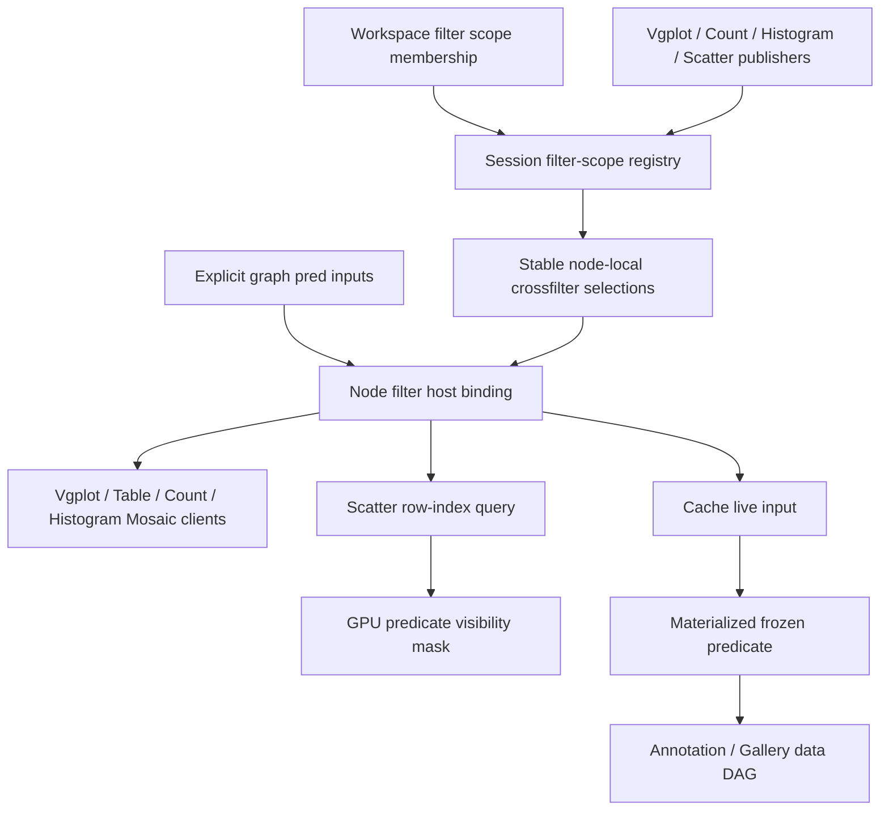

# Mosaic Filter Scopes Agent-Team Playbook

## Summary

Replace chart-to-view live `sel` edges and process-wide predicate routing with workspace filter-scope membership backed by session-local Mosaic crossfilter selections. Preserve explicit data-DAG predicates, GPU scatter filtering, and Cache as the snapshot boundary from live coordination into the data graph.

This document also defines the OMP execution team, dependency waves, cross-agent contracts, and final integration checks.

---

## Problem Frame

Current chart brushing is represented as a graph `sel` output. A chart wired to Table or Scatter filters only downstream targets, cannot receive peer filters without a backward edge, and encourages cycles in a graph evaluator designed as a DAG. `predicateBus` and `rowSetBus` partially hide that mismatch by composing process-wide state outside workspace scope membership.

Mosaic already models coordinated crossfiltering: multiple clauses share one `Selection.crossfilter()`, associated source clients skip their own clause, and peer clauses compose. Workspace coordination already models named group membership and persistence. Filter scopes should combine those two existing primitives rather than add a cycle engine or second coordination framework.

Current `charts/02-crossfilter` changes are the baseline. They already resolve a predicate to scatter row indices and apply a GPU visibility mask without rebuilding position or color buffers; this refactor changes how that predicate reaches Scatter.

---

## Scope Boundaries

**In scope**

- Runtime-backed `filter` coordination scopes and capability-gated node-host APIs.
- Vgplot, Table, Count Plot, Histogram, and Scatter query/filter adapters.
- Scatter predicate-to-row-index GPU mask path already present on the branch.
- Removal of native chart SQL-as-`sel` ports, obsolete process-wide predicate/row-set routing, and affected host plumbing.
- Cache capture of a live filter scope into a stable graph predicate.
- Workspace document migration and preset updates.
- Focused tests, integrated checks, and browser smoke coverage.

**Out of scope**

- Generic cyclic graph evaluation, feedback-delay nodes, or recursive dataflow.
- Removal of `sel` as an SDK/graph value kind; authored explicit row sets may still use it.
- Persisting Mosaic `Selection`, client, coordinator, or temporary-table objects.
- Restoring live brush clauses after reload; only scope membership persists.
- Unrelated focus, ordering, view-sync, annotation, or rendering refactors.
- Migration of external plugin-authored `sel` ports; authored row-set contracts remain valid.

---

## Requirements

**Filter coordination**

- R1. Nodes assigned to the same `filter` scope share one canonical session-local clause set mirrored into stable node-local Mosaic crossfilter selections; nodes in different scopes remain isolated.
- R2. Each query consumer combines explicit graph `pred` input with its current filter-scope selection.
- R3. A publishing view does not filter its own query clients, while every peer clause in the same scope still applies.
- R4. Multiple publishers in one scope compose with logical AND, and clearing one publisher preserves the others.
- R5. Changing, clearing, or removing a node's filter-scope membership moves or removes its clauses and client associations without remount leaks.

**Native view behavior**

- R6. Vgplot, Count Plot, Histogram, Table, and Scatter consume the shared query selection through the node-host seam.
- R7. Vgplot, Count Plot, Histogram, and Scatter publish filters into their assigned runtime scope instead of graph `sel` outputs or process-wide buses.
- R8. Scatter resolves the combined query selection to row indices and changes only the GPU predicate visibility mask; position and color buffers remain intact.
- R9. Large Scatter lassos retain revision-specific temporary-table predicates so Mosaic cannot return a stale cached result.

**Graph and cache boundary**

- R10. Native chart SQL selections no longer appear as live graph `sel` fan-out edges; explicit authored row-set ports remain valid.
- R11. An unpinned Cache assigned to a filter scope follows the current resolved predicate; pinning asynchronously materializes a revision-stable predicate that survives later brush changes and mutable temporary-table replacement.
- R12. Cache combines any explicit graph `pred` input with its assigned filter scope before pinning, preserving active-empty selections as an empty result rather than no filter.
- R13. Existing workspace documents migrate exactly representable native chart/view/cache `sel` topology into filter-scope membership before topology validation; non-representable topology uses the existing source-byte-backed recovery path.

**Lifecycle and quality**

- R14. Filter selections, clauses, subscriptions, clients, and temporary row-set resources are released when a node, workspace runtime, or dataset session is disposed.
- R15. No new package dependency, compatibility shim, deprecated alias, or parallel coordination framework remains after cutover.
- R16. Every stacked PR layer remains independently reviewable and valid on its immediate base; rebasing after a lower-layer change preserves commit ownership, CI ordering, and issue-closing semantics.

---

## High-Level Technical Design



Workspace state persists only `coordinationScopes[nodeId].filter = scope`. Dataset-session runtime owns the scope registry because Mosaic coordinator, selections, query clients, and temporary tables share that lifetime.

Each node binding keeps a stable combined query `Selection`, publisher source, facet map, associated-client set, and current scope. The registry mirrors current scope clauses into each member's stable selection through public clause update/reset and removable listener APIs. A scope change removes old-scope clauses, applies new-scope clauses, and keeps existing clients attached to the same node-local selection. An unassigned node receives no scope clauses; its stable selection still includes explicit graph predicates, and it publishes nowhere.

Clearing a brush removes only that facet and preserves scope membership. Unlinking removes scope membership, the published clause, and client associations but preserves the node's local brush state; moving or relinking republishes that current state into the new scope.

Each stable node-local crossfilter selection contains the node's explicit graph predicate clause and mirrored current-scope clauses. Clause `clients` hold the publishing node's Mosaic clients, so crossfilter resolution omits only that node's own published clause for those clients. Peer clauses and graph predicates remain active.

---

## Key Technical Decisions

- KTD1. **Scope membership persists; filter values do not:** Mosaic objects are runtime state and violate the workspace's `JsonValue` persistence rule.
- KTD2. **Extend the existing coordination registry with a runtime-backed type:** `filter` needs picker membership and scope-change notification, not a serialized coordination cell.
- KTD3. **One stable `Selection.crossfilter()` per bound node:** the scope registry mirrors canonical scope clauses into member selections, while Mosaic remains authoritative for Boolean composition and client exclusion. Public update/reset and listener teardown avoid Mosaic's non-detachable private selection relays.
- KTD4. **Keep graph predicates inside each node's stable query selection:** data-DAG filtering and symmetric workspace filtering remain orthogonal and compose once at the host seam.
- KTD5. **Associate every node-owned Mosaic client with its publisher clause:** source plots retain full distributions while peer filters apply.
- KTD6. **Keep consumers attached across scope moves:** the node-local selection identity never changes; only mirrored clauses and removable listeners change. Do not mutate `MosaicClient` internals or private relay fields.
- KTD7. **Retain Scatter's row-index query and GPU mask:** this already avoids position/color buffer rebuilds and gives active-empty filters exact semantics.
- KTD8. **Materialize Cache pins asynchronously and revision-atomically:** frozen output must not retain a mutable `sel_*` table reference. Cache commits resolved row identities only if the filter revision is unchanged after materialization; stale, aborted, or failed pins leave the prior cache untouched and surface an error.
- KTD9. **Delete obsolete buses and native live `sel` plumbing:** after filter-scope cutover, `predicateBus`, `rowSetBus`, edge row-set host bindings, and native chart selection ports have no independent role.
- KTD10. **Migrate only exactly representable native selection topology:** derive the directed influence relation induced by a candidate scope and require it to equal the original native `sel` edges. Non-representable components enter backed-up recovery; true authored row-set edges stay in the graph model.

---

## Shared Cross-Agent Contract

Implementation agents use this contract verbatim. API spelling may change only through a Main-agent decision communicated to every active agent before edits continue.

`FilterCoordinationAPI` must provide six behaviors:

1. Return the node's stable combined query `Selection`.
2. Notify non-client consumers when its resolved predicate or revision changes.
3. Publish or clear an instance facet, optionally retaining row identities for durable Cache capture.
4. Associate and disassociate Mosaic clients with the instance clause without connecting them twice.
5. Read and subscribe to resolved combined-predicate changes for non-client consumers such as Cache.
6. Abortably materialize the current resolved predicate to stable row identities and report the observed monotonic revision.

Additional invariants:

- `filter` is a runtime-backed coordination type gated by `filter-coordination`.
- Explicit graph `pred` input remains private runtime state and feeds the combined query selection.
- `useMosaicClient` owns client creation/destruction and uses the stable filter selection plus client association.
- Vgplot marks connect through the host lifecycle seam, not direct unmanaged `coordinator.connect()` calls.
- Facets remain instance-local and AND-compose inside the scope selection: `lasso`, `chart`, `range`, and `isolation` are sufficient; do not add speculative facet abstractions.
- Large-row-set publications keep the existing tokenized SQL rule.
- Cache uses the filter API's resolved-predicate subscription and abortable materializer, but it is not a Mosaic query client. Checkpoint pinning is asynchronous and exposes pending/error state.
- No implementation agent runs formatters, linters, builds, or project-wide tests during parallel waves. Each agent owns focused test changes and returns exact focused commands; Main runs validation after integration.
- Preserve unrelated uncommitted work. Do not reset, stash, overwrite, or reformat files outside the assigned target.

---

## Implementation Units and Dependency Waves

### U1. Runtime filter-scope foundation

**Owner:** `MosaicRuntime` using `mosaic-implementer`  
**Wave:** 1; all adapter work depends on this contract.

- **Goal:** Add runtime-backed filter membership, session registry, SDK host surface, client association, and scope-change lifecycle.
- **Files:**
  - `packages/sdk/src/node.ts`
  - `packages/sdk/src/host.ts`
  - `packages/sdk/src/index.ts`
  - `apps/ndea/src/frontend/core/coordination/define-type.ts`
  - `apps/ndea/src/frontend/core/coordination/coordination.ts`
  - `apps/ndea/src/frontend/core/coordination/filter-scope-runtime.ts` (new)
  - `apps/ndea/src/frontend/core/session/dataset-session.ts`
  - `apps/ndea/src/frontend/core/session/DatasetSessionProvider.tsx`
  - `apps/ndea/src/frontend/core/node/runtime/session-port.ts`
  - `apps/ndea/src/frontend/core/node/runtime/host.ts`
  - `apps/ndea/src/frontend/core/node/runtime/host-facets.ts`
  - `apps/ndea/src/frontend/core/node/runtime/workspace-runtime.ts`
  - `apps/ndea/src/frontend/core/node/app-node-host.ts`
  - `apps/ndea/src/frontend/core/workspace/workspace-store.ts`
  - `apps/ndea/src/frontend/core/graph/runtime-session.ts`
  - `apps/ndea/src/frontend/hooks/useMosaicClient.ts`
  - focused tests beside these modules
- **Patterns:** `focus`, `viewSync`, and `ordering` capability gates; `Selection.crossfilter()` and clause `clients`; host tracked disposers; dataset-session runtime ownership.
- **Test scenarios:**
  1. Two bindings in scope A observe each other's clauses but each associated client skips its own clause.
  2. Two publishers in A compose with AND; clearing one leaves the other.
  3. Moving a node A to B removes A's mirrored clauses, applies B's clauses, preserves the node-local selection and clients, and leaves A peers intact.
  4. Unassigning or disposing a binding clears its clauses, clients, subscriptions, and empty registry entry.
  5. Graph predicates apply together with scope predicates and never self-skip.
  6. Runtime-backed `filter` appears in the existing scope picker without creating `coordinationSpace.filter`.
  7. `useMosaicClient` keeps one client across scope moves and destroys/disassociates it once on disposal.
  8. Resolved-predicate revision changes for every facet update, and abortable row-id materialization rejects stale completion without replacing prior state.
- **Verification owned by Main:** focused coordination, host, runtime, and hook tests returned by this agent.

### U2. Vgplot, table, count, and histogram adapters

**Owner:** `ViewAdapters` using `mosaic-implementer`  
**Wave:** 2; parallel with U3 and U4 after U1.

- **Goal:** Move native chart publication and query filtering to the shared filter host contract; remove chart/table SQL-as-row-set ports.
- **Files:**
  - `apps/ndea/src/frontend/nodes/charts/core/routing.ts`
  - `apps/ndea/src/frontend/nodes/charts/core/routing.test.ts`
  - `apps/ndea/src/frontend/nodes/charts/core/use-chart-leaf.ts`
  - `apps/ndea/src/frontend/nodes/charts/vgplot/plugin.ts`
  - `apps/ndea/src/frontend/nodes/charts/vgplot/body.ts`
  - `apps/ndea/src/frontend/nodes/charts/vgplot/plot-host.ts`
  - `apps/ndea/src/frontend/nodes/charts/vgplot/plot-host.test.ts`
  - `apps/ndea/src/frontend/nodes/charts/count-plot/plugin.ts`
  - `apps/ndea/src/frontend/nodes/charts/count-plot/view.tsx`
  - `apps/ndea/src/frontend/nodes/charts/histogram/plugin.ts`
  - `apps/ndea/src/frontend/nodes/charts/histogram/view.tsx`
  - `apps/ndea/src/frontend/nodes/table/plugin.ts`
  - `apps/ndea/src/frontend/nodes/table/view.tsx`
  - `apps/ndea/src/frontend/nodes/table/useTableQuery.ts`
  - local chart routing and registry tests
- **Patterns:** existing `useMosaicClient`; retained Vgplot `Plot` disposal; field-change filter clearing; capability-gated host access.
- **Test scenarios:**
  1. Chart brush/click publishes and clears the correct local facet through `host.filters`.
  2. Vgplot marks use the host's stable combined query selection and client association, then disconnect exactly once on replacement or dispose.
  3. Vgplot scope reassignment updates mirrored clauses without remounting the plot or leaking marks and brush listeners.
  4. Table page count and page SQL use the same combined query selection and invalidate cached pages after peer filter changes.
  5. Count and Histogram show peer-filtered counts while their own active clause is excluded from their own query clients.
  6. Chart definitions expose no native `sel` output; Table exposes no `in-sel`; required filter capability is declared.
- **Verification owned by Main:** focused chart, table, plot-host, routing, and registration tests returned by this agent.

### U3. Scatter filter adapter

**Owner:** `ScatterAdapter` using `mosaic-implementer`  
**Wave:** 2; parallel with U2 and U4 after U1.

- **Goal:** Feed Scatter's current combined filter selection into the existing row-index query and GPU predicate visibility mask; publish Scatter facets into the runtime scope.
- **Files:**
  - `apps/ndea/src/frontend/nodes/scatter/plugin.ts`
  - `apps/ndea/src/frontend/nodes/scatter/routing.ts`
  - `apps/ndea/src/frontend/nodes/scatter/ScatterView.tsx`
  - `apps/ndea/src/frontend/nodes/scatter/gpu/hooks/useScatterBrushSync.ts`
  - `apps/ndea/src/frontend/nodes/scatter/gpu/hooks/useIsolationBridge.ts`
  - `apps/ndea/src/frontend/nodes/scatter/gpu/hooks/usePredicateRowIndices.ts`
  - `apps/ndea/src/frontend/nodes/scatter/gpu/hooks/usePredicateRowIndices.test.ts`
  - local Scatter routing and registration tests
- **Patterns:** current `predicateFilterRowIds` prop, `setPredicateFilter`/`clearPredicateFilter`, tokenized large-lasso staging, stable GPU buffers.
- **Test scenarios:**
  1. No active predicate returns `null` and clears the GPU predicate mask.
  2. Active-empty predicate returns `[]` and hides every point.
  3. Peer clauses resolve to row indices and update only the predicate mask.
  4. Source Scatter's own lasso clause does not dim its own points, while another Scatter in the scope is filtered.
  5. Range and isolation facets compose with lasso; clearing one preserves the others.
  6. Large lassos publish tokenized temporary-table SQL and release the table on clear/dispose.
  7. Scatter definitions expose no native `in-sel` or `sel` output and retain only capabilities still used.
- **Verification owned by Main:** focused predicate resolver, scatter routing, host-routing, and GPU contract tests returned by this agent.

### U4. Graph migration, Cache capture, and dead-path deletion

**Owner:** `GraphMigration` using `mosaic-implementer`  
**Wave:** 2; parallel with U2 and U3 after U1.

- **Goal:** Convert known persisted native live-selection topology to filter scopes, make Cache the durable snapshot boundary, update presets, and remove obsolete buses and edge row-set plumbing.
- **Files:**
  - `apps/ndea/src/frontend/core/workspace/persist.ts`
  - `apps/ndea/src/frontend/core/workspace/persist.test.ts`
  - `apps/ndea/src/frontend/core/workspace/persist-roundtrip.test.ts`
  - `apps/ndea/src/frontend/core/workspace/presets.ts`
  - `apps/ndea/src/frontend/core/workspace/presets.test.ts`
  - `apps/ndea/src/frontend/core/graph/runtime-session.ts`
  - `apps/ndea/src/frontend/core/graph/runtime-session.test.ts`
  - `apps/ndea/src/frontend/core/node/runtime/host-facets.ts`
  - `apps/ndea/src/frontend/core/node/runtime/host-facets.test.ts`
  - `apps/ndea/src/frontend/nodes/utils/cache/node.tsx`
  - `apps/ndea/src/frontend/nodes/utils/cache/body.tsx`
  - `apps/ndea/src/frontend/core/buses/index.ts`
  - `apps/ndea/src/frontend/core/buses/predicate-bus.ts` (delete)
  - `apps/ndea/src/frontend/core/buses/row-set-bus.ts` (delete)
  - `apps/ndea/src/frontend/core/buses/interaction-buses.test.ts`
  - `apps/ndea/src/frontend/core/workspace/workspace-context.tsx`
  - affected cache and topology tests
- **Patterns:** sequential workspace document migrations with backup-before-rewrite; current live-until-cached checkpoint; graph `pred` passthrough; tokenized temporary selections.
- **Test scenarios:**
  1. Document v6 known chart-to-Table/Scatter/Cache native `sel` components become deterministic filter scopes and those edges disappear before topology validation.
  2. Migration compares the scope-induced directed influence relation with original native edges and proceeds only on exact equality.
  3. Asymmetric fan-out such as P1→T1, P1→T2, P2→T2 is rejected as non-representable rather than broadening P2 to T1.
  4. Unrelated scopes stay separate, and true authored row-set edges remain unchanged.
  5. Unknown or non-representable native topology enters existing recovery behavior instead of silently dropping or broadening data.
  6. Annotate preset assigns Table, Scatter, and Cache to one filter scope and removes Scatter-to-Cache `sel` wiring.
  7. Unpinned Cache follows combined graph and filter predicates; pin freezes current row identities; later brush changes do not alter output; recache replaces it.
  8. Active-empty pin yields an empty predicate; temp-table-backed pin remains valid after publisher update/disposal; stale, aborted, or failed materialization preserves prior cache and reports error.
  9. A filter revision changed during pin prevents commit of superseded rows.
  10. Removing a node or workspace releases staged selection tables and leaves no predicate/row-set bus calls or dead capabilities.
- **Verification owned by Main:** focused persistence, preset, graph runtime, cache, and host-facet tests returned by this agent.

### U5. Integration review and proof

**Owner:** Main, followed by `CrossfilterReviewer` using `mosaic-reviewer`  
**Wave:** 3 after U1-U4 changes are integrated.

- **Goal:** Audit contracts across slices, fix integration defects, run one validation pass, and prove behavior in a live workspace.
- **Integration-owned file:** `apps/ndea/src/frontend/core/node/host-routing.test.ts`; U2 and U3 update local tests, then Main reconciles the shared host-routing contract once.
- **Review focus:** source-client exclusion, scope moves, active-empty semantics, temporary-table lifetime, Cache durability, native port migration, node/session disposal, GPU buffer stability, and stacked-PR integrity.
- **Test scenarios:** all acceptance examples below plus each implementer's focused tests.
- **Verification:** targeted tests, affected-file checks, workspace-wide check, production build, and browser smoke.

---

## OMP Agent Playbook

### Main agent responsibilities

Main owns decomposition, contract changes, sequencing, integration, final fixes, and validation. Main must not delegate architecture decisions after Wave 1 begins. If U1 discovers a contract blocker, Main updates this document's shared contract and broadcasts one replacement contract to all active peers.

Before dispatch, Main records unrelated changed files and treats them as user-owned. After each wave, Main reads agent outputs and verifies actual edits; `completed` means the job exited, not that its patch is accepted.

### Shared `context` for implementation waves

```text
# Goal
Replace native chart live-selection graph wiring with workspace filter scopes backed by session-local Mosaic crossfilter selections. Keep explicit graph predicates, Scatter GPU mask filtering, and Cache as the snapshot bridge into the data DAG.

# Constraints
Work in the current charts/02-crossfilter worktree and preserve unrelated uncommitted changes. Follow AGENTS.md and use vp only. Implement the assigned slice in one pass. Do not run formatters, linters, builds, project-wide tests, or unrelated cleanup during parallel work. Add or update focused tests, then report exact commands Main should run. No compatibility shims, duplicate APIs, new dependencies, generic cycle engine, or persisted Mosaic objects. Message Main immediately if the shared contract cannot support the slice; do not invent a second contract.

# Contract
Filter is a runtime-backed coordination type. The registry owns canonical scope clauses and mirrors them into one stable node-local Selection.crossfilter per binding through public update/reset and removable listeners. Explicit graph predicates are clauses in that same stable selection. Source clients skip only their own clause and remain attached across scope moves. Filter publishing supports optional row identities; mutable temp-table predicates retain revision tokens. Cache pinning uses an abortable row-id materializer and commits only when the monotonic filter revision is unchanged. Native SQL-as-sel ports disappear only with the exact-representability workspace migration; authored row-set sel values remain supported.
```

### Wave 1 task: `MosaicRuntime`

**Agent:** `mosaic-implementer`

```text
# Target
Own packages/sdk host and capability contracts; coordination type/port changes; new filter-scope runtime; dataset-session ownership; app host/runtime binding; useMosaicClient integration; focused tests. Do not edit native chart, table, scatter, cache, preset, or persistence modules.

# Change
1. Add filter-coordination capability and host API matching the shared contract; remove only foundation APIs made obsolete inside this ownership boundary.
2. Extend coordination definitions for membership-only runtime-backed types and add scope-name subscription needed when no serialized cell value exists.
3. Implement canonical per-scope clause registries and stable per-node crossfilter selections with clause mirroring, client exclusion, scope moves, empty-scope cleanup, removable listeners, and idempotent disposal.
4. Move temporary-table token/revision generation from `predicateBus.makeToken` into the dataset-session filter/data-publication runtime, then route `NodeDataAPI.publishRowSet` through that owner before U4 deletes the bus.
5. Own the registry in dataset-session runtime and bind it through Workspace node hosts with explicit graph pred input included in each combined query selection.
6. Add an abortable asynchronous row-id materializer and monotonic resolved-filter revision; carry async checkpoint pending/error state through app host, session port, host facets, workspace store, and graph runtime before freezing the contract.
7. Update useMosaicClient to associate each created client once with the stable node-local selection and destroy/disassociate once.
8. Add focused behavioral tests for composition, source skip, scope isolation/moves, stable selection identity, resolved-predicate subscriptions, stale/aborted materialization, token changes, lifecycle, host capability gating, and client reuse. Skip validation commands; return them to Main.

# Acceptance
U1 test scenarios pass when Main runs the reported commands. No Selection or client enters workspace document state. Unassigned nodes query only explicit graph predicates and publish nowhere. Disposal leaves no clause, listener, client association, or empty registry entry. Public Mosaic APIs only; no writes to private _filterBy or relay fields.
```

### Wave 2 task: `ViewAdapters`

**Agent:** `mosaic-implementer`

```text
# Target
Own Vgplot, Count Plot, Histogram, Table, chart routing/use-chart-leaf, their plugin definitions, and focused tests. Consume U1 contract. Do not edit SDK, coordination/runtime foundation, Scatter, Cache, persistence, presets, or buses.

# Change
1. Route chart publish/clear through host.filters facets and consume the host's current combined query selection.
2. Update Vgplot retained-mark wiring so host lifecycle associates/connects marks once, scope changes update the stable selection without remounting, and every superseded/error/dispose path disconnects once.
3. Update Table paging/count and Count/Histogram queries to use the same current selection and preserve page invalidation, field reset, and active-empty behavior.
4. Remove native chart sel outputs, Table in-sel, unused row-set capabilities, and stale comments/tests within owned files.
5. Add focused tests for publication, source-client exclusion, stable scope selection updates, Vgplot lifecycle, table page invalidation, and exact plugin port/capability contracts. Skip validation commands; return them to Main.

# Acceptance
U2 test scenarios pass when Main runs the reported commands. Source chart distributions remain full under their own brush while peer filters apply. Scope reassignment does not leak Vgplot marks/listeners. Owned definitions contain no SQL-disguised sel ports or unused filter-era capabilities.
```

### Wave 2 task: `ScatterAdapter`

**Agent:** `mosaic-implementer`

```text
# Target
Own Scatter plugin/routing/view, brush and isolation bridges, predicate row-index hook/tests, and affected Scatter routing contract tests. Consume U1 contract and preserve current GPU predicate-mask implementation. Do not edit SDK/runtime foundation, other chart adapters, Cache, persistence, presets, or buses.

# Change
1. Publish lasso, range, and isolation facets through host.filters; keep dataAPI.publishRowSet only for staging large row sets and preserve tokenized SQL.
2. Feed the current combined query selection to usePredicateRowIndices and remove graph-edge/external-row-set routing made obsolete in owned files.
3. Preserve active-inactive distinction: null clears GPU predicate mask; empty results hide all points.
4. Remove Scatter's native in-sel/sel ports and unused capabilities while retaining row-set staging, focus, view sync, schema, GPU, bitmap, and compute needs.
5. Add focused tests for selection resolution, source skip, facet composition, large lasso cleanup, and port/capability contracts. Do not rebuild or redesign GPU buffers. Skip validation commands; return them to Main.

# Acceptance
U3 test scenarios pass when Main runs the reported commands. Peer filters change GPU visibility without reinitializing or reuploading position/color buffers. Scatter's own clause does not self-dim. Large temporary selections remain cache-safe and are disposed on clear/unmount.
```

### Wave 2 task: `GraphMigration`

**Agent:** `mosaic-implementer`

```text
# Target
Own workspace persistence/migrations, presets, graph/cache runtime and UI, obsolete predicate/row-set buses, workspace host dependency composition, and focused tests. Consume U1 contract. Do not edit SDK/runtime foundation or native view/scatter adapter files.

# Change
1. Add the next sequential document migration that rewrites a native chart/view/cache SQL-selection component only when its candidate scope induces exactly the original directed influence relation; route asymmetric or unknown components through existing backed-up recovery and retain true authored row-set edges.
2. Update annotate preset to coordinate Table, Scatter, and Cache on one filter scope and remove Scatter-to-Cache live sel wiring.
3. Make unpinned Cache read combined explicit pred plus assigned filter scope, recook on live scope updates, and pin asynchronously by durable row identity. Commit only when the filter revision is unchanged; preserve the prior pin on stale, aborted, or failed materialization and surface the error. Preserve active-empty as false.
4. Remove Cache in-sel, edge row-set host plumbing, predicateBus, rowSetBus, dead dependency injection, dead capabilities, and tests that only assert removed behavior.
5. Add focused exact-representability/asymmetric-recovery migration, preset, revision-atomic Cache, lifecycle, and recovery tests. Skip validation commands; return them to Main.

# Acceptance
U4 test scenarios pass when Main runs the reported commands. Version migration is deterministic and backup-safe. Known native SQL-selection edges are gone after migration; authored row-set edges survive. Cache output stays fixed after pin despite scope/temp-table changes. No predicate/row-set bus references remain.
```

### Wave 3 task: `CrossfilterReviewer`

**Agent:** `mosaic-reviewer`

```text
# Target
Read-only audit of all changes implementing docs/plans/2026-08-11-001-refactor-mosaic-filter-scopes-agent-playbook-plan.md. Focus on changed SDK/runtime, adapters, Scatter GPU filter bridge, Cache, migration, presets, and deleted buses. Do not edit files or run formatters, linters, builds, or tests.

# Change
1. Trace one publisher clause end to end through scope selection, source-client exclusion, peer queries, Scatter GPU mask, clear, scope move, and disposal.
2. Trace Cache live input and pinning for ordinary SQL, active-empty selection, and mutable tokenized temp-table predicates.
3. Verify document migration ordering, exact influence-relation checks, authored sel preservation, backup/recovery behavior, and native port compatibility.
4. Audit every client, mark, mirrored-clause listener, staged table, and node/session disposer for leaks or double-disconnects.
5. Report only evidence-backed findings, highest severity first, with exact path/line and requirement ID. State explicitly when no finding survives review.

# Acceptance
Report covers R1-R16 and names any unverified requirement. No style-only comments. Every finding includes failure mode and smallest source-level fix.
```

### Main integration sequence

1. Run U1 alone. Read its output, inspect edits, and freeze the actual host contract.
2. Broadcast any contract delta, then launch U2, U3, and U4 in one batch.
3. Integrate returned edits without reverting user-owned changes. Resolve semantic mismatches at the shared host boundary; do not add adapters or aliases to preserve two contracts.
4. Run all reported focused test commands once from Main.
5. Launch U5 reviewer on the integrated diff. Fix confirmed findings at source.
6. Run final checks and browser smoke once.

### Stacked PR delivery contract

Use one GitHub issue, `#141`, as the feature umbrella. Do not create an issue per stack layer. Every PR body says `Part of #141`; only the final feature-completing PR says `Closes #141`. Link `#141` to the Linear project once rather than duplicating each PR as a Linear issue.

Recommended review layers:

1. **Filter runtime:** U1 SDK, coordination, session registry, host, and Mosaic-client contract.
2. **Atomic compatibility cutover:** U2 and U3 adapters plus U4 workspace migration, Cache filter support, preset rewrite, and native port removal.
3. **Dead-path deletion:** remaining U4 obsolete buses, row-set host plumbing, capabilities, comments, and tests; no persisted-workspace behavior changes.

Main owns commits and stack branches after each wave's integrated edits pass focused checks. Agents do not submit PRs independently. Main stages only files owned by the layer, uses `czc` for one conventional signed-off commit per review layer initially, and uses `gh stack` for branch ancestry, rebasing, and submission.

Stress the stack before requesting review:

1. Check out each layer on its immediate base and run its focused tests, `vp check` for every changed package/app path, and `vp run build`; no layer may rely on files introduced above it.
2. On disposable mirror branches, change one U1 host-contract detail, amend the bottom layer, rebase, amend required consumer changes into their owning upper commits, rerun immediate-base checks, inspect diffs and DCO sign-offs, then discard the rehearsal branches.
3. Simulate a middle-layer CI failure: the bottom layer remains independently mergeable, and the top layer stays blocked rather than being retargeted around the failure.
4. Using the repository-configured GitHub merge method, rehearse each lower-layer merge and rebase the remainder; confirm base branches, PR order, DCO sign-offs, and diff boundaries remain correct.
5. Confirm intermediate PRs reference but do not close `#141`; only the final merged layer closes it.
6. Inspect the local chain with `gh stack view --json`, then open `gh stack submit` only to inspect the generated PR chain and exit with `q` or `Esc` without saving. Verify titles match commit subjects and no unrelated user-owned changes enter any layer; submit and save only after review approval.

---

## Acceptance Examples

- AE1. **Peer filtering:** Given Vgplot, Table, and Scatter in filter scope A, when Vgplot brushes a range, Table rows and Scatter visibility match that range while Vgplot retains its full source distribution.
- AE2. **AND composition:** Given Vgplot and Count Plot publish in A, when both filters are active, Table and Scatter receive their conjunction; clearing Count Plot leaves Vgplot's filter active.
- AE3. **Scope isolation:** Given Table and Scatter in A and another Table in B, when A changes, B does not query or rerender.
- AE4. **Scope move:** Given an active publisher in A, when moved to B, A peers lose its clause and B peers gain it without stale client associations.
- AE5. **Active empty:** Given a filter matching zero rows, Table count is zero and Scatter hides every point; clearing the filter restores all rows and points.
- AE6. **Large lasso:** Given a large Scatter lasso backed by `sel_*`, when the selection changes, peer queries use the new token and never reuse the old cached result.
- AE7. **Cache stability:** Given Cache linked to A, when cached and the brush later changes or its temp table is replaced, Cache commits only a revision-stable row snapshot and its graph predicate and downstream Annotation/Gallery set remain fixed until recache.
- AE8. **Migration:** Given a v6 workspace with exactly scope-representable chart `sel` fan-out to Table, Scatter, or Cache, loading creates an equivalent filter scope, removes known native live-selection edges, and preserves unrelated authored row-set topology; asymmetric non-representable fan-out enters recovery.
- AE9. **Lifecycle:** Given a filtered node is deleted or the dataset session remounts, coordinator client counts, scope clauses, subscriptions, and staged selection resources return to baseline.
- AE10. **GPU stability:** Given Scatter positions and colors are loaded, peer filter changes alter only predicate visibility state; GPU position/color buffers and canvas instance remain unchanged.
- AE11. **Stack resilience:** Given three dependent PR layers, when the runtime layer is amended and the stack rebased, each upper PR retains a clean layer-only diff, its focused checks pass on the new immediate base, and only the final PR can close `#141`.

---

## System-Wide Impact

- **Workspace persistence:** document version advances; only filter membership persists.
- **SDK:** node capabilities gain the filter host contract; built-in native views cut over, while external plugin-authored `sel` ports remain valid and may adopt filter scopes separately.
- **Mosaic:** one coordinator remains dataset-session-owned; query clients use stable node-local crossfilter selections mirrored from canonical workspace scope clauses.
- **Graph evaluator:** remains acyclic and keeps explicit `pred`, `sel`, and `focus` value kinds; native chart coordination leaves the graph.
- **DuckDB:** large selections still use instance-scoped temporary tables and revision tokens; Cache pins materialize stable row identity.
- **WebGPU:** existing predicate mask remains a separate isolation layer and does not reallocate immutable data buffers.

---

## Risks and Dependencies

- **Mosaic source exclusion:** missing client association makes a chart filter itself; duplicate association or connection can double-query or leak. Tests must inspect exact client sets and disconnect counts.
- **Scope reassignment:** Mosaic selection relays cannot be detached publicly. Stable node-local selections and removable clause/listener mirroring avoid stale groups without private-field mutation.
- **Temporary selections:** freezing SQL that references a mutable or disposed temp table corrupts Cache semantics. Pin must materialize stable row identity and verify its filter revision before commit.
- **Migration ambiguity:** a connected component may broaden directed fan-out. Automatic migration requires exact influence-relation equivalence; all other topology uses recovery.
- **Active-empty semantics:** `null` means no filter; `[]` or false means match none. Every runtime, query, GPU, and Cache boundary must preserve this distinction.
- **Parallel integration:** U2-U4 depend on U1 naming and behavior. Contract drift is resolved once by Main, never through compatibility aliases.
- **Stack drift:** Wave ownership does not automatically guarantee clean commit boundaries when agents touch shared tests. Main must resolve overlaps before layer commits and verify every PR diff after rebasing.

---

## Verification

**Focused contracts**

Main runs the exact focused commands returned by U1-U4, covering at minimum:

- `apps/ndea/src/frontend/core/coordination/coordination.test.ts`
- new filter-scope runtime tests
- `apps/ndea/src/frontend/core/node/runtime/host.test.ts`
- `apps/ndea/src/frontend/core/node/runtime/workspace-runtime.test.ts`
- `apps/ndea/src/frontend/nodes/charts/vgplot/plot-host.test.ts`
- `apps/ndea/src/frontend/nodes/scatter/gpu/hooks/usePredicateRowIndices.test.ts`
- `apps/ndea/src/frontend/core/graph/runtime-session.test.ts`
- `apps/ndea/src/frontend/core/workspace/persist.test.ts`
- `apps/ndea/src/frontend/core/workspace/persist-roundtrip.test.ts`
- `apps/ndea/src/frontend/core/workspace/presets.test.ts`
- affected routing, registration, and cache tests

**Static and build checks**

- Run `vp check` on every changed package and app path, then `vp run -r check`.
- Run the affected app test set, then `vp run -r test` if focused results pass.
- Run `vp run build`; do not use bare `vp build`.

**Browser smoke**

Use the development fixture or a real dataset with Vgplot, Table, Count Plot, Histogram, two Scatters, and Cache. Exercise AE1-AE11, inspect `/mosaic` requests and console errors, and compare coordinator/client counts before and after node deletion and remount. Confirm filter changes do not recreate Scatter canvas or reupload position/color buffers.
